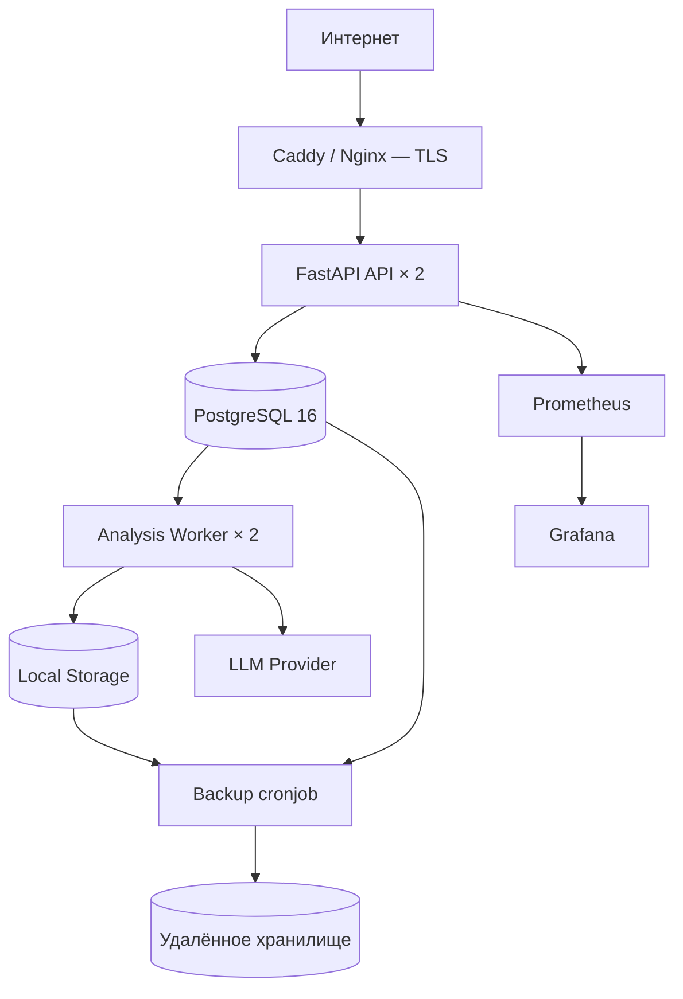
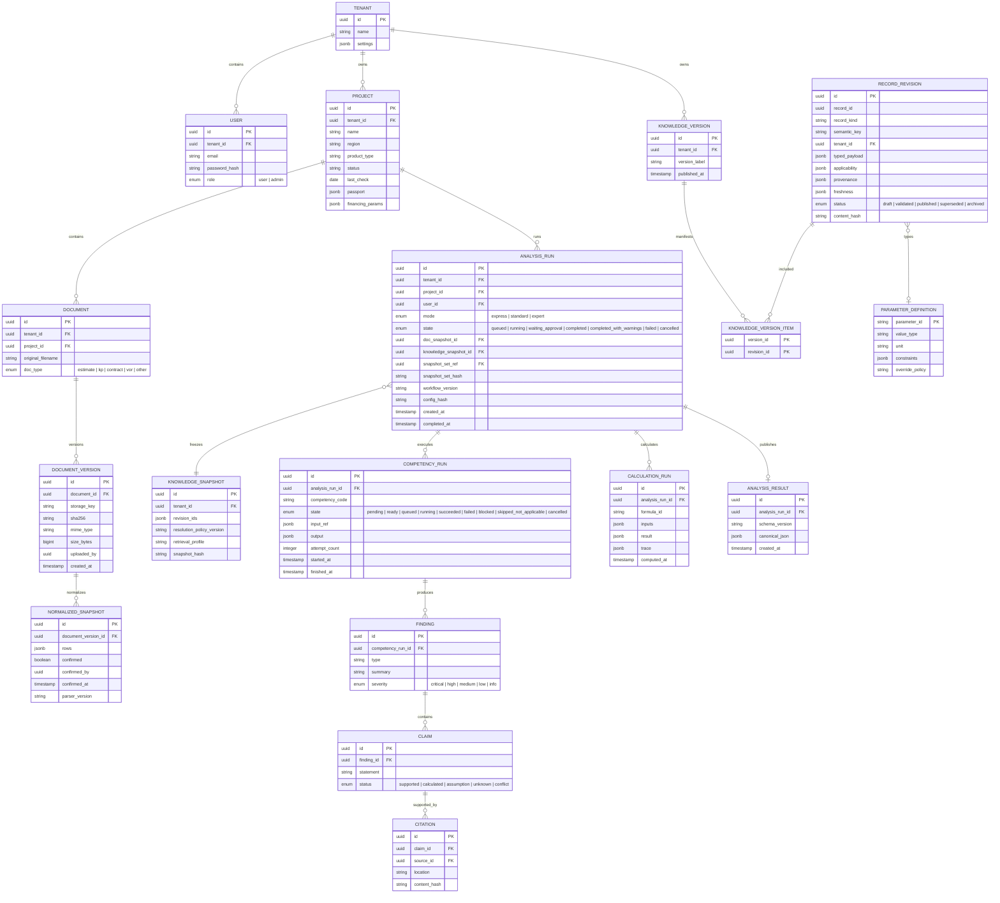
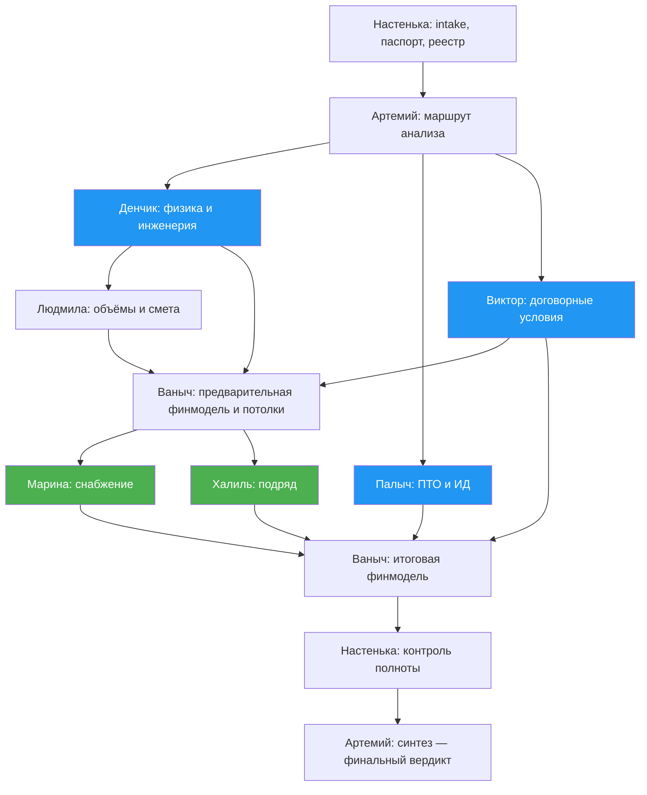
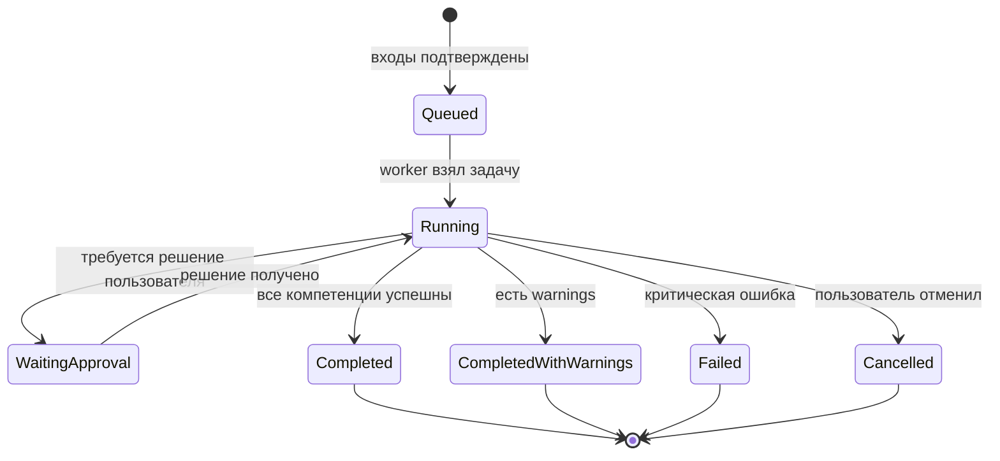
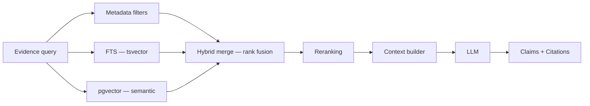

# Оптимальная архитектура «СтройИнтеллект»

> **Документ:** Сравнительный анализ + оптимальный синтез
> **Источники:** `docs/architecture_proposal.md` (Вариант А — «лёгкий»), `docs/specs/00-stroiintellect-system-architecture.md` (Вариант Б — «тяжёлый»)
> **Дата:** 05.08.2026

---

## 0. Статус baseline и источники

Этот документ — краткий архитектурный baseline и индекс решений. Детальные требования и контракты находятся в модульных спецификациях `docs/specs/00–13`.

| Specs | Контур |
|---|---|
| `00–01` | Scope, source policy, договорные требования и приёмка |
| `02–03` | Legacy traceability, workflow и компетенции |
| `04–05` | Canonical data, knowledge и parameter platform |
| `06–07` | Ingestion/normalization и deterministic calculation engine |
| `08–09` | Retrieval/RAG/LLM gateways и security/tenancy |
| `10–12` | API/runtime, web/exports, deployment/recovery |
| `13` | Testing, evals и delivery gates |

Порядок разрешения противоречий:

```text
Главное ТЗ
→ явные решения владельца продукта
→ проверяемые исполнимые правила legacy
→ этот архитектурный baseline
→ BRD и отраслевые прототипы как roadmap/reference
```

Платформа проектируется как multi-tenant продукт для нескольких компаний. ПАО «АПРИ» является pilot tenant и договорным контуром первой приёмки. Внутри tenant MVP поддерживает две роли; права по отдельным объектам не входят в договорный объём АПРИ.

Критерий legacy-полноты: трассируются 100% входных и выходных параметров, формул, статусов, единиц, источников, запретов и межкомпетентных передач, которые влияют на результат. Пояснительный текст без исполнимого правила остаётся reference.

---

## 1. Сравнительный анализ двух вариантов

### 1.1 Обзор вариантов

| Параметр | Вариант А (`architecture_proposal.md`) | Вариант Б (`00-stroiintellect-system-architecture.md`) |
|----------|---------------------------------------|-------------------------------------------------------|
| **Объём** | ~730 строк, 48 КБ | ~2685 строк, 84 КБ |
| **Стиль** | Высокоуровневый обзор модулей | Полная спецификация до уровня YAML-контрактов |
| **Стек** | Node.js/Python (нерешённый), BullMQ + Redis | Python 3.12 + FastAPI, PostgreSQL queue (без Redis) |
| **Архитектура** | 7 модулей + 3 хранилища | Модульный монолит, 15 доменных модулей |
| **Мультитенантность** | Не описана | PostgreSQL RLS с первого дня |
| **RAG** | Не описан | File-first + опциональный pgvector за eval gate |
| **Безопасность** | Базовая: санитизация + PII removal | Полный pipeline: classification → redaction → policy → audit |
| **Тесты** | Упомянуты для Calc Engine | Полная test pyramid + evals + load + security |
| **DevOps** | Docker Compose → K8s | Docker Compose, GitHub Actions CI/CD, dev/test/prod |
| **Deployment** | «Серверы в РФ» (абстрактно) | VPS pilot first, Ansible, compose overlays |
| **Legacy traceability** | Не описана | 100% fragment catalog с dispositions |

### 1.2 Что хорошо в Варианте А

| Сильная сторона | Почему важно |
|----------------|-------------|
| **Быстрая читаемость** | Новый разработчик за 15 минут понимает систему целиком |
| **Функциональная полнота** | Все 10 расчётов, все 9 компетенций, все 5 экранов — перечислены явно |
| **Хороший маппинг на ТЗ** | Таблица §ТЗ → модуль — сразу видно покрытие требований |
| **Конкретные файловые структуры** | Дерево файлов каждого модуля — можно начинать кодить |
| **Чёткое разделение Calc / AI** | Таблица «что считает модуль, что делает LLM» — однозначная граница |
| **Анализ легаси** | Понятная таблица агентов, паттернов и проблем |
| **Наглядные диаграммы** | ASCII-схемы + mermaid — визуально ясный поток |

### 1.3 Что не хватает Варианту А

| Пробел | Последствие |
|--------|------------|
| **Нет мультитенантности** | Невозможно изолировать данные разных организаций |
| **Нет версионирования документов** | Перезагрузка файла потеряет старую версию |
| **Нет immutable snapshots** | Обновление опорной базы задним числом изменит старые результаты |
| **Нет structured output contract** | LLM может вернуть что угодно, нет Pydantic-валидации |
| **Нет redaction pipeline** | «Санитизация» упомянута, но нет pipeline с policy и fail-closed |
| **Нет retry/lease semantics** | BullMQ скрывает сложность, но нет описания at-least-once и idempotency |
| **Нет legacy traceability** | Нет способа доказать, что легаси-правило не потеряно |
| **Нет backup/recovery** | Нет RPO/RTO, нет процедуры восстановления |
| **Redis как SPOF** | Три зависимости от Redis (queue, cache, sessions) — лишний компонент для MVP |
| **TypeScript vs Python** | Стек не определён, упомянуты оба — это блокер для начала работ |
| **Нет state machine** | Статусы проверки упомянуты (4 шт), но нет полной state machine |
| **Нет канонического JSON** | Результат — «jsonb response» без schema, Excel/Word могут расходиться |
| **Нет DAG зависимостей** | Поток линейный (ГИП→Сметчик→Экономист), не учитывает параллельные ветви |

### 1.4 Что хорошо в Варианте Б

| Сильная сторона | Почему важно |
|----------------|-------------|
| **Полнота** | Покрывает ВСЕ аспекты: security, observability, backup, CI/CD, testing |
| **Tenant isolation** | RLS + fail-closed — данные защищены по контракту |
| **Immutable snapshots** | Документы, знания, результаты — версионированы, старые не меняются |
| **Canonical JSON** | Один источник истины → UI, Excel, Word читают одно и то же |
| **Formula catalog** | Каждый расчёт версионирован, имеет trace и inputs |
| **DAG компетенций** | Параллельные ветви (Марина‖Халиль, Палыч‖Виктор) — быстрее |
| **State machine** | 10 состояний AnalysisRun + 8 состояний CompetencyRun — полный lifecycle |
| **PostgreSQL queue** | Нет Redis, нет Kafka — одна БД для всего, транзакционность |
| **Redaction pipeline** | Classification → detectors → NER → tokens → validation → policy |
| **ADR реестр** | 20 архитектурных решений зафиксированы с обоснованием |
| **Acceptance matrix** | Чёткие gates для release |
| **Claim/Citation model** | Каждый вывод LLM привязан к конкретному фрагменту документа |

### 1.5 Что перегружено в Варианте Б (оверинжиниринг)

| Избыток | Почему это оверинжиниринг для MVP |
|---------|----------------------------------|
| **Legacy fragment catalog** | Каталогизация каждого пояснительного фрагмента избыточна. Обязательно 100% покрытие параметров и исполнимых правил; остальные fragments классифицируются как reference |
| **RAG overspecification** | 7 разделов (§17.1–17.13) с детальным chunking, reranking, ACL per chunk — можно упростить до единого `EvidenceRetriever` port с двумя реализациями |
| **Knowledge proposal lifecycle** | draft → proposed → in_review → approved → published → superseded + AI proposals с human approval — для MVP достаточно «загрузил Excel → опубликовал» |
| **Redaction classification** (4 класса) | Для pilot достаточно default `confidential`, но outbound residual validation и fail-closed остаются обязательными |
| **ClamAV** | Malware scanner как обязательный Docker-сервис можно отложить до отдельного threat/risk gate |
| **Jaeger + OTEL** | Distributed tracing — полезно на масштабе, но для модульного монолита на VPS избыточно |
| **Ansible** | Для одного VPS с docker compose — достаточно скрипта деплоя |
| **30+ таблиц в БД** | legacy_fragments, embedding_indexes, embedding_records, knowledge_proposals, approvals — половина из них для MVP не нужна |
| **SBOM + Trivy + secret scan в CI** | Корпоративный compliance для одного VPS-пилота — можно добавить позже |
| **Monthly restore drill** | Для пилотного проекта — quarterly достаточно |
| **RAG/File-first parity tests** | Нужны для двух реализуемых retrieval-треков, но не подменяют договорную приёмку |
| **Property-based testing** | Правильно по сути, но для MVP достаточно примеров с фикстурами |

### 1.6 Сводная таблица сравнения

| Критерий | Вариант А | Вариант Б | Оптимум |
|----------|-----------|-----------|---------|
| Понятность | ✅ Высокая | ⚠️ Нужно время | Как А |
| Покрытие ТЗ | ✅ Полное | ✅ Полное + beyond | Как А |
| Tenant isolation | ❌ Нет | ✅ RLS | Из Б |
| Immutable data | ❌ Нет | ✅ Snapshots | Из Б (упрощённо) |
| Canonical output | ❌ Нет | ✅ JSON Schema | Из Б |
| Calc Engine | ✅ 10 формул | ✅ + formula catalog | Из Б |
| DAG компетенций | ⚠️ Линейный | ✅ С параллелизмом | Из Б |
| State machine | ⚠️ 4 статуса | ✅ 10 статусов | Из Б (упрощённо) |
| Security / Redaction | ⚠️ Базовый | ✅✅ Полный pipeline | Из Б (без NER/classification) |
| RAG | ❌ Нет | ✅ Полный (7 разделов) | Из Б (упрощённо, dual-profile) |
| Legacy traceability | ❌ Нет | ✅✅ 100% fragments | 100% параметров и исполнимых правил |
| Стек определённость | ❌ Node/Python? | ✅ Python + FastAPI | Из Б |
| DevOps | ⚠️ Абстрактный | ✅ Полный | Из Б (без Ansible/ClamAV) |
| Сложность реализации | Низкая | Высокая | Средняя |
| Время до MVP | ~10 недель | ~14 недель | ~12 недель |

---

## 2. Оптимальная архитектура

### 2.1 Принцип: берём лучшее из обоих

```
Из Варианта А:                         Из Варианта Б:
─────────────────                      ─────────────────
✅ Читаемая структура                  ✅ Python + FastAPI (определённость)
✅ Маппинг ТЗ → модули                 ✅ Модульный монолит (не микросервисы)
✅ Таблица Calc vs AI                   ✅ PostgreSQL queue (без Redis)
✅ Конкретные файловые деревья          ✅ Tenant isolation (RLS)
✅ Наглядные диаграммы                  ✅ Immutable snapshots
✅ Анализ легаси                        ✅ Canonical JSON → Excel/Word
                                        ✅ DAG с параллельными ветвями
Отбрасываем из А:                       ✅ State machine
─────────────────                       ✅ Formula catalog
❌ Redis                                ✅ Claim/Citation
❌ S3/MinIO                             ✅ Structured LLM output
❌ K8s                                  ✅ CI/CD pipeline
❌ Нерешённый стек
                                        ✅ Dual-profile: file-first + RAG
                                        ✅ EvidenceRetriever port

                                        Отбрасываем из Б:
                                        ─────────────────
                                        ❌ Каталогизация каждого пояснительного fragment
                                        ❌ Knowledge proposal lifecycle
                                        ❌ 4-level classification
                                        ❌ ClamAV
                                        ❌ Jaeger/OTEL
                                        ❌ Ansible
                                        ❌ SBOM/Trivy (MVP)
                                        ❌ Property-based testing (MVP)
```

### 2.2 Архитектурный стиль

**Модульный монолит** с двумя entrypoints: `api` и `worker`.

```
Один Docker image → два процесса:

┌─────────────────────────────────────────────────────────┐
│                    ЕДИНЫЙ IMAGE                          │
│                                                         │
│   ┌─── api ────────────────────────────────────┐       │
│   │  FastAPI + SSE + WebSocket                  │       │
│   │  Auth, Routes, Audit, Config               │       │
│   └────────────────┬───────────────────────────┘       │
│                    │                                     │
│   ┌─── worker ─────┴───────────────────────────┐       │
│   │  Document parsing                           │       │
│   │  Calculation Engine                         │       │
│   │  Competency DAG                             │       │
│   │  Report generation                          │       │
│   └─────────────────────────────────────────────┘       │
│                                                         │
│   Shared: Domain, Ports, Application Services           │
└─────────────────────────────────────────────────────────┘
```

**Почему не микросервисы:** один VPS, 10 пользователей, один заказчик в MVP. Модульные границы внутри монолита позволяют выделить сервис позже при реальной необходимости.

**Почему не Redis:** PostgreSQL обеспечивает транзакционную очередь (`SELECT ... FOR UPDATE SKIP LOCKED`). Одна БД = меньше инфраструктуры, проще backup/restore, нет рассинхронизации.

### 2.3 Стек технологий

| Компонент | Технология | Обоснование |
|-----------|-----------|-------------|
| **Backend** | Python 3.12, FastAPI, Pydantic v2 | Строительная отрасль, Decimal, парсинг документов, экосистема |
| **Frontend** | React, TypeScript, Vite, TanStack Query | Зрелая экосистема, SPA, SSE |
| **База данных** | PostgreSQL 16 | Единственная БД: данные + очередь + RLS |
| **Файлы** | Локальный filesystem через абстракцию | MVP на VPS, MinIO потом |
| **Очередь** | PostgreSQL (jobs table + SKIP LOCKED) | Без Redis, без Kafka |
| **LLM** | OpenAI-compatible API (адаптер) | Сменяемый: Claude → GPT → YandexGPT |
| **Document parsing** | openpyxl, python-docx, lxml, pdfplumber | Нативный Python, без внешних зависимостей |
| **Report generation** | openpyxl (Excel), python-docx (Word) | Формулы, стили |
| **Deploy** | Docker Compose | VPS в РФ |
| **CI/CD** | GitHub Actions | Auto-deploy test, manual production |
| **Мониторинг** | Prometheus + Grafana | Достаточно для MVP |

### 2.4 Общая топология (Production)



**Docker Compose services:**

| Service | Назначение |
|---------|-----------|
| `proxy` | TLS termination, rate limiting |
| `api` (×2) | HTTP API + SSE + WS |
| `worker` (×2) | Async jobs: parsing, calculations, competencies, export |
| `postgres` | Единственная БД |
| `migration` | Alembic one-shot |
| `backup` | Ежедневный pg_dump + filesystem snapshot |
| `prometheus` | Метрики |
| `grafana` | Дашборды |

---

### 2.5 Логическая структура проекта

```
stroiintellekt/
├── backend/
│   └── src/stroiintellekt/
│       │
│       ├── identity/              # Пользователи, auth, sessions
│       │   ├── domain/
│       │   ├── application/
│       │   ├── ports/
│       │   ├── adapters/
│       │   └── api/
│       │
│       ├── tenancy/               # Tenant context, RLS, роли
│       │   └── ...
│       │
│       ├── projects/              # Объекты (паспорт, статус, участники)
│       │   └── ...
│       │
│       ├── documents/             # Upload, versions, hashes, lifecycle
│       │   └── ...
│       │
│       ├── normalization/         # Парсеры → каноническая форма → human review
│       │   ├── domain/
│       │   │   ├── models.py       # NormalizedRow, NormalizedSnapshot
│       │   │   └── contracts.py    # DocumentParser protocol
│       │   ├── adapters/
│       │   │   ├── excel_parser.py
│       │   │   ├── xml_parser.py    # ГРАНД-Смета
│       │   │   ├── docx_parser.py
│       │   │   └── pdf_parser.py
│       │   └── ...
│       │
│       ├── reference_knowledge/   # Опорная база: CRUD, search, freshness
│       │   ├── domain/
│       │   │   ├── models.py       # KnowledgeRecord, KnowledgeVersion
│       │   │   └── freshness.py    # 90-day expiry
│       │   ├── adapters/
│       │   │   └── excel_importer.py
│       │   └── ...
│       │
│       ├── calculations/          # 10 детерминированных расчётов
│       │   ├── domain/
│       │   │   ├── formulas/
│       │   │   │   ├── convergence.py
│       │   │   │   ├── estimate.py
│       │   │   │   ├── deviation.py
│       │   │   │   ├── cost_per_sqm.py
│       │   │   │   ├── credit_schedule.py
│       │   │   │   ├── bdds.py
│       │   │   │   ├── margin.py
│       │   │   │   ├── order_deadline.py
│       │   │   │   ├── work_duration.py
│       │   │   │   └── penalty.py
│       │   │   ├── types.py        # Decimal, Money, Quantity, units
│       │   │   └── trace.py        # FormulaTrace — провенанс расчёта
│       │   └── ...
│       │
│       ├── analysis/              # AnalysisRun, DAG, state machine
│       │   ├── domain/
│       │   │   ├── models.py       # AnalysisRun, CompetencyRun
│       │   │   ├── dag.py          # Dependency-based DAG 9 компетенций
│       │   │   └── states.py       # State machine
│       │   └── ...
│       │
│       ├── competencies/          # 9 контрактов + промпты
│       │   ├── domain/
│       │   │   ├── contracts.py    # Input/Output schemas per competency
│       │   │   └── registry.py     # Competency registry
│       │   ├── prompts/            # .md файлы (version-controlled)
│       │   │   ├── artemiy_pm.md
│       │   │   ├── denchik_engineer.md
│       │   │   ├── lyudmila_estimator.md
│       │   │   ├── marina_supply.md
│       │   │   ├── khalil_subcontract.md
│       │   │   ├── palych_pto.md
│       │   │   ├── viktor_contract.md
│       │   │   ├── vanych_finance.md
│       │   │   └── nastenka_admin.md
│       │   └── ...
│       │
│       ├── retrieval/              # EvidenceRetriever — dual-profile
│       │   ├── domain/
│       │   │   └── contracts.py    # EvidenceRetriever protocol
│       │   ├── adapters/
│       │   │   ├── exact_retriever.py    # File-first: SQL + FTS
│       │   │   └── hybrid_retriever.py   # RAG: SQL + FTS + pgvector
│       │   └── ...
│       │
│       ├── embeddings/             # Embedding provider + index (для RAG)
│       │   ├── domain/
│       │   │   └── contracts.py    # EmbeddingProvider protocol
│       │   ├── adapters/
│       │   │   └── openai_compatible.py
│       │   └── ...
│       │
│       ├── llm_gateway/           # Адаптер LLM (OpenAI-compatible)
│       │   ├── domain/
│       │   │   └── contracts.py    # LLMProvider protocol
│       │   ├── adapters/
│       │   │   ├── anthropic.py
│       │   │   ├── openai.py
│       │   │   └── yandex_gpt.py
│       │   └── ...
│       │
│       ├── redaction/             # Анонимизация перед LLM
│       │   ├── domain/
│       │   │   └── pipeline.py     # detect → replace → validate
│       │   └── ...
│       │
│       ├── exports/               # Excel, Word → из canonical JSON
│       │   ├── domain/
│       │   │   └── contracts.py
│       │   ├── adapters/
│       │   │   ├── excel_export.py
│       │   │   └── word_export.py
│       │   └── ...
│       │
│       ├── audit/                 # Immutable events, security trail
│       │   └── ...
│       │
│       ├── operations/            # Job queue, health, metrics
│       │   ├── domain/
│       │   │   └── job.py          # Job model, lease, retry
│       │   └── ...
│       │
│       ├── shared/                # Общие типы, errors, config
│       │   ├── types.py            # Money, Decimal, Units
│       │   ├── errors.py
│       │   ├── provenance.py       # SourceRef, Status (fact|calc|assumption|unknown)
│       │   └── config.py
│       │
│       ├── api/                   # FastAPI routes
│       │   ├── main.py
│       │   ├── deps.py             # DI, tenant context
│       │   ├── routes/
│       │   │   ├── auth.py
│       │   │   ├── projects.py
│       │   │   ├── documents.py
│       │   │   ├── normalization.py
│       │   │   ├── analyses.py
│       │   │   ├── knowledge.py
│       │   │   ├── exports.py
│       │   │   └── admin.py
│       │   └── sse.py              # Server-Sent Events для прогресса
│       │
│       └── workers/               # Worker entrypoint
│           └── main.py
│
├── frontend/
│   └── src/
│       ├── pages/
│       │   ├── Login.tsx
│       │   ├── ProjectList.tsx      # Экран 1: Реестр объектов
│       │   ├── ProjectDetail.tsx    # Экран 2: Карточка объекта
│       │   ├── DocumentUpload.tsx   # Экран 3: Загрузка и разбор
│       │   ├── NormReview.tsx       # Экран 3.1: Проверка данных
│       │   ├── Workspace.tsx        # Экран 4: Рабочий экран
│       │   ├── ResultView.tsx       # Экран 4.1: Результат
│       │   └── Journal.tsx          # Экран 5: Журнал (admin)
│       ├── components/
│       │   ├── QueuePanel.tsx       # Очередь проверок
│       │   ├── SourceBadge.tsx      # ✅ ⚠️ ❌
│       │   ├── ProgressTracker.tsx  # Live-progress компетенций
│       │   └── ExportPanel.tsx      # Excel / Word
│       └── services/
│           ├── api.ts               # Generated OpenAPI client
│           └── sse.ts               # SSE client
│
├── config/
│   ├── workflows/                   # DAG config
│   ├── modes/                       # express / standard / expert
│   ├── formulas/                    # Formula catalog versions
│   ├── providers/                   # LLM + embeddings provider profiles
│   ├── profiles/                    # retrieval.yaml — file_first / rag_enabled
│   └── exports/                     # Report templates
│
├── tests/
│   ├── unit/
│   ├── integration/
│   ├── acceptance/
│   └── fixtures/
│
├── evals/                           # LLM evaluation datasets
│
└── infra/
    └── compose/
        ├── compose.base.yaml
        ├── compose.dev.yaml
        ├── compose.test.yaml
        └── compose.prod.yaml
```

---

### 2.6 Модель данных



ER-диаграмма показывает агрегаты, а не финальный физический DDL. Authoritative knowledge model находится в `docs/specs/05-knowledge-and-parameter-platform.md`, canonical statuses и values — в `docs/specs/04-canonical-data-and-structured-output.md`, ingestion snapshots — в `docs/specs/06-document-ingestion-and-normalization.md`, calculation contracts — в `docs/specs/07-calculation-engine.md`, workflow/runtime states — в `docs/specs/03-domain-workflow-and-competency-contracts.md` и `docs/specs/10-api-queue-and-runtime-state.md`.

Физическая схема должна поддерживать как минимум:

- tenants, users, projects;
- documents, versions и normalized snapshots;
- parameter definitions, typed record revisions, knowledge versions/snapshots и tenant overlays;
- analyses, competency/calculation runs и canonical results;
- findings, claims, citations и recommendations;
- jobs, approvals, exports, audit и config versions;
- versioned retrieval corpus/index records для RAG-профиля.

Фиксированное число таблиц не является архитектурным требованием.

---

### 2.7 DAG компетенций



**Параллельные ветви:**
- Денчик, Палыч и Виктор начинают работу параллельно по доступным документам
- Марина и Халиль работают параллельно после получения потолков от Ваныча
- Настенька ведёт intake и координацию сквозным процессом

Шаблон DAG не означает обязательный запуск всех компетенций для каждого запроса. Оркестратор отсекает неприменимые ветви и фиксирует `skipped_not_applicable`. Обязательные зависимости «физика → объём → деньги» не могут быть обойдены.

---

### 2.8 State machine: AnalysisRun



Parsing, normalization и input review относятся к lifecycle документов и `NormalizedSnapshot`. Retry после failed/cancelled создаёт новый `AnalysisRun`, не возвращает historical run в очередь.

---

### 2.9 Canonical JSON → единый источник истины

```
Подтверждённые входы
    → Calculation Engine (Decimal, formula trace)
    → Competency DAG (LLM + evidence)
    → AnalysisResult (canonical JSON, schema versioned)
    → PostgreSQL
    ↙ ↓ ↘
  Web UI   Excel   Word
```

> [!IMPORTANT]
> Внутреннее ядро, состояние и canonical result не зависят от Excel. UI и Word проецируют canonical JSON. Договорный Excel является адаптером ввода/вывода, содержит согласованные рабочие формулы и редактируемые параметры для пользователя, но не становится источником состояния системы. Расхождение экспортного Excel после пересчёта с canonical result = баг.

**Envelope:**

```json
{
  "schema_version": "1.0.0",
  "tenant_id": "uuid",
  "project_id": "uuid",
  "analysis_id": "uuid",
  "mode": "standard",
  "created_at": "2026-08-05T12:00:00Z",
  "input_snapshot": { "document_versions": [], "knowledge_version_id": "uuid" },
  "calculations": [],
  "competencies": [],
  "findings": [],
  "summary": {
    "budget_status": "at_risk",
    "base_margin_pct": "7.2",
    "adjusted_margin_pct": "12.1",
    "accuracy_range": "±3-5%",
    "critical_threshold_rub": "15000000.00",
    "top_risks": [],
    "corrective_measures": [],
    "continuation_conditions": []
  }
}
```

---

### 2.10 Разделение Calc Engine vs LLM

| Calculation Engine (детерминированный) | AI Orchestrator (интерпретация) |
|---------------------------------------|-------------------------------|
| Σ разделов = итог ± 0₽ | Классификация расхождения |
| Объём × цена = сумма | Сопоставление позиции со справочником |
| Подрядчик − опорная база = Δ₽ | Оценка существенности |
| Себестоимость ₽/м² | Выявление рисков в договоре |
| Проценты ПФ + график выборки | Формулирование выводов |
| БДДС помесячный + кассовый разрыв | Рекомендации с вариантами |
| 3 сценария маржи | SWOT, примортем, матрица решений |
| Крайний срок заказа | Синтез по компетенциям |
| Обратный расчёт срока | Вердикт 🟢🟡🔴 |
| Пеня ₽/день | — |

**Правила Calc Engine:**
- Только `Decimal`, не float
- Типизированные единицы (RUB, RUB_PER_SQM, DAYS, ...)
- Явное округление (ROUND_HALF_UP, scale=2)
- `unknown` ≠ `0` → `insufficient_data`
- Каждый результат имеет `formula_trace` (inputs, formula_id, version)
- НДС и ключевая ставка — параметры с датой действия

---

### 2.11 Redaction pipeline (упрощённый vs Вариант Б)

```
Документ
    → Детерминированные детекторы (regex: ФИО, телефоны, email, ИНН, реквизиты)
    → Стабильные токены замены: [ORG_1], [PERSON_1], [PHONE_1]
    → Замена наименований объекта/подрядчика на ID
    → Проверка: если детектор не смог → блокировка, не fallback
    → Редактированный текст → LLM
```

**Что убрали из Б:**
- обязательность конкретной NER-технологии; detector stack выбирается по eval
- 4-level classification (public/internal/confidential/restricted) — для MVP всё = confidential

**Что сохранили из Б:**
- Fail-closed: ошибка redaction → блокировка, не пропуск
- Стабильные токены (один и тот же объект = один и тот же `[ORG_1]` в рамках анализа)
- Residual validation перед каждым outbound transfer
- RedactionResult с detector coverage, reason codes и outbound payload hash
- Curated negative corpus: остаточные реквизиты в outbound payload = 0
- Audit: хеш отредактированного контента, без sensitive payload

---

### 2.12 Dual-Profile Retrieval: File-First и RAG-Enabled

Это **не два продукта** и **не две кодовые базы**. Это одно ядро с одним `EvidenceRetriever` портом и двумя реализациями, переключаемыми конфигурацией.

#### 2.12.1 Два профиля одной системы

```
┌─────────────────────────────────────────────────────────────────┐
│                      ЕДИНЫЙ APPLICATION CORE                     │
│                                                                 │
│   Competency ──► EvidenceRetriever port ──► EvidenceSet         │
│                          │                                       │
│              ┌───────────┴───────────┐                          │
│              ▼                       ▼                          │
│   ┌─────────────────────┐  ┌──────────────────────────┐        │
│   │   FILE-FIRST        │  │   RAG-ENABLED            │        │
│   │   (ExactRetriever)  │  │   (HybridRetriever)      │        │
│   │                     │  │                          │        │
│   │ • SQL exact match   │  │ • SQL exact match        │        │
│   │ • FTS (tsvector)    │  │ • FTS (tsvector)         │        │
│   │ • Metadata filters  │  │ • pgvector semantic      │        │
│   │ • pgvector OFF      │  │ • Rank fusion            │        │
│   │ • embeddings OFF    │  │ • Reranking              │        │
│   └─────────────────────┘  └──────────────────────────┘        │
│                                                                 │
│   Компетенции НЕ знают, какой профиль активен                   │
└─────────────────────────────────────────────────────────────────┘
```

#### 2.12.2 Единый порт

```python
class EvidenceRetriever(Protocol):
    """Единый порт для обоих профилей."""

    async def retrieve(
        self,
        query: EvidenceQuery,
        snapshot_id: UUID,
        actor: ActorContext,
    ) -> EvidenceSet: ...
```

**EvidenceQuery** содержит:
- текстовый запрос (для FTS / semantic search)
- структурированные фильтры (domain, region, object_type, date range)
- tenant_id (обязателен, из контекста)
- max_results

**EvidenceSet** возвращает:
- `List[Evidence]` — найденные фрагменты с source_id, location, content_hash, score
- `retrieval_status`: `answered | not_found | low_confidence | conflict | stale_source`
- Нет source span = нет фактического ответа (запрещено)

#### 2.12.3 File-First Profile (базовый)

```
structured query
    → tenant + ACL filter
    → domain, region, object_type, date filters
    → exact structured match (SQL WHERE)
    → PostgreSQL full-text search (tsvector + tsquery)
    → EvidenceSet
```

**Применяется для:**
- расценок, коэффициентов, нормативов
- сроков действия, региональных значений
- формализованных правил из опорной базы

**Когда достаточно file-first:**
- Опорная база структурирована (13 листов Excel)
- Запросы предсказуемые (позиция сметы → расценка)
- Данные точные (цифры, коды, даты)

#### 2.12.4 RAG-Enabled Profile



**Добавляет поверх file-first:**
- Semantic search через pgvector (cosine distance)
- Rank-based fusion (FTS score + vector score с настраиваемыми весами)
- Опциональный reranking
- Расширенный контекст из неструктурированных документов

**Когда нужен RAG:**
- Поиск по неструктурированным документам (договоры, ТЗ, акты)
- Семантически близкие, но текстово разные запросы
- Кейс-база и исторические прецеденты
- Кросс-документный анализ

#### 2.12.5 Feature Gate

RAG-трек реализуется и настраивается в изолированном test/eval контуре. Использование `rag_enabled` для production tenant analyses разрешается **только** после прохождения production admission gate `G7` из spec 13:

```yaml
# config/profiles/retrieval.yaml
retrieval_profile: file_first  # или: rag_enabled

rag_gate:
  enabled: false
  requirements:
    - eval_corpus_exists: true
    - retrieval_recall_at_10: 0.90
    - citation_precision: 0.95
    - acl_leakage: 0
    - no_source_safe_response: 0.98
    - file_first_parity: true       # exact matches не ухудшились
    - embedding_provider_configured: true
    - embedding_index_complete: true
```

**Правила gate:**
- pgvector, embeddings provider и index разрешены в test/eval profile для построения corpus и измерения метрик
- production profile по умолчанию остаётся `file_first` до gate
- production tenant не может выбрать `rag_enabled`, пока `G7` status не `pass`
- Rollback: переключение обратно на file-first без потери данных
- Отключение pgvector **не ломает** основной analysis contract

#### 2.12.6 Parity Contract

RAG-профиль **не имеет права** изменять детерминированную истину file-first:

| Правило | Описание |
|---------|----------|
| Exact matches совпадают | Если file-first нашёл расценку = 1500 ₽/м², RAG возвращает то же |
| Calculations совпадают | Calc Engine одинаков в обоих профилях |
| ACL decisions совпадают | Tenant isolation одинакова |
| `unknown` ≠ факт | RAG не может превратить `unknown` в факт только по semantic similarity |
| Provenance не ухудшается | Существующие claims не теряют source span |
| RAG только добавляет | Новые цитированные evidence и новые поддержанные claims |

#### 2.12.7 Embedding Infrastructure (для RAG-профиля)

```yaml
# config/providers/embeddings.yaml
embeddings:
  provider_protocol: openai-compatible
  model: intfloat/multilingual-e5-small
  dimension: 384
  distance: cosine
  query_prefix: "query: "
  document_prefix: "passage: "
```

**Chunking** — структурное разбиение:
- DOCX: heading → paragraph → table
- XLSX: sheet → logical table → row
- Норматив: section → clause
- Смета: позиция и связанный блок

**Правила:**
- Не смешивать vectors разных моделей
- Не менять dimension существующего index
- Index version = model + dimension + chunking config
- Числа дополнительно индексируются как structured values

**Дополнительные таблицы (только при RAG-профиле):**

```
embedding_indexes       — версия индекса (model, dimension, status)
embedding_records       — chunk_id, vector, metadata, source_ref
```

#### 2.12.8 Workflow: как профиль влияет на анализ

```
                    ┌─── File-First ───────────────────────────┐
                    │                                          │
Competency DAG      │  Evidence = SQL exact + FTS              │
    │               │  Context = structured matches            │
    ▼               │  Достаточно для: расценки, коэффициенты, │
EvidenceRetriever ──┤  нормативы, формализованные правила      │
    │               │                                          │
    │               ├─── RAG-Enabled ─────────────────────────┤
    │               │                                          │
    ▼               │  Evidence = SQL + FTS + semantic search   │
LLM Gateway         │  Context = structured + unstructured     │
    │               │  Добавляет: договорные нюансы, кейсы,    │
    ▼               │  кросс-документный контекст              │
Canonical JSON      │                                          │
                    └──────────────────────────────────────────┘

Canonical JSON одинаков по структуре в обоих профилях.
Разница — в полноте evidence и глубине контекста.
```

---

### 2.13 PostgreSQL Queue (без Redis)

```sql
-- Claiming job
SELECT id FROM jobs
WHERE state = 'queued'
  AND available_at <= now()
  AND tenant_id = :tenant_id
ORDER BY priority DESC, created_at
FOR UPDATE SKIP LOCKED
LIMIT 1;
```

**Job model:**

```python
class Job:
    id: UUID
    tenant_id: UUID
    analysis_id: UUID
    job_type: Literal["parse", "calculate", "competency", "export"]
    state: Literal["queued", "running", "succeeded", "failed", "cancelled"]
    priority: int = 100
    attempt_count: int = 0
    max_attempts: int = 3
    available_at: datetime
    lease_owner: str | None
    lease_until: datetime | None
    deadline_at: datetime
```

**Retry policy:**
- Retry: timeout, 429, 502/503/504, connection reset
- No retry: invalid credentials, missing data, unsupported file, schema error
- Backoff: exponential + jitter + Retry-After

---

### 2.14 Tenant Isolation

```
┌──────────────────────────────────────────────────────────┐
│                    TENANT ISOLATION                        │
│                                                          │
│  API Request                                             │
│     │                                                    │
│     ├─ Auth middleware → extract tenant_id from session   │
│     ├─ SET LOCAL app.tenant_id = :tenant_id              │
│     │                                                    │
│  PostgreSQL RLS:                                         │
│     CREATE POLICY tenant_access ON projects              │
│       USING (tenant_id = current_setting('app.tenant_id')│
│              ::uuid)                                     │
│     WITH CHECK (same);                                   │
│                                                          │
│  Worker                                                  │
│     ├─ Job contains tenant_id                            │
│     ├─ SET LOCAL before processing                       │
│     ├─ Reset after completion                            │
│                                                          │
│  Storage                                                 │
│     └─ Key: {tenant_id}/{project_id}/{doc_id}/{ver_id}   │
└──────────────────────────────────────────────────────────┘
```

Платформа рассчитана на несколько компаний, а АПРИ является первым pilot tenant. Tenant isolation — фундамент, а не расширение договорных ролей. Внутри tenant MVP остаются две роли без прав по отдельным объектам.

---

### 2.15 API Endpoints

```
/api/v1/auth          # Login, logout, session
/api/v1/projects      # CRUD объектов (экраны 1, 2)
/api/v1/documents     # Upload, versions, preview (экран 3)
/api/v1/normalization  # Review, confirm snapshot (экран 3.1)
/api/v1/analyses      # Create, status, result (экран 4)
/api/v1/knowledge     # CRUD опорной базы, import Excel
/api/v1/exports       # Excel, Word download (экран 4)
/api/v1/admin         # Users, journal, audit (экран 5)

/api/v1/analyses/{id}/progress  # SSE endpoint
```

**Контракт:**
- OpenAPI — контракт frontend/backend
- Команды используют `Idempotency-Key`
- Lists: pagination + filtering
- Errors: единый `ProblemDetails`
- Tenant context — только из session, не из body

---

### 2.16 Экраны Frontend

```
1. Реестр объектов — список, статус, дата последней проверки, сводный вывод
2. Карточка объекта — паспорт, документы, история проверок, параметры ПФ
3. Загрузка и разбор — dropzone, предпросмотр, ручная правка, сверка суммы
4. Рабочий экран — выбор компетенции, режим, live-progress, результат, export
5. Журнал — audit log (admin)
```

Login, просмотр опорной базы, результат анализа и review нормализации являются маршрутами или подэкранами этих пяти договорных поверхностей, а не расширением продуктового scope.

**UX-принципы:**
- `✅ факт` / `📊 расчёт` / `⚠️ допущение` / `❓ неизвестно` / `⚡ конфликт` — визуально различаются
- Пустое поле ≠ ноль
- SSE для live-progress компетенций (не polling)
- Mobile: статус + summary + скачивание отчёта

---

## 3. Маппинг требований ТЗ

| Раздел ТЗ | Требование | Модуль / Решение |
|-----------|-----------|-----------------|
| §2 | Финансово-технический контроль | Domain layer, 9 competencies |
| §3.1 | 9 компетенций | `competencies/` + DAG |
| §3.2 | Не заменяет юриста/ГБ | `legal_boundary` в canonical JSON |
| §4 | 2 роли, до 10 одновременных пользователей pilot tenant | `identity/` + `tenancy/`; нагрузочная модель analyses определяется отдельно |
| §5.1 | 9 компетенций, последовательность | `analysis/dag.py` |
| §5.2 | Сквозная оценка бюджета | Full DAG run |
| §5.3 | 3 режима (60с / 5мин / 15мин) | `config/modes/` |
| §5.4 | 5 экранов | `frontend/pages/` |
| §5.5 | Асинхронное выполнение | `operations/` + PG queue |
| §6.1 | Инфраструктура в РФ | VPS + Docker Compose |
| §6.2 | Числа считает модуль | `calculations/` |
| §6.3 | Смена LLM конфигурацией | `llm_gateway/` + `config/providers/` |
| §6.4 | Эталонные образцы | `competencies/prompts/` + exemplars |
| §7 | Опорная база | `reference_knowledge/` |
| §8 | Форматы: xls/xlsx, XML, docx, PDF с текстовым слоем | `normalization/adapters/` |
| §8.1 | Безопасность данных | `redaction/` + RLS |
| §9 | Маркировка источников | `shared/provenance.py` |
| §10 | Выгрузки Excel/Word | `exports/` |
| §11 | 60с / 5мин / 15мин, ≥2 000 позиций, 99% в рабочие часы, журнал ≥12 мес | `operations/`, `audit/`, load tests |
| §12 | ≥95% extraction, 0 ₽, ≥70% нарушений, ≥80% чек-листа, 2 объекта | `tests/acceptance/` + `evals/` |
| §13 | 90 дней, 3 этапа × 30 дней | delivery gates и stage acceptance |
| §14 | Вне объёма (расширение) | Модульная архитектура |
| §15 | Материалы и участие Заказчика | customer dependency matrix |

---

## 4. Legacy Traceability

Обязательное покрытие строится на уровне всех параметров и исполнимых правил:

| Категория | Что фиксируем | Как проверяем |
|-----------|--------------|--------------|
| **Формулы** | 10 расчётов из §6.2 ТЗ и все влияющие параметры | Unit, invariant и fixture tests |
| **Правила компетенций** | Ключевые правила из legacy-промптов (4 запрета, маркировка, физика до денег) | Competency evals |
| **Последовательность** | DAG = легаси-такты | Integration test: DAG order |
| **Выходные форматы** | Структура Excel/Word | Regression: input-1 → output-1 (structure match) |
| **Кейс-база** | Каранайаул, Школа №19, ЧТЗ | Триггеры в competency prompts + eval fixtures |

Каждый обязательный вход, выход, статус, unit, formula, prohibition и handoff получает stable ID, disposition, schema/config reference и test/eval reference. Пояснительные фрагменты без исполнимого правила остаются reference и не блокируют release.

---

## 5. Чего НЕТ в MVP (roadmap)

| Функция | Когда |
|---------|-------|
| Выбор основного retrieval-профиля | После сравнительных eval двух реализованных треков |
| OCR PDF-сканов | Roadmap |
| АРПС | Roadmap |
| > 2 ролей, права по объектам | Roadmap |
| Портфельный режим | Roadmap |
| Интеграции (1С, BIM) | Roadmap |
| Редактирование опорной базы через UI | Roadmap |
| OIDC / AD | Roadmap |
| Локальная LLM / GPU | Roadmap |
| ClamAV (malware scan) | Roadmap (добавить перед on-prem) |
| Специализированный tracing backend (Jaeger) | Roadmap; end-to-end `trace_id` и correlation обязательны в MVP |
| Посимвольный каталог всех пояснительных fragments | Roadmap (только при отдельном compliance-требовании) |

---

## 6. Явно запрещённые решения MVP

1. Redis, Kafka, Celery — без измеренного blocker
2. Kubernetes для одного VPS
3. Микросервисы — модульный монолит
4. Arithmetic через LLM
5. Число без provenance
6. Отправка raw document внешнему provider
7. Shared cache между tenants
8. Перезапись старого анализа (immutable)
9. Hardcoded промпты, коэффициенты, ставки в коде
10. Production deploy без approval
11. Отдельная кодовая база для RAG — один порт, два адаптера
12. Включение pgvector без прохождения eval gate
13. Смешение vectors разных embedding-моделей в одном index

---

## 7. Внутренний план реализации и договорные этапы

Недельная декомпозиция является внутренним способом планирования и должна укладываться в договорные три этапа по 30 календарных дней. Она не заменяет этапные результаты и порядок согласования из ТЗ.

| Договорный этап | Недели | Фокус | Передаваемый результат |
|---|---:|---|---|
| **Этап 1, 30 дней** | 1–4 | Доступ, provider gateway, три режима, initial knowledge package, эталоны, checklist, versioned contracts/prompts девяти компетенций | Проверяемые ответы девяти компетенций на согласованных эталонах, база/режимы/checklist и промежуточный протокол |
| **Этап 2, 30 дней** | 5–8 | Production parsers/normalization, deterministic calculations, financial model, XLSX/DOCX и violations registry | Расчёты, parsers, договорные exports, реестр расхождений и финмодель с промежуточным протоколом |
| **Этап 3, 30 дней** | 9–12 | Five-screen web flow, PostgreSQL queue/DAG, journal, end-to-end integration, acceptance, training, pilot deploy | Рабочее приложение, acceptance evidence на двух объектах, обучение и итоговый протокол |

Каждый этап передаётся на промежуточную проверку. Заказчик согласует результат за один рабочий день либо даёт мотивированные замечания со ссылкой на ТЗ; задержка согласования или обязательных материалов сдвигает зависимые сроки. Внутренние component gates могут выполняться раньше, но не заменяют договорные stage outcomes.

---

## 8. Ключевые архитектурные решения (ADR)

| # | Решение | Обоснование |
|---|---------|-------------|
| 1 | **Модульный монолит** | Упрощает транзакционность и тестирование при сохранении границ модулей |
| 2 | **Python + FastAPI** | Decimal, парсинг документов, экосистема LLM, один язык backend |
| 3 | **PostgreSQL-only** | Данные + очередь + RLS = одна БД, нет рассинхронизации |
| 4 | **Tenant isolation с RLS** | Добавить позже = переписать. Фундамент с первого дня |
| 5 | **Canonical JSON** | Внутренний источник истины. Excel — независимый adapter ввода/вывода |
| 6 | **Immutable snapshots** | Обновление базы не меняет старые результаты |
| 7 | **Calc ≠ LLM** | §6.2 ТЗ. Детерминированные формулы + formula trace |
| 8 | **Промпты как файлы** | §6.3 ТЗ. Git-версионирование, изменение без пересборки |
| 9 | **LLM Adapter** | §6.3 ТЗ. Смена провайдера конфигурацией |
| 10 | **Legacy-aligned DAG с pruning** | Сохраняет доказанные handoff, ранние ветви ПТО/договора и запускает только применимые компетенции |
| 11 | **SSE (не WebSocket)** | Для progress достаточно SSE, проще реализация и прокси |
| 12 | **Dual-profile: file-first + RAG** | Одно ядро, один `EvidenceRetriever` port, два adapter. RAG включается за feature gate после eval |
| 13 | **Multi-tenant platform, АПРИ как pilot** | RLS изолирует компании; две роли pilot scope не расширяются правами по объектам |
| 14 | **Excel как adapter boundary** | Ядро не зависит от Excel; импорт и выгрузки сохраняют договорный формат и legacy-удобство |
| 15 | **Contract-first delivery gates** | Release evidence связывает требования, правила, tests/evals, security, recovery и owner/customer acceptance |
