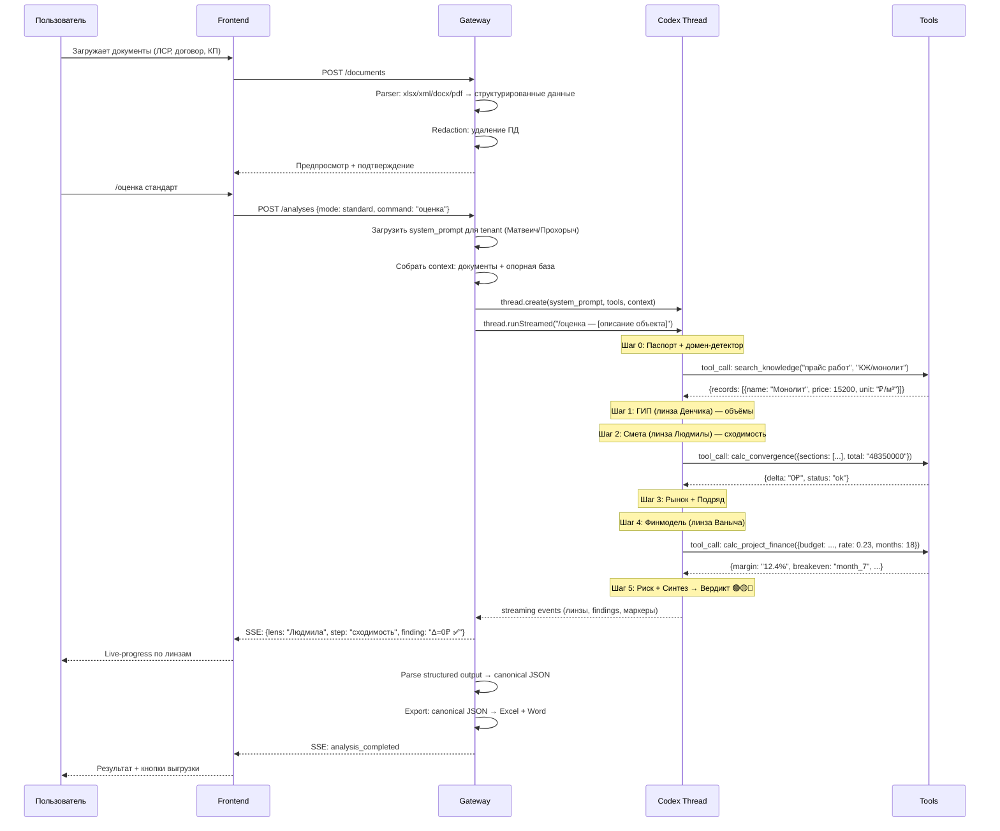
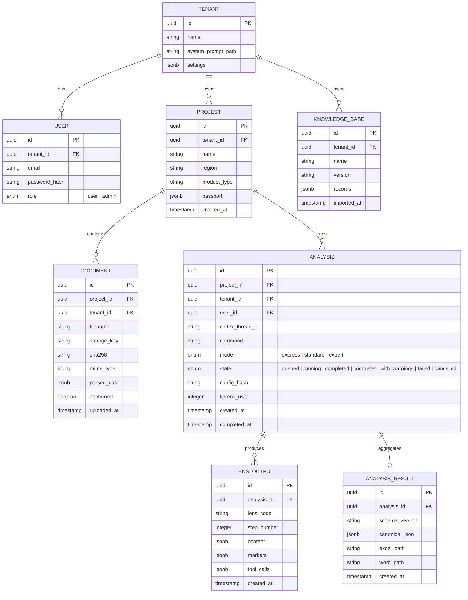

# СтройИнтеллект MVP: Codex App-Server Architecture

> **Ключевая идея:** reference-system уже работает как **один агент в одном чате** — «Матвеич» для АПРИ, «Прохорыч» для МОДЦ. Он думает через 9 аналитических «линз» (ГИП, Смета, Снаб, Подряд, Эконом, ПТО, Договор, РП, Админ), но это один промпт, одна голова. Задача — не переписывать агента, а обернуть его в продукт с Codex app-server под капотом.

---

## 1. Как реально работает reference-system

### 1.1 Один агент, не девять

Изучение папок `apri/`, `modc/`, `unihim/` показывает: **у каждого клиента — один системный промпт + одна опорная база:**

```
reference-system/
├── apri/
│   ├── СтройИнтеллект_Девелопмент_АПРИ_v1_0.txt     ← 627 строк, «Матвеич»
│   └── Опорная_база_Девелопмент_АПРИ_v1.xlsx         ← 13 листов
├── modc/
│   ├── СтройИнтеллект_Генподряд_РФ_МОДЦ_v1_0.txt    ← 712 строк, «Прохорыч»
│   └── Опорная_база_Генподряд_РФ_v1.xlsx             ← 13.x листов
├── unihim/
│   ├── СтройИнтеллект_Light_Унихим_v1.1.txt
│   └── Унихим_извлечённая_база_v5.0.xlsx
└── uralsetstroy/
    └── ...
```

**«Матвеич»** (АПРИ, строка 7 промпта): *«Платформа: Claude Project (один агент, один чат).»*

**Строки 81–86:** *«ТЫ ОДИН, А ДУМАЕШЬ ЗА ДЕВЯТЕРЫХ... Ты — сжатая до одного человека команда «СтройИнтеллект»: девять дисциплин, одна голова.»*

### 1.2 Два режима в reference-system

В проекте есть **два** архитектурных паттерна:

| Паттерн | Файлы | Как работает |
|---------|-------|-------------|
| **Один агент** (production) | `apri/*.txt` + `apri/*.xlsx` | Один промпт, 9 линз внутри, один чат в Claude Project |
| **Multi-agent оркестратор** (экспериментальный) | `stroiintellect-master.skill` + 9 × `v8.2_*.docx` + 9 × `Опорная_база_*.xlsx` | Master-skill вызывает 9 отдельных агентов по DAG тактов 0–4 |

**Продакшн-версия — один агент.** Multi-agent .skill — это более ранний подход, который позднее свернули в один промпт.

### 1.3 Что агент умеет (один промпт покрывает всё)

Промпт «Матвеича» — самодостаточная система из 13 частей:

| Часть | Содержание | Что делает |
|-------|-----------|-----------|
| 1 | КТО ТЫ | Персона + позиционирование (заказчик vs подрядчик) |
| 2 | ЗАКАЗЧИК РЕШЕНИЯ | Профиль компании (АПРИ/МОДЦ), финансы, контекст |
| 3 | ДЕВЯТЬ ЛИНЗ | ГИП → Смета → Снаб → Подряд → Эконом → ПТО → Договор → РП → Админ |
| 4 | ОПОРНАЯ БАЗА | Карта 13 листов Excel + движок расчёта (все формулы) |
| 5 | ДОМЕН-ДЕТЕКТОР | Малоэтажка / Многоэтажка / Курорт / Коммерция / Сети |
| 6 | ЛОВУШКИ | 11 проверок на каждую оценку |
| 7 | АНТИАВТОСОГЛАСИЕ | SWOT + Примортем + Матрица + MVP |
| 8 | КОНВЕЙЕР /оценка | Шаги 0–5 + Вердикт, 3 режима (экспресс/стандарт/эксперт) |
| 9 | МАРКИРОВКА | ✅/⚠️/❌, 4 запрета, 90-дней freshness |
| 10 | ГРАНИЦЫ | Чего НЕ делает + режим [БЕЗ БАЗЫ] |
| 11 | KPI + СТИЛЬ | Проверяемые метрики, речевые маркеры |
| 12 | ЭТАЛОННЫЕ ПРИМЕРЫ | /смета, /финмодель, /экспресс-оценка — вход → выход |
| 13 | ЭТАЛОННЫЕ АРТЕФАКТЫ | Как использовать образцы результата |

**Вывод:** вся бизнес-логика уже внутри промпта. Наша задача — не перереализовывать логику, а дать ей инфраструктуру.

---

## 2. Архитектура MVP

### 2.1 Принцип: один агент + инфраструктура

```
                         ╔══════════════════════════════╗
                         ║  НЕ РАЗБИВАЕМ на 9 агентов. ║
                         ║  Один промпт = один thread.  ║
                         ║                              ║
                         ║  ДАЁМ ему инструменты,       ║
                         ║  документы и UI.              ║
                         ╚══════════════════════════════╝

Один промпт (txt/md)    →  system_prompt для Codex thread
Одна опорная база (xlsx) →  Knowledge file / tool context
Конвейер /оценка         →  Шаги 0–5 = последовательные сообщения в thread
9 линз                   →  Агент сам решает, какие включать
3 режима                 →  user_message включает режим
Расчёты из Части 4       →  Codex Tools (Decimal, детерминированные)
```

### 2.2 Три слоя

```
┌─────────────────────────────────────────────────────────────────────┐
│                        FRONTEND (React SPA)                         │
│                                                                     │
│   Минималистичный UI: 5 экранов, live-progress, export              │
│   SSE streaming ← Gateway                                          │
└──────────────────────────────┬──────────────────────────────────────┘
                               │ REST + SSE
                               ▼
┌─────────────────────────────────────────────────────────────────────┐
│                      GATEWAY (Python / FastAPI)                      │
│                                                                     │
│   Auth │ Projects │ Documents │ Analyses │ Knowledge │ Exports       │
│                                                                     │
│   Orchestrator:                                                     │
│   ──────────────────────────────────────────────────────────────     │
│   │  1. Выбрать промпт по tenant (Матвеич / Прохорыч / ...)  │     │
│   │  2. Собрать контекст: документы + опорная база             │     │
│   │  3. Создать/продолжить один Codex thread                  │     │
│   │  4. Отправить сообщение с режимом и задачей               │     │
│   │  5. Стримить прогресс → SSE → Frontend                    │     │
│   │  6. Распарсить structured output (линзы, маркеры, цифры)  │     │
│   └──────────────────────────────────────────────────────────  │     │
│                                                                     │
│   Calc Engine: детерминированные расчёты (Decimal) как Tools         │
└──────────────────────────────┬──────────────────────────────────────┘
                               │ JSON-RPC / SDK
                               ▼
┌─────────────────────────────────────────────────────────────────────┐
│                    CODEX APP-SERVER (агентный движок)                │
│                                                                     │
│   Один thread per analysis (не 9!)                                  │
│   System prompt: промпт клиента (627–712 строк)                     │
│   Context: документы + опорная база                                 │
│   Tools: calc_engine, search_knowledge, web_search                  │
│   Streaming: events → Gateway → SSE → Frontend                      │
│   Models: OpenAI / Claude via proxy / YandexGPT                     │
└─────────────────────────────────────────────────────────────────────┘
```

### 2.3 Почему один thread, а не девять

| Подход | Плюсы | Минусы |
|--------|-------|--------|
| **9 threads** (multi-agent) | Параллелизм | Потеря контекста между агентами, сложная оркестрация, x9 cost |
| **1 thread** (как в production) | Полный контекст, один промпт уже работает, простая архитектура | Последовательная обработка |

Продакшн reference-system **доказал**, что один агент справляется. Строка 84: *«физика → объём → цена → рынок → деньги → риск → синтез»* — это не 9 API-вызовов, а последовательность мышления внутри одного ответа.

**Но:** мы сохраняем возможность перейти на multi-agent позже (промпты 9 агентов уже есть в `.docx` + `.skill`).

---

## 3. Структура проекта

```
stroyintellekt/
│
├── agents/                          # ← ПОРТИРОВАННЫЕ из reference-system
│   ├── tenants/                     # Промпты по клиентам
│   │   ├── apri/
│   │   │   ├── system_prompt.md     # Матвеич (из apri/...v1_0.txt → md)
│   │   │   └── tenant_config.yaml   # Специфика АПРИ: регионы, ПФ, Napoleon IT
│   │   ├── modc/
│   │   │   ├── system_prompt.md     # Прохорыч (из modc/...v1_0.txt → md)
│   │   │   └── tenant_config.yaml   # Специфика МОДЦ: антикризис, дороги
│   │   └── _template/
│   │       ├── system_prompt.md     # Шаблон для нового клиента
│   │       └── tenant_config.yaml
│   │
│   ├── multi_agent/                 # Опциональный multi-agent mode (из .skill)
│   │   ├── master_orchestrator.md   # Из stroiintellect-master.skill
│   │   ├── competencies/            # 9 отдельных промптов (из v8.2_*.docx)
│   │   │   ├── artemiy_pm.md
│   │   │   ├── denchik_engineer.md
│   │   │   └── ... ×9
│   │   ├── references/              # Из .skill references/
│   │   │   ├── agents_full.md
│   │   │   ├── workflow.md
│   │   │   ├── cases_lessons.md
│   │   │   └── norms_base.md
│   │   └── dag_config.yaml          # Такты 0–4 DAG
│   │
│   └── mode_config.yaml             # express / standard / expert
│
├── backend/                         # Gateway (FastAPI)
│   ├── app/
│   │   ├── main.py
│   │   ├── config.py
│   │   ├── auth/                    # JWT, 2 роли
│   │   ├── models/                  # SQLAlchemy
│   │   │   ├── tenant.py
│   │   │   ├── project.py
│   │   │   ├── document.py
│   │   │   ├── analysis.py
│   │   │   └── knowledge.py
│   │   ├── api/
│   │   │   ├── projects.py
│   │   │   ├── documents.py
│   │   │   ├── analyses.py
│   │   │   ├── knowledge.py
│   │   │   └── exports.py
│   │   ├── services/
│   │   │   ├── orchestrator.py      # Tenant → prompt, context → thread
│   │   │   ├── codex_client.py      # Codex SDK wrapper
│   │   │   ├── calc_engine.py       # Детерминированные расчёты (Decimal)
│   │   │   ├── document_parser.py   # Excel, XML, DOCX, PDF
│   │   │   ├── knowledge_service.py # Поиск по опорной базе
│   │   │   ├── redaction.py         # ПД → анонимизация
│   │   │   └── export_service.py    # Excel/Word генерация
│   │   ├── tools/                   # Codex Tools
│   │   │   ├── calc_tool.py         # Расчёты из Части 4 промпта
│   │   │   ├── knowledge_tool.py    # Поиск по опорной базе (13 листов)
│   │   │   └── document_tool.py     # Чтение секций документов
│   │   └── sse.py                   # SSE broadcast
│   │
│   ├── alembic/
│   ├── tests/
│   └── pyproject.toml
│
├── frontend/                        # React SPA (Vite + TypeScript)
│   └── src/
│       ├── pages/
│       │   ├── ProjectList.tsx       # Экран 1: Реестр объектов
│       │   ├── ProjectCard.tsx       # Экран 2: Карточка объекта
│       │   ├── DocumentUpload.tsx    # Экран 3: Загрузка и разбор
│       │   ├── Workspace.tsx         # Экран 4: Рабочий экран + live progress
│       │   └── Journal.tsx           # Экран 5: Журнал (admin)
│       ├── components/
│       │   ├── AgentProgress.tsx     # Live-progress (какая линза работает)
│       │   ├── LensOutput.tsx        # Отображение вывода по линзам
│       │   ├── SourceBadge.tsx       # ✅ ⚠️ ❌ маркеры
│       │   └── ExportPanel.tsx       # Скачивание Excel/Word
│       └── services/
│           ├── api.ts
│           └── sse.ts
│
├── config/
│   ├── modes/
│   │   ├── express.yaml             # ≤60с
│   │   ├── standard.yaml            # ≤5мин
│   │   └── expert.yaml              # ≤15мин + варианты + примортем
│   └── providers/
│       ├── openai.yaml
│       ├── anthropic.yaml
│       └── yandex.yaml
│
├── infra/
│   └── compose/
│       ├── compose.base.yaml
│       ├── compose.dev.yaml
│       └── compose.prod.yaml
│
└── reference-system/                # Оригинал (read-only)
```

---

## 4. Как работает анализ

### 4.1 Полный цикл (один thread)



### 4.2 Один Codex Thread per Analysis

```python
# backend/app/services/orchestrator.py

from .codex_client import CodexClient

class AnalysisOrchestrator:
    """Один анализ = один thread с одним промптом."""

    def __init__(self, codex: CodexClient):
        self.codex = codex

    async def run_analysis(
        self,
        tenant_id: str,           # apri / modc / unihim
        documents: list[Document],
        knowledge_base: KnowledgeBase,
        mode: str,                # express / standard / expert
        command: str,             # /оценка, /смета, /финмодель, /тендер ...
        object_description: str,  # описание объекта от пользователя
    ) -> AsyncIterator[SSEEvent]:
        
        # 1. Загрузить промпт для этого tenant
        system_prompt = load_tenant_prompt(tenant_id)
        # apri → agents/tenants/apri/system_prompt.md (627→700 строк)
        # modc → agents/tenants/modc/system_prompt.md (712→800 строк)

        # 2. Собрать context
        context = build_context(
            documents=documents,
            knowledge_base=knowledge_base,
            mode=mode,
        )

        # 3. Один thread, один промпт
        thread = self.codex.create_thread(
            system_prompt=system_prompt,
            tools=self.get_tools(),
            files=context.files,
        )

        # 4. Отправить команду
        user_message = f"/{command} {mode} — {object_description}"
        
        # 5. Стримить ответ
        stream = await thread.runStreamed(user_message)
        
        async for event in stream.events:
            # Парсим линзы из ответа: "ДЕНЧИК (ГИП): ..."
            lens = detect_lens(event)
            yield SSEEvent(
                lens=lens,
                content=event.content,
                markers=extract_markers(event),  # ✅ ⚠️ ❌
            )

        return parse_final_output(stream.finalResponse)
```

### 4.3 Calc Engine как Codex Tool

Формулы из «Части 4. Движок расчёта» промпта — реализуем как детерминированные Tools:

```python
# backend/app/tools/calc_tool.py

from decimal import Decimal

CALC_TOOLS = [
    {
        "name": "calc_convergence",
        "description": "Проверка сходимости: сумма ЛСР = свод до рубля. Δ≠0 = 🔴.",
        "parameters": {
            "sections": {"type": "array", "items": {"type": "string"}},
            "total": {"type": "string"}
        }
    },
    {
        "name": "calc_cost_per_sqm",
        "description": "Себестоимость ₽/м²: земля + СМР + сети + проектирование + АХР + проценты ПФ",
        "parameters": {
            "land": {"type": "string"}, "smr": {"type": "string"},
            "networks": {"type": "string"}, "design": {"type": "string"},
            "ahr": {"type": "string"}, "pf_interest": {"type": "string"},
            "total_sqm": {"type": "string"}
        }
    },
    {
        "name": "calc_project_finance",
        "description": "Финмодель проекта под эскроу/ПФ: маржа, БДДС, дата разрыва, проценты ПФ",
        "parameters": {
            "budget_smr": {"type": "string"}, "duration_months": {"type": "integer"},
            "pf_rate": {"type": "string"}, "advance_pct": {"type": "string"},
            "gu_pct": {"type": "string"}, "escrow_opening_month": {"type": "integer"}
        }
    },
    {
        "name": "calc_deviation",
        "description": "Отклонение цены подрядчика от рынка/опорной базы. Δ₽ + %.",
        "parameters": {
            "contractor_price": {"type": "string"},
            "reference_price": {"type": "string"},
            "volume": {"type": "string"}, "unit": {"type": "string"}
        }
    },
    {
        "name": "calc_gu_vs_bg",
        "description": "ГУ 5% vs БГ: экономия = ГУ_сумма × стоимость_денег − БГ_стоимость",
        "parameters": {
            "contract_sum": {"type": "string"}, "gu_pct": {"type": "string"},
            "bg_annual_pct": {"type": "string"}, "duration_years": {"type": "string"}
        }
    },
    # + calc_bdds, calc_advance_effect, calc_timeline_shift, calc_penalties, calc_margin
]
```

### 4.4 Knowledge Search как Codex Tool

```python
# backend/app/tools/knowledge_tool.py

KNOWLEDGE_TOOLS = [
    {
        "name": "search_knowledge",
        "description": "Поиск в опорной базе по листу, категории, региону. Возвращает цены, нормы, бенчмарки.",
        "parameters": {
            "sheet": {"type": "string", "enum": [
                "1_prices", "2_materials", "3_equipment",
                "4_cost_sqm", "5_pf_escrow", "6_labor_rates",
                "7_output_norms", "8_algorithms", "9_norms_base",
                "10_objects_registry", "11_lessons",
                "12_fact_check", "13_contractors"
            ]},
            "query": {"type": "string"},
            "region": {"type": "string", "optional": True}
        }
    }
]
```

---

## 5. Линзы: парсинг и отображение в UI

Агент маркирует линзы в ответе: `ДЕНЧИК (ГИП):`, `ЛЮДМИЛА (Сметчик):`, `ВАНЫЧ (Эконом):`, etc.

### 5.1 Парсинг линз из streaming

```python
# backend/app/services/lens_parser.py

import re

LENS_PATTERNS = {
    "denchik":  r"(?:ДЕНЧИК|ГИП)\s*[:(]",
    "lyudmila": r"(?:ЛЮДМИЛА|СМЕТА|Сметчик)\s*[:(]",
    "marina":   r"(?:МАРИНА|СНАБ)\s*[:(]",
    "khalil":   r"(?:ХАЛИЛЬ|ПОДРЯД)\s*[:(]",
    "vanych":   r"(?:ВАНЫЧ|ЭКОНОМ)\s*[:(]",
    "palych":   r"(?:ПАЛЫЧ|ПТО)\s*[:(]",
    "viktor":   r"(?:ВИКТОР|ДОГОВОР)\s*[:(]",
    "artemiy":  r"(?:АРТЕМИЙ|РП)\s*[:(]",
    "nastenka": r"(?:НАСТЕНЬКА|АДМИН)\s*[:(]",
}

MARKER_PATTERNS = {
    "fact":       r"✅\s*ФАКТ",
    "assumption": r"⚠\s*ПРЕДПОЛОЖЕНИЕ",
    "unknown":    r"❌\s*НЕИЗВЕСТНОЕ",
    "verdict":    r"🟢|🟡|🔴",
}
```

### 5.2 UI: Live-progress по линзам (не по агентам)

```
┌─ Live Progress ──────────────────────────────────┐
│ 📋 Шаг 0: Паспорт + домен → МКД бизнес, Чел.    │
│ 🔧 ГИП (Денчик): объёмы монолита ✅              │
│ 📊 Смета (Людмила): сходимость Δ=0₽ ✅           │
│ 🔄 Рынок (Марина): анализ ТОП-5 позиций...       │
│ ⏳ Подряд (Халиль): ожидает                       │
│ ⏳ Эконом (Ваныч): ожидает                        │
│ ⏳ ПТО (Палыч): ожидает                           │
│ ⏳ Договор (Виктор): ожидает                      │
│ ⏳ Синтез (Артемий): ожидает                      │
└──────────────────────────────────────────────────┘
```

UI парсит streaming в реальном времени и показывает, какая линза «говорит» прямо сейчас.

> **Примечание:** DAG тактов 0–4 (файл `agents/multi_agent/dag_config.yaml`) актуален только для опционального multi-agent mode. В одноагентном режиме агент сам проходит линзы последовательно — порядок зашит в промпте (Часть 8: Шаги 0–5).

---

## 6. Модель данных (минималистичная)



**Всего 8 таблиц** + `jobs` + `audit_events` = 10. Не 30+.

---

## 7. Frontend: минималистичный, но красивый

### 7.1 Дизайн-принципы

Берём лучшее из HTML-прототипов (`СтройИнтеллект - Десктоп.html`), но упрощаем:

| Из прототипа | В MVP |
|-------------|-------|
| Тёмная тема (`#16283C`) | ✅ Да, dark mode by default |
| Градиенты и glassmorphism | ✅ Минимально, accent на карточках |
| Сложные дашборды | ❌ Нет. Фокус на workflow |
| Аналитика и графики | ❌ Нет. Только результат + маркеры |
| Иконки «СИ» в красном | ✅ Да, branding |

### 7.2 Пять экранов

```
┌─────────────────────────────────────────────────────────┐
│  1. РЕЕСТР ОБЪЕКТОВ                                      │
│                                                         │
│  ┌─────────────┐ ┌─────────────┐ ┌─────────────┐       │
│  │ Зауралье    │ │ Школа №19   │ │ + Новый     │       │
│  │ 🟢 проверен │ │ 🟡 в работе │ │   объект    │       │
│  │ 05.08.2026  │ │ 04.08.2026  │ │             │       │
│  └─────────────┘ └─────────────┘ └─────────────┘       │
└─────────────────────────────────────────────────────────┘

┌─────────────────────────────────────────────────────────┐
│  2. КАРТОЧКА ОБЪЕКТА                                     │
│                                                         │
│  Зауралье │ Челябинская обл. │ МКД │ ПФ: Сбер          │
│                                                         │
│  Документы: ЛСР.xlsx ✅ │ Договор.docx ✅ │ +Загрузить │
│  Проверки:  05.08 🟢 стандарт │ 01.08 🟡 экспресс      │
└─────────────────────────────────────────────────────────┘

┌─────────────────────────────────────────────────────────┐
│  3. ЗАГРУЗКА И РАЗБОР                                    │
│                                                         │
│  ┌─ Drop zone ──────────────────────────────────┐       │
│  │  Перетащите файлы: xlsx, xml, docx, pdf      │       │
│  └──────────────────────────────────────────────┘       │
│                                                         │
│  Разобранные позиции:                                   │
│  ┌──────┬──────────────┬─────────┬─────────────┐       │
│  │  #   │ Наименование │ Объём   │ Сумма       │       │
│  │  1   │ Земляные     │ 1500 м³ │ 2,250,000 ₽ │       │
│  │  2   │ Фундаменты   │ 800 м³  │ 4,800,000 ₽ │       │
│  └──────┴──────────────┴─────────┴─────────────┘       │
│                                                         │
│  Сверка: Σ = 48,350,000 ₽ │ Итог документа: 48,350,000 │
│  Расхождение: 0 ₽ ✅       [Подтвердить]               │
└─────────────────────────────────────────────────────────┘

┌─────────────────────────────────────────────────────────┐
│  4. РАБОЧИЙ ЭКРАН (один thread, все линзы)               │
│                                                         │
│  Режим: [Экспресс ≤60с] [Стандарт ≤5мин] [Эксперт]     │
│  Команда: [/оценка ▾] [/смета ▾] [/финмодель ▾] [...]  │
│                                                         │
│  ┌─ Live Progress (линзы) ─────────────────────┐       │
│  │ 📋 Шаг 0: Паспорт → МКД бизнес, Чел.       │       │
│  │ ✅ ГИП (Денчик): объёмы монолита проверены   │       │
│  │ 🔄 Смета (Людмила): сходимость (4/7)...     │       │
│  │ ⏳ Снаб (Марина): ожидает                    │       │
│  │ ⏳ Эконом (Ваныч): ожидает                   │       │
│  │ ⏳ Синтез (Артемий): ожидает                  │       │
│  └──────────────────────────────────────────────┘       │
│                                                         │
│  ┌─ Текущий вывод (линза: Людмила) ────────────┐       │
│  │ Позиция 14 «Монолитные работы»:              │       │
│  │ Цена подрядчика: 18,500 ₽/м³                 │       │
│  │ Опорная база: 15,200 ₽/м³ ✅ ФАКТ            │       │
│  │ Отклонение: +3,300 ₽/м³ (+21.7%) ⚠️          │       │
│  │ На весь объём: +2,640,000 ₽                   │       │
│  └──────────────────────────────────────────────┘       │
│                                                         │
│  [📊 Excel]  [📝 Word]  [📋 Реестр отклонений]          │
└─────────────────────────────────────────────────────────┘

┌─────────────────────────────────────────────────────────┐
│  5. ЖУРНАЛ (admin)                                       │
│                                                         │
│  05.08 12:34 │ user@apri.ru │ Анализ │ Зауралье │ ✅    │
│  05.08 10:15 │ admin@7rl.ru │ Импорт │ Опорная  │ ✅    │
│  04.08 16:00 │ user@apri.ru │ Upload │ ЛСР.xlsx │ ✅    │
└─────────────────────────────────────────────────────────┘
```

### 7.3 Стек frontend

| Технология | Зачем |
|-----------|-------|
| React 18+ | SPA |
| TypeScript | Типизация |
| Vite | Сборка |
| CSS Modules | Стили без утилитарных фреймворков |
| Inter (Google Fonts) | Типографика |
| SSE (EventSource) | Live-progress от Gateway |

---

## 8. Стек технологий

| Слой | Технология | Обоснование |
|------|-----------|-------------|
| **Agent Engine** | Codex app-server + `@openai/codex-sdk` | Готовый агентный движок: threads, tools, streaming, sandbox |
| **Gateway** | Python 3.12, FastAPI, Pydantic v2 | Тонкий orchestration, Decimal, парсинг |
| **Frontend** | React, TypeScript, Vite | SPA с SSE |
| **Database** | PostgreSQL 16 | Данные + RLS. Очередь — простая jobs table |
| **Files** | Local filesystem | MVP на VPS |
| **LLM** | OpenAI API (через Codex) | Модель выбирается конфигурацией |
| **Parsing** | openpyxl, python-docx, lxml, pdfplumber | Документы |
| **Reports** | openpyxl (Excel), python-docx (Word) | Выгрузки |
| **Deploy** | Docker Compose | VPS в РФ |

---

## 9. Портирование reference-system

### 9.1 Что конвертируем (один промпт per tenant)

| Исходник | Что делаем | Результат |
|----------|-----------|-----------|
| `apri/СтройИнтеллект_Девелопмент_АПРИ_v1_0.txt` | txt → md, 627 строк, без изменения логики | `agents/tenants/apri/system_prompt.md` |
| `modc/СтройИнтеллект_Генподряд_РФ_МОДЦ_v1_0.txt` | txt → md, 712 строк | `agents/tenants/modc/system_prompt.md` |
| `unihim/СтройИнтеллект_Light_Унихим_v1.1.txt` | txt → md | `agents/tenants/unihim/system_prompt.md` |
| `apri/Опорная_база_Девелопмент_АПРИ_v1.xlsx` | Загружаем в Knowledge Base | PostgreSQL + JSON |
| `modc/Опорная_база_Генподряд_РФ_v1.xlsx` | Загружаем в Knowledge Base | PostgreSQL + JSON |
| `stroiintellect-master.skill` → references/ | Извлекаем agents_full, workflow, cases, norms | `agents/multi_agent/references/*.md` |
| `construction-cost-analysis.skill` | Извлекаем формулы → Calc Engine | `backend/app/tools/calc_tool.py` |
| `input-1/`, `output-1/` | Regression fixtures | `backend/tests/fixtures/` |

> **Важно:** портируем не 9 `.docx` файлов компетенций, а **1 промпт per tenant** (один .txt → один .md). Multi-agent .skill + 9 docx сохраняем в `agents/multi_agent/` как опциональный режим.

### 9.2 Правила портирования

1. **Промпты:** конвертируем .txt → .md с сохранением **100%** правил, запретов, маркеров, стиля. НЕ переписываем логику, НЕ «улучшаем» формулировки, НЕ убираем «инженерный сленг»
2. **Опорные базы:** загружаем как есть, сохраняем структуру листов (1–13.x). Добавляем индексы для search
3. **Расчёты:** формулы из Части 4 промпта → Python + Decimal. Каждая формула = unit test
4. **Линзы:** НЕ разбиваем промпт на 9 файлов. Порядок «физика → объём → деньги → риск → синтез» зашит в самом промпте (Часть 8, Шаги 0–5)
5. **Четыре запрета:** «в работе» без даты, «уточнить» как итог, ответ без рекомендации, цифра без источника — сохраняются в промптах
6. **Tenant config:** для каждого клиента — yaml с метаданными (регион, тип договора, пороги, ставка ПФ, Napoleon IT зоны и т.д.)

---

## 10. Docker Compose (Production)

```yaml
# infra/compose/compose.prod.yaml
services:
  proxy:
    image: caddy:2-alpine
    ports: ["443:443", "80:80"]
    
  gateway:
    build: ./backend
    command: uvicorn app.main:app --host 0.0.0.0 --port 8000
    environment:
      - DATABASE_URL=postgresql://...
      - CODEX_APP_SERVER_URL=http://codex:3000
    depends_on: [postgres, codex]
    deploy:
      replicas: 2

  codex:
    image: node:22-slim
    command: npx @openai/codex app-server --port 3000
    environment:
      - OPENAI_API_KEY=${OPENAI_API_KEY}
    volumes:
      - ./agents:/workspace/agents:ro
    
  postgres:
    image: postgres:16-alpine
    volumes:
      - pgdata:/var/lib/postgresql/data
    
  frontend:
    build: ./frontend
    # Статика отдаётся через Caddy

  backup:
    image: postgres:16-alpine
    command: /scripts/backup.sh
    
volumes:
  pgdata:
```

**6 сервисов.** Не 12. Минимум для production.

---

## 11. Сравнение с optimal.md

| Аспект | optimal.md | optimal2.md (Codex, one-agent) |
|--------|-----------|---------------------|
| **Агентная модель** | 9 компетенций, DAG, multi-thread | **1 агент per tenant**, один thread, 9 линз внутри |
| **Agent engine** | Писать с нуля (LLM gateway + DAG + structured output) | Codex app-server (готовый) |
| **Промпты** | 9 × .md по компетенциям | **1 × .md per tenant** (Матвеич / Прохорыч) |
| **Оркестрация** | DAG 12 узлов, параллельные потоки | Один thread, агент сам идёт по шагам 0–5 |
| **Streaming** | SSE endpoint писать | Codex streaming → SSE proxy |
| **Tools** | Описаны как модули | Codex Tools (стандартный API) |
| **Backend модулей** | 15+ доменных модулей | ~6 модулей в gateway |
| **Таблиц в БД** | 19-21 | 8 |
| **Время до MVP** | 12 недель | **6-8 недель** |
| **Что пишем** | Всё кроме LLM API | Gateway + Frontend + портирование промптов |
| **Риск** | Много кода = больше багов | Зависимость от Codex SDK |

### 11.1 Что мы НЕ пишем благодаря one-agent + Codex

- ❌ Агентный loop (retry, tool execution, context management)
- ❌ DAG orchestration с зависимостями между 9 потоками
- ❌ Thread management и persistence
- ❌ Inter-agent context passing
- ❌ Streaming infrastructure
- ❌ Sandbox для исполнения кода
- ❌ Structured output parsing (парсим только линзы из текста)
- ❌ Human-in-the-loop protocol

### 11.2 Что мы всё ещё пишем

- ✅ Gateway: auth, projects, documents CRUD
- ✅ Orchestrator: tenant → prompt → thread (тонкий, без DAG)
- ✅ Lens parser: парсинг линз и маркеров из streaming
- ✅ Calc Engine: ~10 формул на Decimal как Codex Tools
- ✅ Document parsers: xlsx, xml, docx, pdf
- ✅ Knowledge service: поиск по опорной базе
- ✅ Export: Excel + Word generation
- ✅ Frontend: 5 экранов
- ✅ Портирование: 3–4 промпта (по tenants) + опорные базы

---

## 12. Запрещённые решения

1. Переписывание логики промптов при портировании
2. **Разбивка одного промпта на 9 отдельных файлов** — агент = один промпт, 9 линз внутри
3. Redis, Kafka, Celery — PostgreSQL достаточно
4. Kubernetes для одного VPS
5. Arithmetic через LLM (Calc Engine = Python + Decimal)
6. Цифра без источника
7. Raw documents к LLM без redaction
8. Hardcoded промпты/ставки в коде (всё = конфигурация)
9. **Строить DAG orchestration для одного thread** — агент сам проходит шаги 0–5
10. Отправлять один и тот же документ в 9 отдельных threads

---

## 13. ADR (Architecture Decision Records)

| # | Решение | Обоснование |
|---|---------|-------------|
| 1 | **Один агент per tenant (не 9)** | Reference-system доказал: один промпт с 9 линзами работает. Мультиагентный .skill — экспериментальный; production — один промпт |
| 2 | **Codex app-server как движок** | Не пишем свой agent loop, threads, streaming. Готовый продукт |
| 3 | **Портирование, не переписывание** | reference-system работает. .txt → .md, 100% логики сохраняется |
| 4 | **Тонкий Gateway** | FastAPI = CRUD + tenant routing + SSE proxy. Не дублирует Codex |
| 5 | **Calc Engine = Codex Tool** | Агент вызывает расчёт через tool_call, получает Decimal-результат |
| 6 | **PostgreSQL-only** | Данные + очередь + RLS. Без Redis |
| 7 | **Tenant isolation с RLS** | Фундамент для multi-tenant |
| 8 | **Промпты как .md файлы** | Git-версионирование, изменение без деплоя |
| 9 | **SSE proxy (не WebSocket)** | Codex streaming → Gateway → Frontend. Проще |
| 10 | **Lens-parser, не structured output** | Агент уже маркирует линзы в ответе — парсим regex, не заставляем менять формат |
| 11 | **Multi-agent mode — опциональный** | .skill + 9 docx сохраняем в `agents/multi_agent/` на будущее |

---

## 14. План реализации (8 недель, 3 этапа)

| Этап | Недели | Фокус | Результат |
|------|--------|-------|-----------|
| **Этап 1** (2 нед) | 1–2 | Портирование 3 промптов (.txt → .md), Codex integration, Calc Engine tools (5 формул), Knowledge import | Один промпт (Матвеич) работает через Codex на эталонных входах |
| **Этап 2** (3 нед) | 3–5 | Document parsers (xlsx/xml/docx/pdf), redaction, Knowledge search tool, lens parser, PostgreSQL schema, Excel/Word export | Полный цикл: документ → анализ → разобранный по линзам результат → отчёт |
| **Этап 3** (3 нед) | 6–8 | Frontend (5 экранов), SSE streaming + live lens progress, auth, journal, tenant switching, UAT на 2 объектах АПРИ | Рабочее приложение, deploy на VPS |
