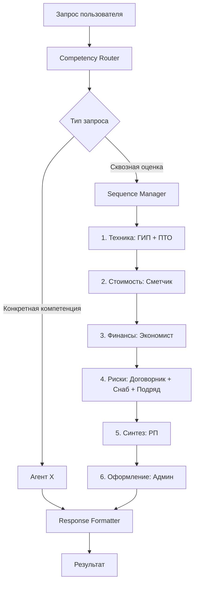
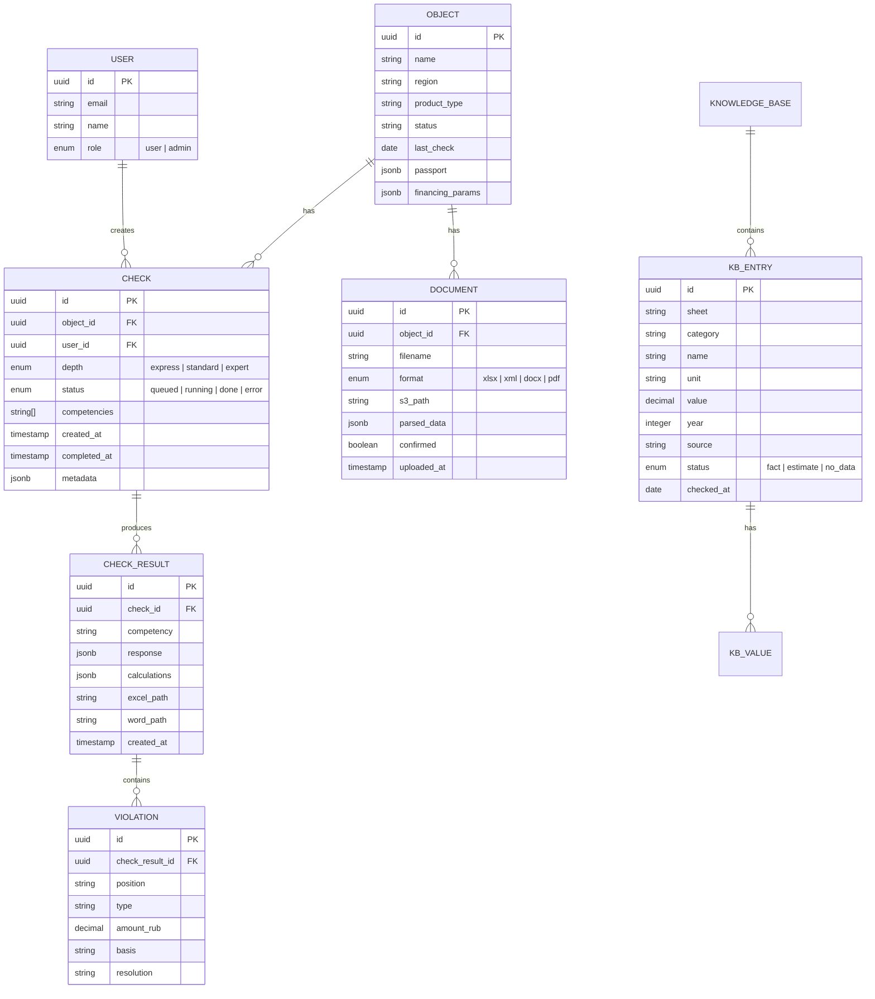

# Модульная архитектура «СтройИнтеллект (Девелопмент)»

> **Для:** ПАО «АПРИ»  
> **Исполнитель:** ООО «7 Красных Линий»  
> **Дата:** 05.08.2026  
> **Основание:** ТЗ от 03.08.2026 + анализ легаси-системы (reference-system)

---

## 1. Анализ легаси-системы

### 1.1 Что есть сейчас

Текущий «СтройИнтеллект» — это **9 ИИ-ассистентов**, работающих как промпты в Claude. Каждый агент — отдельный файл системной инструкции (`.txt`, 50–80 КБ) с привязанной «опорной базой» в Excel (`.xlsx`). Существует также система «скиллов» (`.skill` = zip-архивы с markdown-файлами, скриптами и шаблонами).

```
┌─────────────────────────────────────────────────────────┐
│                    LEGACY ARCHITECTURE                   │
│                                                         │
│  ┌──────────┐   ┌──────────┐   ┌──────────┐            │
│  │Артемий/РП│   │Денчик/ГИП│   │Людмила/  │  ...×9     │
│  │  .txt    │   │  .txt    │   │Сметчик   │            │
│  │  .xlsx   │   │  .xlsx   │   │  .txt    │            │
│  └────┬─────┘   └────┬─────┘   └──┬───────┘            │
│       │              │            │                      │
│       ▼              ▼            ▼                      │
│  ┌──────────────────────────────────────────────┐       │
│  │      Claude (ручной конвейер агентов)        │       │
│  │  Пользователь вручную передаёт документы     │       │
│  │  от агента к агенту (Такты 0→4)              │       │
│  └──────────┬───────────────────────────────────┘       │
│             │                                            │
│             ▼                                            │
│  ┌──────────────────────────────────────────────┐       │
│  │  Выход: Word-записка + Excel-аналитика       │       │
│  │  (ручная генерация через скрипты)            │       │
│  └──────────────────────────────────────────────┘       │
└─────────────────────────────────────────────────────────┘
```

### 1.2 Девять компетенций (агентов)

| # | Агент | Роль | Вход | Выход |
|---|-------|------|------|-------|
| 1 | **Артемий** (РП) | Маршрутизация, синтез, вердикт 🟢🟡🔴 | Задача + документы | Маршрут, итоговое заключение |
| 2 | **Денчик** (ГИП) | Инженерный анализ, нормативы, физика | ТЗ, РД, чертежи | Инж. заключение, ВОР с геометрией |
| 3 | **Людмила** (Сметчик) | Смета, ВОР, КС-2, конъюнктура | ВОР от Денчика + ЛСР | Разбор сметы, дельта по позициям |
| 4 | **Марина** (Снаб) | Закупки, лид-таймы, поставщики | Спецификация + потолки | Лид-тайм карта, 3 КП по ТОП-5 |
| 5 | **Халиль** (Подряд) | Скоринг субподрядчиков, тендер | ТТ + потолки от Ваныча | Ведомость распределения, скоринг |
| 6 | **Палыч** (ПТО) | Исполнительная документация | Описание объекта + работы | Чеклист ИД, статус, нарушения |
| 7 | **Виктор** (Договорник) | Аудит договора, юр. риски | Проект договора | Реестр рисков с суммами |
| 8 | **Ваныч** (Экономист) | Финмодель, БДДС, маржа, 3 сценария | ВОР + условия контракта | Финмодель, кассовый разрыв, потолки |
| 9 | **Настенька** (Админ) | Паспорт, КСГ, координация | Результаты всех агентов | Сводный протокол, дашборд |

### 1.3 Ключевые паттерны легаси, которые надо сохранить

1. **Документный конвейер (Такты 0→4):** строгая последовательность — Денчик → Людмила → Ваныч → Марина/Халиль → Артемий. Нарушение порядка = системная ошибка.
2. **Правило «физика до денег»:** Ваныч не считает без ВОР от Людмилы, Людмила не считает без ВОР от Денчика.
3. **Четыре запрета:** «в работе» без даты, «уточнить» как итог, ответ без рекомендации, цифра без источника.
4. **Маркировка источников:** ✅ ФАКТ / ⚠ ПРЕДПОЛОЖЕНИЕ / ❌ НЕИЗВЕСТНОЕ на каждой цифре.
5. **Опорная база:** Excel с обязательными полями: значение, единица, год, источник, статус, дата проверки. Срок годности = 90 дней.
6. **Три режима глубины:** экспресс / стандарт / эксперт.
7. **Кейс-база уроков** (Каранайаул, Школа №19, ЧТЗ) — автоматические проверки по триггерам.
8. **Вариативность конфигурации:** под разных заказчиков создаются специализированные версии промптов (АПРИ/девелопмент, МОДЦ/генподряд, Унихим/промка, УСС/сети).

### 1.4 Критические проблемы легаси

| Проблема | Влияние |
|----------|---------|
| Ручной конвейер: человек передаёт данные между агентами | Скорость, ошибки, потеря контекста |
| Нет UI — всё в чате Claude | Нет истории, нет очереди, нет совместной работы |
| Расчёты делает LLM | Погрешности, нет сходимости «до копейки» |
| Опорная база = файл в проекте Claude | Нет версионирования, аудита, обновления |
| Нет разграничения доступа | Невозможна командная работа |
| PDF-парсинг через pdftotext + regex | Хрупкий, требует ручной правки |

---

## 2. Требования ТЗ (Приложение №1 к КП АПРИ)

### 2.1 Ключевые требования

| Раздел ТЗ | Требование | Архитектурное следствие |
|-----------|-----------|----------------------|
| §2 | Финансово-технический контроль на стороне застройщика | Домен — девелопмент, не генподряд |
| §5.1 | 9 компетенций, последовательность: технич. → стоимость → финансы → риски → вывод | Оркестратор агентов |
| §5.2 | Сквозная оценка бюджета по всем компетенциям | Cross-cutting analysis pipeline |
| §5.3 | 3 режима: экспресс (≤60с), стандарт (≤5мин), эксперт (≤15мин) | Configurable depth parameter |
| §5.4 | 5 экранов: реестр → карточка → загрузка → рабочий → журнал | Web SPA |
| §5.5 | Асинхронное выполнение, очередь, уведомления | Task queue + WebSocket |
| §6.1 | Инфраструктура исполнителя, серверы в РФ | Cloud/VPS в РФ |
| **§6.2** | **Числа считает расчётный модуль, не LLM** | **Calculation Engine** |
| §6.3 | Смена LLM-провайдера без изменения кода | LLM Adapter pattern |
| §6.4 | Эталонные образцы в контексте ИИ | Few-shot examples в промптах |
| §7 | Опорная база в Excel с обязательными полями | Knowledge Base Service |
| §8 | Форматы: Excel, ГРАНД-Смета XML, Word, PDF с текстом | Document Ingest Pipeline |
| §8.1 | Коммерческая тайна, анонимизация перед LLM | Data sanitization layer |
| §9 | Маркировка источников, статус нормативов | Провенанс-метаданные |
| §10 | Выгрузки: Excel (формулы), Word (записка), реестр нарушений | Report Generation |
| §11 | SLA: 99% доступность, журнал 12 мес | Monitoring + audit log |
| §12 | Приёмка: ≥95% позиций, 0₽ расхождение, ≥70% нарушений, ≥80% чек-листа | Quality gates в pipeline |
| §14 | Вне объёма: АРПС, PDF-сканы, >2 ролей, портфель, интеграции | Модульность для будущего расширения |

### 2.2 Перечень расчётов (§6.2) — что делает Calculation Engine

```
1. Сходимость: сумма разделов vs итог источника (расхождение в ₽)
2. Позиция сметы: объём × цена, суммы по разделам, итог
3. Отклонение: цена подрядчика vs опорная база (на ед. и на объём)
4. Себестоимость: по элементам + ₽/м², сравнение с опорной базой
5. Проценты по проектному кредиту + график выборки
6. БДДС помесячный, дата и сумма первого кассового разрыва
7. 3 сценария маржи
8. Крайний срок заказа (от даты ввода − срок поставки)
9. Обратный расчёт срока: дни = объём ÷ (выработка × численность)
10. Пеня: ₽/день от ключевой ставки
```

---

## 3. Предлагаемая модульная архитектура

### 3.1 Обзор модулей

```
┌─────────────────────────────────────────────────────────────────────────┐
│                         WEB FRONTEND (SPA)                              │
│  Реестр объектов │ Карточка │ Загрузка/Разбор │ Рабочий │ Журнал       │
└────────┬────────────────────────────────────────────────────────────────┘
         │ REST + WebSocket
         ▼
┌─────────────────────────────────────────────────────────────────────────┐
│                         GATEWAY API (BFF)                               │
│  Auth │ Rate Limit │ Request Router │ WS Hub │ Audit Logger            │
└────┬──────────┬──────────┬──────────┬──────────┬───────────────────────┘
     │          │          │          │          │
     ▼          ▼          ▼          ▼          ▼
┌─────────┐ ┌─────────┐ ┌─────────┐ ┌─────────┐ ┌─────────────────────┐
│DOCUMENT │ │ CALC    │ │KNOWLEDGE│ │   AI    │ │   TASK QUEUE +      │
│ INGEST  │ │ ENGINE  │ │  BASE   │ │ AGENT   │ │   ASYNC ENGINE      │
│PIPELINE │ │         │ │ SERVICE │ │ORCHESTR.│ │                     │
│         │ │         │ │         │ │         │ │  ┌───────────────┐  │
│ Upload  │ │ 10 расч.│ │ CRUD    │ │ 9 комп. │ │  │  Job Runner   │  │
│ Extract │ │ формул  │ │ Search  │ │ Routing │ │  │  Status Track │  │
│ Validate│ │ Scenario│ │ Version │ │ Context │ │  │  Retry        │  │
│ Preview │ │ БДДС    │ │ Expire  │ │ Compose │ │  │  Notify (WS)  │  │
│ Sanitize│ │ Margin  │ │ Import  │ │ LLM Adpt│ │  └───────────────┘  │
└────┬────┘ └────┬────┘ └────┬────┘ └────┬────┘ └────────┬────────────┘
     │          │          │          │                   │
     └──────────┴──────────┴──────────┴───────────────────┘
                           │
                    ┌──────┴──────┐
                    │  STORAGE    │
                    │             │
                    │ PostgreSQL  │
                    │ S3 (docs)   │
                    │ Redis       │
                    └─────────────┘
```

### 3.2 Модуль 1: Gateway API (BFF)

**Назначение:** Единая точка входа, маршрутизация, аутентификация, аудит.

```
gateway-api/
├── auth/               # JWT + 2 роли (пользователь, администратор)
│   ├── middleware.ts
│   └── roles.ts
├── routes/
│   ├── objects.ts       # CRUD объектов (экран 1, 2)
│   ├── documents.ts     # Загрузка документов (экран 3)
│   ├── checks.ts        # Запуск/результаты проверок (экран 4)
│   ├── journal.ts       # Журнал операций (экран 5)
│   └── admin.ts         # Управление опорной базой
├── websocket/
│   ├── hub.ts           # WS-хаб для уведомлений
│   └── channels.ts      # Каналы: check.{id}.status, check.{id}.result
├── audit/
│   └── logger.ts        # Журнал: пользователь, дата, документ, результат
└── config/
    └── llm-provider.ts  # Конфигурация LLM (§6.3 — без изменения кода)
```

**Ключевые решения:**
- 2 роли (§4): `user` (работа с объектами) и `admin` (журнал + загрузка опорной базы)
- WebSocket для уведомлений о завершении проверок (§5.5)
- Audit log с глубиной ≥12 месяцев (§11)
- Rate limiting по пользователю для защиты от перегрузки LLM

---

### 3.3 Модуль 2: Document Ingest Pipeline

**Назначение:** Приём, разбор, валидация и предпросмотр входных документов.

```
document-ingest/
├── upload/
│   ├── handler.ts         # Приём файлов (§8)
│   └── storage.ts         # Сохранение в S3
├── parsers/
│   ├── excel-parser.ts    # .xlsx / .xls → позиции сметы
│   ├── xml-parser.ts      # ГРАНД-Смета (XML) → позиции
│   ├── word-parser.ts     # .docx → таблицы + текст (договоры)
│   └── pdf-parser.ts      # PDF с текстовым слоем → текст для LLM
├── extractors/
│   ├── estimate-extractor.ts    # Извлечение позиций сметы
│   ├── vor-extractor.ts         # Извлечение ВОР
│   └── contract-extractor.ts    # Извлечение условий договора
├── validators/
│   ├── sum-checker.ts     # Сверка суммы позиций с итогом (§12.1б)
│   └── completeness.ts    # Пометка неполных позиций
├── sanitizer/
│   ├── pii-remover.ts     # Удаление/обезличивание ПД (§8.1)
│   └── anonymizer.ts      # Замена наименований на ID перед LLM (§8.1)
└── preview/
    └── preview-api.ts     # Предпросмотр + ручная правка (экран 3)
```

**Форматы на входе (§8):**

| Формат | Обработка |
|--------|-----------|
| Excel (.xlsx, .xls) | Структурный разбор: позиции, разделы, итоги |
| ГРАНД-Смета (XML) | Разбор по XML-схеме формата |
| Word (.docx) | Извлечение таблиц и текста договоров |
| PDF с текстовым слоем | Текст для передачи LLM (без структурного разбора) |

> [!IMPORTANT]
> Форматы АРПС и OCR PDF-сканов **вне объёма** (§14). Архитектура позволяет добавить парсер позднее без изменения остальных модулей.

---

### 3.4 Модуль 3: Calculation Engine

**Назначение:** Все числовые расчёты. LLM не считает — только интерпретирует (§6.2).

```
calc-engine/
├── core/
│   ├── convergence.ts       # 1. Сходимость: Σ разделов vs итог
│   ├── estimate-calc.ts     # 2. Позиция: объём × цена, разделы, итог
│   ├── deviation.ts         # 3. Отклонение: подрядчик vs опорная база
│   ├── cost-per-sqm.ts      # 4. Себестоимость ₽/м² по элементам
│   ├── credit-schedule.ts   # 5. Проценты ПФ + график выборки
│   ├── bdds.ts              # 6. БДДС помесячный + кассовый разрыв
│   ├── margin-scenarios.ts  # 7. 3 сценария маржи
│   ├── order-deadline.ts    # 8. Крайний срок заказа
│   ├── work-duration.ts     # 9. Обратный расчёт: дни = V ÷ (W × N)
│   └── penalty.ts           # 10. Пеня ₽/день от ключевой ставки
├── params/
│   ├── nds-rate.ts          # НДС: 22% с 01.01.2026 (параметризовано)
│   ├── key-rate.ts          # Ключевая ставка ЦБ (параметризовано)
│   └── indices.ts           # Индексы Минстроя (субъект + квартал)
├── reports/
│   ├── excel-builder.ts     # Выгрузка Excel с формулами (§10)
│   ├── word-builder.ts      # Выгрузка Word-записки (§10)
│   └── violations-report.ts # Реестр нарушений Excel (§10)
└── tests/
    └── convergence.test.ts  # Тесты на сходимость ≤ 1₽
```

> [!IMPORTANT]
> **Принцип §6.2:** Ставка НДС и ключевая ставка задаются параметром с датой начала действия. Единственное значение в коде не зашивается.

**Выгрузки (§10):**

| Документ | Содержание |
|----------|-----------|
| Excel | Рабочие формулы, лист параметров, входные значения выделены цветом |
| Word | Паспорт объекта, разделы по компетенциям, сводный вывод |
| Реестр нарушений (Excel) | Позиция, характер, сумма, основание, путь урегулирования |

---

### 3.5 Модуль 4: Knowledge Base Service

**Назначение:** Хранение и доступ к опорной базе, нормативам, эталонным образцам.

```
knowledge-base/
├── storage/
│   ├── reference-data.ts     # CRUD опорной базы (§7)
│   ├── norms-registry.ts     # Нормативы со статусами (действует/отменён)
│   └── exemplars.ts          # Эталонные образцы (§6.4)
├── import/
│   ├── excel-importer.ts     # Импорт опорной базы из Excel
│   └── validator.ts          # Проверка обязательных полей
├── search/
│   ├── match-position.ts     # Сопоставление позиции сметы со справочником
│   └── find-norm.ts          # Поиск норматива по коду/наименованию
├── freshness/
│   └── expiry-checker.ts     # Пометка значений старше 90 дней (§7)
└── api/
    └── kb-api.ts             # Internal API для других модулей
```

**Структура опорной базы (§7) — 13 листов:**

| # | Лист | Содержание |
|---|------|-----------|
| 01 | Стоимость СМР | Расценки по видам работ: земля, фундаменты, стены, кровля, отделка |
| 02 | Стоимость материалов | Цены по категориям: бетон, металл, кирпич, утеплитель |
| 03 | Оборудование | Лифты, витражи, ИТП, вентиляция: цены + сроки поставки |
| 04 | Себестоимость ₽/м² | Сравнительные значения по типам продукта и регионам |
| 05 | Параметры финансирования | Ставки ПФ, аванс, ГУ, эскроу |
| 06 | Ставки труда | Оклады по специальностям и регионам |
| 07 | Нормативы выработки | Человеко-часы на единицу |
| 08 | Алгоритмы | Формулы расчёта |
| 09 | Нормативная база | Документ, редакция, статус |
| 10 | Реестр объектов | Происхождение значений: объект, регион, год |
| 11 | Уроки | Зафиксированные ошибки прошлых расчётов |
| 12 | Сверка расчёта с фактом | Плановое vs фактическое |
| 13 | Подрядчики | Сведения о подрядчиках из документов Заказчика |

**Обязательные поля каждого значения:** значение · единица · год · источник · статус (факт / ориентир / нет данных) · дата проверки.

---

### 3.6 Модуль 5: AI Agent Orchestrator

**Назначение:** Оркестрация 9 компетенций, управление контекстом, адаптер LLM.

```
ai-orchestrator/
├── agents/
│   ├── agent-definitions/
│   │   ├── rp.prompt.md          # Артемий (РП) — маршрутизация, синтез
│   │   ├── gip.prompt.md         # Денчик (ГИП) — инженерный анализ
│   │   ├── estimator.prompt.md   # Людмила (Сметчик) — сметный анализ
│   │   ├── supply.prompt.md      # Марина (Снаб) — закупки
│   │   ├── subcontract.prompt.md # Халиль (Подряд) — субподряд
│   │   ├── pto.prompt.md         # Палыч (ПТО) — ИД
│   │   ├── legal.prompt.md       # Виктор (Договорник) — юридика
│   │   ├── economist.prompt.md   # Ваныч (Экономист) — финмодель
│   │   └── admin.prompt.md       # Настенька (Админ) — координация
│   └── agent-runner.ts           # Запуск агента с контекстом
├── routing/
│   ├── competency-router.ts      # Определение релевантных компетенций
│   ├── sequence-manager.ts       # Порядок: техника → стоимость → финансы
│   └── cross-check.ts            # Сквозная оценка бюджета (§5.2)
├── context/
│   ├── context-builder.ts        # Сборка контекста: документы + опорная база
│   ├── exemplar-injector.ts      # Вставка эталонных образцов (§6.4)
│   ├── depth-config.ts           # Настройка глубины (экспресс/стандарт/эксперт)
│   └── cache-manager.ts          # Кэширование неизменной части (§6.3)
├── llm/
│   ├── adapter.ts                # Абстракция LLM-провайдера (§6.3)
│   ├── providers/
│   │   ├── anthropic.ts          # Claude
│   │   ├── openai.ts             # GPT (резерв)
│   │   └── yandex-gpt.ts        # YandexGPT (резерв, РФ)
│   └── token-counter.ts         # Учёт токенов и стоимости
├── response/
│   ├── formatter.ts              # Форматирование ответа по §9
│   ├── source-marker.ts          # Маркировка: ✅/⚠/❌ (§9)
│   ├── norm-status-checker.ts    # Проверка статуса норматива (§9)
│   └── divergence-detector.ts    # Выявление расхождений между компетенциями
└── prompts/
    └── system-instruction.md     # Версионируемая инструкция (§6.3)
```

**Поток оркестрации (на основе легаси-тактов):**



> [!IMPORTANT]
> **§6.3:** Системная инструкция хранится в файле с контролем версий и может изменяться без пересборки Системы. Промпты хранятся как `.md`-файлы в репозитории, а не зашиты в код.

---

### 3.7 Модуль 6: Task Queue + Async Engine

**Назначение:** Асинхронное выполнение проверок (§5.5).

```
task-queue/
├── queue/
│   ├── job-producer.ts      # Постановка задачи в очередь
│   ├── job-consumer.ts      # Исполнение задачи
│   └── job-status.ts        # Статусы: в очереди → выполняется → завершена → ошибка
├── runner/
│   ├── check-runner.ts      # Оркестрация полной проверки
│   ├── retry-policy.ts      # Повторный запуск при ошибке
│   └── timeout-manager.ts   # SLA по режимам (60с / 5мин / 15мин)
├── notifications/
│   ├── ws-notifier.ts       # Уведомление через WebSocket
│   └── status-broadcaster.ts # Трансляция смены статуса
└── storage/
    └── result-store.ts      # Сохранение результатов в карточке объекта
```

**Жизненный цикл проверки:**

```
Пользователь                  Система
    │                           │
    ├──► Запуск проверки ──────►│
    │    (режим + компетенция)  │
    │                           ├──► Job → Queue
    │◄── Статус: "в очереди" ──┤
    │                           │
    │    (переходит к другому)  ├──► Consumer берёт Job
    │                           ├──► Статус: "выполняется"
    │◄── WS: статус обновлён ──┤
    │                           │
    │                           ├──► Calc Engine + AI Orchestrator
    │                           ├──► Статус: "завершена"
    │◄── WS: проверка готова ──┤
    │                           │
    ├──► Просмотр результата ──►│
    │◄── Результат + выгрузки ─┤
```

---

### 3.8 Модуль 7: Web Frontend (SPA)

**Назначение:** 5 экранов (§5.4) + асинхронная очередь.

```
web-frontend/
├── pages/
│   ├── ObjectList/           # Экран 1: Реестр объектов
│   │   ├── ObjectList.tsx
│   │   └── ObjectCard.tsx    # Статус, дата проверки, сводный вывод
│   ├── ObjectDetail/         # Экран 2: Карточка объекта
│   │   ├── Passport.tsx      # Паспорт, тип, регион, ПФ
│   │   ├── Documents.tsx     # Загруженные документы
│   │   └── CheckHistory.tsx  # История проверок
│   ├── Upload/               # Экран 3: Загрузка и разбор
│   │   ├── DropZone.tsx
│   │   ├── Preview.tsx       # Предпросмотр извлечённых позиций
│   │   ├── ManualEdit.tsx    # Ручная правка строк
│   │   └── SumCheck.tsx      # Сверка суммы с итогом
│   ├── Workspace/            # Экран 4: Рабочий экран
│   │   ├── CompetencySelect.tsx  # Выбор компетенции
│   │   ├── FreeQuery.tsx         # Свободный запрос
│   │   ├── DepthSelector.tsx     # Режим: экспресс/стандарт/эксперт
│   │   ├── ResultView.tsx        # Ответ системы
│   │   └── ExportPanel.tsx       # Выгрузка Excel/Word
│   └── Journal/              # Экран 5: Журнал (только администратор)
│       ├── AuditLog.tsx
│       └── Filters.tsx
├── components/
│   ├── QueuePanel.tsx        # Очередь проверок пользователя
│   ├── Notification.tsx      # Уведомления о завершении
│   └── SourceBadge.tsx       # Маркер: ✅ ⚠ ❌
└── services/
    ├── api.ts                # REST-клиент
    └── ws.ts                 # WebSocket-клиент
```

---

## 4. Стек технологий

| Слой | Технология | Обоснование |
|------|-----------|-------------|
| Frontend | React + TypeScript | Зрелая экосистема, SPA с WS |
| Backend / API | Node.js (Fastify) или Python (FastAPI) | Быстрый IO, хорошая поддержка WS |
| Task Queue | BullMQ (Redis) | Лёгкая очередь, retry, приоритеты |
| Database | PostgreSQL | Реляционные данные + JSONB для гибкости |
| File Storage | S3-совместимый (MinIO / Yandex Object Storage) | Документы, выгрузки |
| Cache | Redis | Сессии, кэш LLM-контекста, очередь |
| LLM Provider | Anthropic API (Claude) → сменяемый | §6.3 — адаптер |
| Document Processing | SheetJS (xlsx), docx4js, pdf-parse | Парсинг без внешних зависимостей |
| Excel Generation | ExcelJS / openpyxl | Формулы, стили, листы |
| Word Generation | docx (npm) | Структурированные отчёты |
| Инфраструктура | Docker Compose → K8s | Серверы в РФ (§6.1) |
| Мониторинг | Prometheus + Grafana | SLA 99% (§11) |

---

## 5. Модель данных

### 5.1 Основные сущности



---

## 6. Потоки обработки

### 6.1 Основной поток: проверка объекта

```
1. Пользователь создаёт объект → заполняет паспорт (Экран 2)
2. Загружает документы (Экран 3):
   a. Система разбирает файл → извлекает позиции
   b. Предпросмотр → пользователь правит ошибки
   c. Сверка суммы → подтверждение
3. Запускает проверку (Экран 4):
   a. Выбирает компетенцию (или «сквозная оценка»)
   b. Выбирает режим (экспресс / стандарт / эксперт)
   c. Task Queue создаёт Job
4. Async Engine выполняет:
   a. Calc Engine считает числа (сходимость, отклонения, БДДС, маржу)
   b. AI Orchestrator формирует выводы (классификация, риски, рекомендации)
   c. Report Generator готовит Excel + Word
5. Уведомление → пользователь видит результат (Экран 4)
6. Журнал фиксирует операцию (Экран 5)
```

### 6.2 Разделение ответственности: Calc Engine vs AI Orchestrator

```
┌──────────────────────────────────┬──────────────────────────────────────┐
│       CALCULATION ENGINE         │         AI ORCHESTRATOR              │
│       (детерминированный)        │         (интерпретация)              │
├──────────────────────────────────┼──────────────────────────────────────┤
│ Σ разделов = итог ± 0₽          │ Классификация расхождения            │
│ Объём × цена = сумма             │ Сопоставление со справочником        │
│ Подрядчик − опорная база = Δ₽   │ Оценка существенности               │
│ Себестоимость ₽/м²              │ Выявление рисков в договоре          │
│ БДДС, кассовый разрыв           │ Формулирование выводов               │
│ 3 сценария маржи                │ Рекомендации с вариантами            │
│ Пеня = ₽/день                   │ SWOT, примортем, матрица решений     │
│ Крайний срок заказа             │ Синтез по компетенциям               │
└──────────────────────────────────┴──────────────────────────────────────┘
```

---

## 7. Маппинг требований ТЗ на модули

| Раздел ТЗ | Требование | Модуль |
|-----------|-----------|--------|
| §5.1 | 9 компетенций | AI Agent Orchestrator |
| §5.2 | Сквозная оценка бюджета | AI Orchestrator → Sequence Manager |
| §5.3 | 3 режима глубины | AI Orchestrator → Depth Config |
| §5.4 | 5 экранов | Web Frontend |
| §5.5 | Асинхронное выполнение | Task Queue + Async Engine |
| §6.1 | Инфраструктура в РФ | Docker / K8s на серверах в РФ |
| §6.2 | Расчётный модуль | Calculation Engine |
| §6.3 | Смена LLM без изменения кода | AI Orchestrator → LLM Adapter |
| §6.4 | Эталонные образцы | AI Orchestrator → Exemplar Injector |
| §7 | Опорная база | Knowledge Base Service |
| §8 | Входные документы | Document Ingest Pipeline |
| §8.1 | Обработка данных (безопасность) | Document Ingest → Sanitizer |
| §9 | Требования к ответу | AI Orchestrator → Response Formatter |
| §10 | Выгрузки | Calculation Engine → Reports |
| §11 | Нефункциональные (SLA, журнал) | Gateway API → Audit + Monitoring |
| §12 | Критерии приёмки | Calc Engine тесты + QA pipeline |
| §14 | Вне объёма (расширение) | Модульная архитектура позволяет |

---

## 8. Безопасность и обработка данных (§8.1)

```
┌──────────────────────────────────────────────────────────────┐
│                    DATA FLOW                                  │
│                                                              │
│  Документ ──► Sanitizer ──► Anonymizer ──► LLM Provider     │
│               │               │                               │
│               ├─ ПД удалены   ├─ Названия → ID              │
│               │               │                               │
│               ▼               ▼                               │
│  Calc Engine (полные данные, не уходят к LLM)                │
│  PostgreSQL (зашифрованное хранение, серверы в РФ)           │
│  S3 (документы, серверы в РФ)                                │
│                                                              │
│  Журнал: пользователь + дата + документ + результат          │
│  Данные для обучения LLM: отключено (§8.1)                   │
└──────────────────────────────────────────────────────────────┘
```

---

## 9. План реализации (3 этапа × 30 дней)

### Этап 1 (дни 1–30): Ядро + ИИ-инженер

| Неделя | Работы | Результат |
|--------|--------|-----------|
| 1–2 | Gateway API + Auth + DB schema, Knowledge Base import, наполнение опорной базы | Инфраструктура, опорная база загружена |
| 2–3 | AI Orchestrator: 9 промптов, LLM-адаптер, контекст, эталонные образцы | ИИ-инженер отвечает по 9 компетенциям |
| 3–4 | Depth config, response formatter, маркировка источников, чек-лист качества | Три режима глубины, качество ответа |

**Результат этапа 1:** ИИ-инженер формирует ответы по 9 компетенциям через API. Чек-лист качества согласован.

### Этап 2 (дни 31–60): Расчётный модуль + документы

| Неделя | Работы | Результат |
|--------|--------|-----------|
| 5–6 | Document Ingest Pipeline (Excel + XML + Word + PDF парсеры), preview API | Загрузка и разбор документов |
| 6–7 | Calculation Engine (10 расчётов), тесты на сходимость | Числа считаются детерминированно |
| 7–8 | Report Generation (Excel + Word + реестр нарушений), интеграция Calc + AI | Полный цикл проверки |

**Результат этапа 2:** Расчётный модуль. На реальной смете — реестр расхождений, себестоимость ₽/м², финмодель.

### Этап 3 (дни 61–90): UI + приёмка

| Неделя | Работы | Результат |
|--------|--------|-----------|
| 9–10 | Web Frontend: 5 экранов, WS-уведомления, очередь | Рабочий интерфейс |
| 10–11 | Task Queue + Async Engine, SLA по режимам | Асинхронное выполнение |
| 11–12 | Приёмка на контрольном наборе (2 объекта), обучение пользователей | Система принята по §12 |

**Результат этапа 3:** Система принята, пользователи обучены.

---

## 10. Принципы модульности для будущего расширения

Архитектура спроектирована так, чтобы **вне объёма** (§14) позиции подключались без изменения ядра:

| Будущая функция | Как подключается |
|----------------|-----------------|
| Редактирование опорной базы через UI | Новый экран → Knowledge Base API (уже есть) |
| АРПС-формат | Новый парсер в Document Ingest |
| OCR PDF-сканов | Новый парсер + OCR-сервис (Tesseract / Yandex Vision) |
| Специализированные экраны (КС-2/КС-3, лид-таймы, подрядчики) | Новые компоненты Frontend + endpoints API |
| >2 ролей, права по объектам | Расширение Auth middleware |
| Портфельный режим | Новый Sequence Manager + агрегирующий Dashboard |
| Интеграции (1С, BIM) | Integration Adapters через Gateway API |
| Автопополнение базы из закрытых документов | Pipeline Ingest → Knowledge Base (новый канал) |

---

## 11. Ключевые архитектурные решения

| Решение | Обоснование |
|---------|-------------|
| **Calc Engine отдельно от LLM** | §6.2 ТЗ: числа считает модуль, не модель. Сходимость 0₽ невозможна с LLM |
| **Промпты как файлы, не код** | §6.3 ТЗ: изменение без пересборки. Git-версионирование промптов |
| **LLM Adapter** | §6.3 ТЗ: смена провайдера конфигурацией. Завтра — YandexGPT, послезавтра — GigaChat |
| **Task Queue** | §5.5 ТЗ: асинхронность обязательна. Expert = до 15 мин |
| **Опорная база в DB, не в Excel** | Excel = формат ввода/вывода. В runtime — PostgreSQL с JSONB |
| **Санитизация перед LLM** | §8.1 ТЗ: коммерческая тайна, ПД, анонимизация |
| **Модульные парсеры** | §14 ТЗ: АРПС и OCR вне объёма, но архитектура готова |
| **9 промптов = 9 компетенций, не 9 вызовов** | Для экспресс-режима (60с) может быть 1 вызов с нужными компетенциями в контексте |
