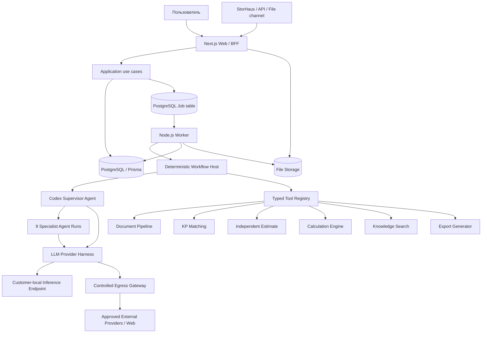

# СтройИнтеллект: модульная агентная архитектура v3

## 1. Статус и назначение

Этот документ является новым архитектурным baseline системы «СтройИнтеллект».

Он заменяет архитектуру `docs/architecture_optimal2.md` и оба дерева старых
спецификаций: `docs/specs-v2/` и `docs/specs/`, созданные по ТЗ от 03.08.2026.
Детали старых документов можно использовать только как явно выбранный
engineering reference. Они не определяют актуальный scope, runtime, deployment
или агентную топологию.

Архитектура основана на:

1. актуальном ТЗ АПРИ от 11.08.2026;
2. актуальном КП АПРИ от 11.08.2026;
3. решениях владельца, принятых 14.08.2026;
4. повторном анализе `reference-system` и `reference-system-new`;
5. полезных controls из `docs/specs/` и `docs/specs-v2/`;
6. архитектурных практиках проекта `/home/govard/projects/7rl/domovey`;
7. актуальных контрактных возможностях Next.js, Prisma ORM и Codex SDK.

Документ фиксирует целевую архитектуру, но не пытается заранее специфицировать
каждый будущий формат, интеграцию или агент. Новая функциональность должна
подключаться через стабильные контракты и registries, а не через форки ядра.

## 2. Иерархия источников

При конфликте применяется следующий порядок:

1. `product/11_08_26_ТЗ_СтройИнтеллект_Приложение_1_к_КП_АПРИ_v3.docx`;
2. `product/11_08_26_КП_СтройИнтеллект_АПРИ_v3.docx`;
3. явные решения владельца продукта;
4. продуктовые документы в `product/droid-gpt56/` и `product/opencode-gpt56/`;
5. `reference-system-new` как актуальный доменный и UX reference;
6. `reference-system` как legacy baseline и regression corpus;
7. старые архитектурные документы как источник отдельных controls;
8. презентационные материалы как reference, но не как системный контракт.

Нижестоящий источник не может молча расширить договорный scope или ослабить
требования к безопасности, воспроизводимости и приёмке.

### 2.1 Coverage актуального ТЗ

Архитектурное покрытие разделов ТЗ от 11.08.2026:

| Раздел ТЗ | Область | Разделы архитектуры |
|---|---|---|
| 1-3 | Термины, назначение, граница Проверки | 4, 11-13 |
| 4 | Пользователи и роли | 10.3, 23.3, 25 |
| 5.1 | Девять функциональных агентов | 14, 27.2 |
| 5.2 | Несколько КП и независимая оценка | 13, 18 |
| 5.3-5.6 | Режимы, шесть экранов, очередь | 13.1, 21, 25, 27.3 |
| 6 | On-prem, модели, расчётный модуль | 6, 15-16, 31 |
| 7 | Опорная база из 14 разделов | 19, 20 |
| 8 | Форматы и интеграционные каналы | 17, 22 |
| 8.3 | Внутренний и внешний контуры | 23 |
| 9-10 | Контракт результата и выгрузки | 13.1, 26 |
| 11 | Производительность, доступность, журнал | 21, 24, 31 |
| 12 | Приёмка | 27 |
| 13 | Четыре этапа, 135 дней | 33 |
| 14 | Ограничения scope | 17, 25, 30 |
| 15 | Входы и обязанности Заказчика | 32, 33 |
| 16 | Гарантия и права использования | 28, 30, 31 |

Ведётся machine-readable requirement manifest по пути из frontmatter. Текущий
слой фиксирует section-level coverage, source hash, решение и архитектурные
ссылки. До implementation он дополняется literal paragraph/table-cell anchors,
hashes и acceptance evidence. 100% literal requirements должны иметь
disposition. Старые controls применяются только через явный allowlist со ссылкой
на актуальное требование или ADR.

## 3. Принятые архитектурные решения

| ID | Решение |
|---|---|
| `ADR-V3-001` | Основная единица продукта — Проверка объекта, а не чат или отдельный LLM-вызов. |
| `ADR-V3-002` | Runtime строится вокруг Codex SDK и управляемых агентных threads. **ИЗМЕНЕНО 07.09.2026 — см. поправку ниже.** |
| `ADR-V3-003` | Один клиент получает одну изолированную инсталляцию на своём VPS/сервере. Для АПРИ инсталляция находится в контуре Заказчика. |
| `ADR-V3-004` | 7КЛ поддерживает отдельную инсталляцию для демо, гостевого доступа и выполнения демонстрационных расчётов. |
| `ADR-V3-005` | Application Compose не содержит model-serving control plane. Model endpoints подключаются конфигурацией. Для АПРИ отдельный inference-узел обязателен по ТЗ, но его provisioning и эксплуатация по решению владельца не входят в ответственность команды приложения и должны быть закреплены за Заказчиком или отдельным подрядчиком в протоколе этапа 1/change request. |
| `ADR-V3-006` | У объекта есть постоянная версионированная память, но каждая Проверка получает новый resumable Codex thread. **ИЗМЕНЕНО 07.09.2026 — см. поправку ниже.** |
| `ADR-V3-007` | Host задаёт обязательный workflow и quality gates; агент-супервизор управляет разрешёнными исследовательскими ветвями. |
| `ADR-V3-008` | Девять договорных агентов являются отдельными функциональными контрактами и agent runs, но не микросервисами. |
| `ADR-V3-009` | Внешний интернет доступен только через fail-closed egress policy, маскирование, лимиты и аудит. |
| `ADR-V3-010` | Независимая оценка сочетает правила, статистику и retrieval аналогов. LLM сопоставляет и объясняет, но не является источником итоговой арифметики. |
| `ADR-V3-011` | Архитектурный стиль — модульный монолит с отдельными web и worker entrypoints. |
| `ADR-V3-012` | Web/BFF реализуется на Next.js; многочасовые агентные задачи выполняются отдельным Node.js worker. |
| `ADR-V3-013` | PostgreSQL — основное хранилище и инфраструктурная основа очереди. Prisma ORM — основной доступ к данным и управление схемой. |
| `ADR-V3-014` | Первая поставка разворачивается через Docker Compose без Kubernetes, Kafka, Redis и отдельного service mesh. |
| `ADR-V3-015` | Обновления поставляются подписанным release bundle; production не зависит от доступности центрального сервера 7КЛ. |
| `ADR-V3-016` | Изменяемые политики, agents, workflows, mappings и templates версионируются как config bundles; системные инварианты остаются типизированным кодом. |

### Поправка к `ADR-V3-002` и `ADR-V3-006` — 7 сентября 2026 (вторая редакция)

**Решения действуют как написаны — экипажем на Codex SDK, рядом с конвейером.**

Первая редакция этой поправки (утро 07.09.2026) объявляла: «Codex SDK не
используется, решения приведены к тому, что сделано» — и пакет был убран из
зависимостей. **Владелец отменил это в тот же день**, повторив требование,
которое называл с самого начала: система строится на агентах, образец — рабочая
система `reference-system*`, платформа — Codex SDK. Поправка переписана; прежняя
редакция оставлена в истории репозитория.

**Что сделано.** Четвёртый режим прогона `codex` (`docs/spec-demo-stage-1.md`):
`platform/codex/` — единственное место, где система знает о `@openai/codex-sdk`.
Каждая роль реестра получает **свой тред** на весь объект (ADR-V3-006 — память в
пределах Проверки, `resumeThread` для памяти между ними); роли идут **тактами
0–4 с воротами** образца, передают друг другу «БЛОК ДЛЯ [ИМЯ]», Дирижёр
принимает вход до такта 0; каждая читает рабочую папку объекта сама в песочнице
только для чтения. Провайдер — конфигурацией Codex (`wire_api = "responses"`,
единственный поддерживаемый в 0.147), из тех же переменных среды, что у
конвейера (ТЗ §6.3 сохраняется).

**Что осталось рядом, не вместо.** Конвейер ролевых промптов и собственный цикл
с инструментами (`modules/agents/agent-loop.ts`) — два прежних режима — не
тронуты ни строкой поведения. Это не осторожность, а условие сборки: правило
`[unwired]` валит её на любом механизме без вызывающего.

**Цена в прототипе — названа, решение владельца.** Путь `codex` не проходит
через egress-шлюз, обезличивание и журнал §12.1л (ADR-V3-009 к нему сегодня не
применяется): «не тратить время на обезличивание и лишние гейты безопасности,
мы строим прототип». Возврат в контур заказчика — ADR-R-020, второй этап.

## 4. Что строим

«СтройИнтеллект» — локально разворачиваемая система поддержки решений для
финансово-технического контроля строительных объектов.

Система:

- принимает и версионирует документы;
- извлекает и нормализует данные;
- требует подтверждения критичных входов человеком;
- выполняет инженерный, сметный, закупочный, финансовый, договорный и
  управленческий анализ;
- сопоставляет несколько коммерческих предложений;
- строит независимую расчётно-аналитическую оценку;
- выполняет арифметику детерминированным расчётным модулем;
- даёт агентам управляемый доступ к файлам, инструментам и разрешённым внешним
  источникам;
- сохраняет источники, формулы, версии, агентные действия и решения человека;
- формирует Excel, Word, сравнительные таблицы и реестр нарушений.

Система не является юридической заменой службы технического заказчика,
проектной экспертизы, юриста, главного бухгалтера или управленческого решения.

## 5. Принципы простоты и расширяемости

### 5.1 Простота первой версии

В первой версии используются:

- один репозиторий;
- один Next.js web process;
- один worker process с настраиваемой конкурентностью;
- один PostgreSQL;
- одно файловое хранилище через adapter;
- один reverse proxy;
- optional backup integration/reference job, активируемый протоколом инсталляции;
- внешние или локальные model endpoints, предоставленные окружением.

Не используются без доказанной необходимости:

- микросервисы;
- Kubernetes;
- Kafka;
- отдельный Redis;
- собственный model-serving control plane;
- универсальный BPM-конструктор;
- event sourcing;
- автоматическое обучение моделей;
- отдельная vector database.

### 5.2 Расширяемость через контракты

Новые возможности подключаются через versioned contracts:

- `AgentDefinition` — новый агент или компетенция;
- `WorkflowDefinition` — новый этап, шаг, gate или режим;
- `ToolDefinition` — новый инструмент агента;
- `ParserAdapter` — новый формат документа;
- `ModelProviderDefinition` — новый provider или endpoint;
- `IntegrationAdapter` — новая внешняя система;
- `ExporterAdapter` — новый формат результата;
- `DomainPack` — новый сегмент строительства;
- `CustomerPack` — настройки конкретного клиента;
- `PolicyBundle` — правила безопасности, egress и существенности;
- `EvalBundle` — regression и acceptance scenarios.

Расширяемость не означает, что всё является произвольной конфигурацией.
Транзакционные инварианты, безопасность, модель provenance, арифметика и
валидация структурированных контрактов остаются в типизированном коде.

## 6. Deployment profiles

### 6.1 Клиентская инсталляция

Одна инсталляция обслуживает одного клиента и административно принадлежит его
контуру. Для АПРИ это обязательное требование ТЗ.

```text
Customer network
├── inference-node            # обязательная зависимость APRI, отдельная зона ответственности
├── reverse-proxy
├── stroyintellect-web       # Next.js UI, BFF, Route Handlers, SSE
├── stroyintellect-worker    # Codex SDK, agents, jobs, integrations
├── postgresql
├── file-storage volume
└── optional backup integration
```

Application Compose не предполагает, что model endpoint расположен в том же
compose, и не содержит model-serving control plane. Локальный OpenAI-compatible
endpoint, другой совместимый provider или разрешённый внешний provider
подключается через конфигурацию.

Актуальное ТЗ включает отдельный inference-узел в полном решении АПРИ и установку
локальных open-weight моделей на этапе 1. Решением владельца команда приложения
не выполняет развёртывание и эксплуатацию моделей. Поэтому до начала этапа 1
протокол или change request обязан назначить provisioning, установку,
конфигурацию, monitoring и recovery inference-узла Заказчику или отдельному
подрядчику. Наличие проверенного endpoint и зафиксированных model/version/runtime
parameters является обязательным входом и gate этапа 1.

Минимальные инфраструктурные входы АПРИ до уточнения протоколом этапа 1:

- inference node: не менее 80 ГБ VRAM на один accelerator chip, 32 CPU cores,
  256 ГБ RAM и 4 ТБ NVMe;
- application/database server: не менее 16 CPU cores, 64 ГБ RAM и 2 ТБ NVMe;
- сеть между узлами: не менее 10 Гбит/с;
- Linux, container runtime, выделенные service accounts и защищённый доступ на
  период работ.

Итоговая конфигурация фиксируется протоколом после provider/model compatibility
и load tests на документах Заказчика.

Никакого скрытого fallback на облачный OpenAI быть не должно. Fallback может
использовать только providers, явно активированные в effective config и
разрешённые data policy.

### 6.2 Demo-инсталляция 7КЛ

Demo VPS использует тот же application image и те же module contracts.
Различаются только:

- customer pack;
- model provider configuration;
- guest access policy;
- quotas;
- retention;
- demo datasets;
- branding и доступные сценарии.

Demo-инсталляция не содержит клиентские документы и базы без отдельного
разрешения. Гостевые workspace изолированы, ограничены по ресурсам и имеют TTL.

### 6.3 Будущий центральный узел

Центральный узел не входит в runtime первой версии. В будущем он может быть
registry для:

- подписанных application releases;
- Prisma migrations;
- prompt и workflow bundles;
- schemas;
- policy и eval bundles;
- release manifests и compatibility metadata.

Клиентская система должна продолжать работу при недоступности registry.
Клиентские документы, расчёты и результаты не передаются в него автоматически.

## 7. Логическая архитектура



## 8. Кодовая структура

Рекомендуемая начальная структура:

```text
apps/
  web/                         # Next.js App Router
    app/
      (product)/               # 6 продуктовых экранов
      api/                     # browser/external Route Handlers
  worker/
    src/main.ts                # job claiming and agent execution

modules/
  identity/
  projects/
  documents/
  checks/
  comparison/
  estimation/
  calculations/
  agents/
  knowledge/
  integrations/
  exports/
  audit/

platform/
  config/
  db/
  storage/
  jobs/
  codex/
  model-runtime/
  egress/
  observability/
  security/

config/
  platform/
  workflows/
  agents/
  models/
  domains/
  customers/
  policies/

prisma/
  schema.prisma
  migrations/

packages/
  contracts/                   # shared versioned schemas
  test-fixtures/
```

Правила границ, адаптированные из `domovey`:

1. `apps/*` — тонкие composition roots.
2. Бизнес-поведение находится в `modules/*`.
3. Межмодульный доступ идёт через публичные typed contracts.
4. `platform/*` не содержит APRI-specific бизнес-логики.
5. Domain-код не импортирует Next.js, Prisma или Codex SDK.
6. Codex SDK импортируется только platform adapter и worker composition root.
7. Runtime circular dependencies запрещены.
8. Architecture boundaries проверяются статическим tooling в CI.

Не требуется заранее создавать одинаковый набор пустых подпапок в каждом
модуле. Структура усложняется только при появлении реальной ответственности.

## 9. Next.js как web и BFF

Next.js отвечает за:

- шесть договорных экранов;
- Server Components для чтения product state;
- Route Handlers для browser mutations и внешних API;
- authentication и session bootstrap;
- загрузку документов;
- подтверждение extracted data и mappings;
- запуск, отмену и повтор Проверок;
- SSE или polling статусов;
- скачивание выгрузок;
- административный журнал.

Next.js не выполняет внутри HTTP request:

- многочасовые Codex turns;
- parsing больших документов;
- независимую оценку;
- генерацию тяжёлых Excel/Word;
- длительный внешний поиск;
- retry loops providers.

Запрос создаёт транзакционно business state и `Job`, после чего
возвращает идентификатор операции. Worker выполняет работу независимо от HTTP
lifecycle.

Для self-hosted streaming reverse proxy должен отключать buffering на SSE route.

## 10. Prisma и PostgreSQL

### 10.1 Роль Prisma

Prisma используется как основной ORM для:

- типизированной схемы;
- domain CRUD;
- транзакций;
- migrations;
- общего доступа web и worker к PostgreSQL;
- тестовой изоляции и seed fixtures.

Один Prisma Client создаётся на process. Web и worker имеют независимые pools.
Production deployment запускает `prisma migrate deploy` отдельным одноразовым
шагом до старта web и worker.

Начальная версия использует один `schema.prisma`. Разделение schema допускается
только когда размер реально мешает навигации и ownership.

### 10.2 PostgreSQL-specific controls

Prisma migrations могут содержать reviewed SQL для возможностей, не выражаемых
Prisma schema полностью:

- Row Level Security;
- partial и composite indexes;
- append-only audit restrictions;
- advisory locks;
- `FOR UPDATE SKIP LOCKED`;
- tenant-safe composite foreign keys;
- check constraints;
- immutable migration checks.

Raw SQL разрешён только в infrastructure layer, параметризован и покрыт
integration tests.

### 10.3 Tenant isolation

Хотя customer installation обслуживает одного клиента, tenant boundary
сохраняется в schema с первого дня:

- tenant-owned записи содержат `tenantId`;
- application services всегда получают actor и tenant context;
- PostgreSQL RLS работает как второй защитный слой;
- queue payload, files, exports и audit содержат tenant scope;
- Demo VPS безопасно поддерживает несколько guest workspaces.

Production APRI installation может быть pinned к одному tenant через installation
config. Это не удаляет tenant fields и policies.

## 11. Логическая модель данных

Физическая Prisma schema должна оставаться компактной, но поддерживать следующие
агрегаты.

| Агрегат | Основные сущности |
|---|---|
| Identity | `Tenant`, `User`, `Session`, `RoleAssignment` |
| Object | `ProjectObject`, `ObjectPassport` |
| Documents | `Document`, `DocumentVersion`, `ExtractionRevision`, `Confirmation` |
| Comparison | `CommercialProposal`, `NormalizedItem`, `ItemMapping`, `ComparisonResult` |
| Knowledge | `KnowledgeEntry`, `KnowledgeVersion`, `ParameterSnapshot`, `SourceRef` |
| Checks | `Check`, `CheckSnapshot`, `WorkflowRun`, `StageRun` |
| Agents | `AgentRun`, `AgentArtifact`, `ToolInvocation`, `ModelInvocation` |
| Calculations | `FormulaVersion`, `Calculation`, `FormulaTrace`, `Scenario` |
| Decisions | `Finding`, `Recommendation`, `HumanDecision`, `OpenQuestion` |
| Operations | `Job`, `IntegrationOutboxEvent`, `IntegrationDelivery`, `Export`, `AuditEvent`, `EgressEvent` |
| Configuration | `ConfigBundle`, `PromptBundle`, `PolicyBundle`, `EvalBundle`, `ReleaseManifest` |

Это логическая модель, а не требование создать отдельную таблицу для каждого
названия. На старте близкие сущности можно объединять, если сохраняются:

- типизированный контракт;
- immutable history;
- provenance;
- tenant boundary;
- queryability;
- отсутствие неограниченного JSON-сваливания domain state.

## 12. Проверка и immutable snapshot

Проверка фиксирует:

- tenant и объект;
- цель и режим;
- версии всех входных документов;
- подтверждённые extraction revisions;
- версии mappings;
- knowledge и parameter snapshots;
- formula versions;
- workflow definition;
- agent и prompt bundle versions;
- model/provider routing policy;
- data/egress policy;
- application release;
- пользователя, создавшего Проверку.

Завершённая Проверка не изменяется после обновления документов, знаний, prompts
или models. Изменение создаёт новую Проверку, связанную с предыдущей.

`threadId` нужен для resume технически прерванного agent run, но не заменяет
канонический snapshot.

### 12.1 Продвижение результатов в память объекта

Завершённый `CheckSnapshot` остаётся неизменным. Findings, decisions и lessons
попадают в `ObjectMemoryProjection` только после human sign-off.

Каждая promotion-запись хранит:

- source Check и subject hash;
- тип и содержимое принятого факта/решения;
- reviewer и timestamp;
- effective version;
- superseded version, если она есть;
- provenance и ограничения применимости.

Новая Проверка закрепляет конкретную версию `ObjectMemoryProjection` и не читает
изменяемое live-state. Отклонённые предположения и неподтверждённые agent outputs
не становятся памятью объекта.

## 13. Сквозной workflow

Базовая последовательность:

```text
Паспорт объекта
→ Data readiness
→ Загрузка и версионирование документов
→ Извлечение и нормализация
→ Подтверждение пользователем
→ Инженерная проверка физики и объёмов
→ Смета и нарушения
→ Сопоставление нескольких КП
→ Независимая оценка
→ Детерминированные расчёты
→ Финмодель и БДДС
→ Договор / ПТО / сроки
→ Синтез вариантов
→ Human sign-off
→ Выгрузки
→ История и lessons
```

Workflow определяется versioned `WorkflowDefinition`, но host проверяет
обязательные системные инварианты:

- деньги не считаются на неподтверждённых критичных объёмах;
- сильный вердикт запрещён до required confirmations;
- несопоставимые позиции не включаются в статистику разброса;
- LLM не публикует арифметический результат без Calculation/FormulaTrace;
- неизвестное не превращается в ноль;
- внешний вызов невозможен без разрешающей policy;
- итог требует предусмотренного human sign-off.

Новый этап добавляется manifest/config, schema и tests. Новый код требуется только
если этап вводит новую бизнес-логику, tool, parser или integration.

### 13.1 Контракт режимов и результата

`ModePolicy` задаёт не только SLA, но и обязательный формат:

- `express`: до 15 строк, без таблиц, обязательны вывод, ключевая цифра и
  рекомендация;
- `standard`: полный результат, источник или FormulaTrace у каждого числа;
- `expert`: требования standard плюс не менее трёх вариантов и сравнительная
  матрица причин, последствий и порогов.

Любой итоговый `ResultContract` требует:

- рекомендацию, а не только описание;
- статус нормативного документа на дату ответа;
- явное отображение расхождений между агентами;
- владельца и срок для каждого открытого вопроса;
- статусы факта, расчёта, оценки и неизвестного;
- обязательный accuracy marker: `±10-15%` без сметы и `±3-5%` со сметой;
- ограничения применимости и required human sign-off.

Accuracy marker является обязательным договорным эвристическим признаком и не
утверждает достигнутую точность продукта. Его удаление или изменение требует
formal change request; протокол UAT отдельно фиксирует фактическую точность.

Сводный результат сквозной оценки бюджета также содержит:

- оценку соблюдения бюджета;
- базовую маржу и маржу после корректирующих мер;
- диапазон расчётной погрешности и критический порог;
- три основных риска с влиянием в рублях;
- три основные корректирующие меры с влиянием в рублях;
- условия продолжения проекта.

Диапазоны точности `±10-15%` без сметы и `±3-5%` со сметой обязательно
отображаются в оценках, интерфейсе и выгрузках как договорные эвристики, а не как
доказанная точность продукта. UAT отдельно фиксирует фактически измеренную
точность и не является условием отображения маркера.

## 14. Агентная архитектура

### 14.1 Host и supervisor

`WorkflowHost` является детерминированной частью приложения. Он:

- выбирает workflow version;
- проверяет gates;
- формирует immutable context bundle;
- запускает или возобновляет agent threads;
- ограничивает tools, network и workspace;
- валидирует structured output;
- сохраняет AgentArtifacts;
- управляет retries, fallback и human review;
- не делегирует агенту изменение канонического state без validation.

`SupervisorAgent` получает цель Проверки и разрешённый маршрут. Он может:

- выбрать применимые дополнительные проверки;
- запускать specialist agents;
- попросить перепроверить файл или источник;
- инициировать разрешённый web research;
- сравнить противоречащие outputs;
- вернуть control host при нехватке данных.

Supervisor не может:

- обходить mandatory stages;
- отключать security policy;
- самовольно менять formulas или confirmed data;
- отправлять данные во внешний контур;
- считать LLM-ответ подтверждённым фактом без provenance.

### 14.2 Девять функциональных агентов

1. Главный инженер проекта.
2. Сметчик.
3. Снабжение.
4. Специалист по поиску подрядчиков.
5. Экономист.
6. Инженер ПТО.
7. Юрист.
8. Руководитель проекта.
9. Администратор — функциональный агент сбора и структуризации данных
   (`data_coordinator_agent`); он не равен RBAC-роли `admin`.

Каждый агент определяется через `AgentDefinition`:

```yaml
id: estimator
version: 1
capability: estimate_review
input_schema: contracts/agents/estimate-review-input.v1.json
output_schema: contracts/agents/estimate-review-output.v1.json
prompt_bundle: estimator-v1
allowed_tools:
  - document.read
  - knowledge.search
  - calculation.run
  - comparison.read
network_policy: internal-only
model_route: analytical-primary
quality_gates:
  - provenance-required
  - calculations-validated
```

Это пример формы, а не hardcoded production config.

До реализации должны существовать девять отдельных versioned manifests:

1. `chief_project_engineer_agent`;
2. `estimate_review_agent`;
3. `procurement_agent`;
4. `contractor_search_agent`;
5. `economist_agent`;
6. `pto_agent`;
7. `legal_agent`;
8. `project_manager_agent`;
9. `data_coordinator_agent`.

Каждый manifest обязательно определяет:

- input и output schemas;
- required functional outputs;
- dependencies и prerequisite gates;
- allowed tools и network/data policy;
- deterministic/AI boundary;
- human reviewer и approval subject;
- insufficient-data behavior;
- degradation и fallback policy;
- checklist ID, fixtures и acceptance evidence.

Отсутствие любого из девяти контрактов блокирует gate этапа 1. Термин
`data_coordinator_agent` отличает договорного ИИ-агента от RBAC-роли `admin`.

### 14.3 Threads и workspace

На каждую Проверку создаётся новый supervisor thread. Specialist agent runs могут
использовать отдельные threads в рамках этой Проверки.

Workspace содержит:

```text
/input           # read-only approved snapshots
/context         # generated typed context manifests
/knowledge       # approved extracts or mounted read-only sources
/work            # agent scratch area
/output          # candidate artifacts
/logs            # technical execution metadata without secrets
```

Агент может самостоятельно исследовать разрешённые файлы и выполнять tools, но
не получает произвольный доступ к host filesystem, environment secrets или
данным других tenant/workspaces.

## 15. LLM provider harness

Codex SDK предоставляет threads, resume, streaming events, structured output,
working directory, sandbox, approvals, network policy и custom model providers.

Host application дополняет это production controls.

### 15.1 Model roles

Для use case задаются логические роли:

- `primary` — основная модель;
- `helper` — дешёвая/быстрая вспомогательная модель;
- `fallback` — резервная модель или provider;
- `judge` — опциональная проверка критичного результата.

Модули зависят от `modelRoute`, а не от имени модели.

### 15.2 Effective provider configuration

```yaml
routes:
  analytical-primary:
    primary: local-reasoning
    helper: local-fast
    judge: independent-local-reviewer
    fallback:
      - local-secondary
      - approved-external
    limits:
      max_concurrency: 2
      min_delay_ms: 300
      request_timeout_ms: 900000
      cumulative_time_budget_ms: 18000000
      external_cost_budget_rub: 0
    retry:
      max_attempts: 3
      strategy: exponential-jitter
    validation:
      structured_output: required
      repair_attempts: 1
```

Конкретные значения являются installation config и уточняются нагрузочными
тестами. Secrets хранятся только в environment/secret storage и ссылаются из
config по имени.

`RoutePolicy` отдельно задаёт:

- триггеры helper и judge;
- разрешённые классы данных для каждой роли;
- требуемую независимость judge от primary provider/model family;
- действие при расхождении: repair, дополнительный deterministic check или
  `needs_review`;
- кумулятивные time/token/cost budgets Проверки.

Для APRI лимит внешних providers задаётся commercial installation config и не
превышает 20 000 ₽/месяц по текущему КП. Он не является универсальным default
ядра. Внутренний маршрут имеет нулевой внешний бюджет, пока egress не разрешён.

### 15.3 Reliability controls

Harness реализует:

- global, provider и model concurrency limits;
- pacing между запросами;
- request и stream timeouts;
- retry для классифицированных transient errors;
- соблюдение provider `Retry-After`;
- exponential backoff с jitter;
- persistent circuit breaker state;
- health probes и half-open recovery;
- provider/model fallback;
- общий retry и time budget Проверки;
- cancellation;
- schema validation и repair;
- usage, latency и failure telemetry;
- provenance каждого model invocation.

Fallback выполняется только при разрешённой policy. Смена модели не скрывается:
результат сохраняет provider, model, prompt, schema, retry и fallback trace.

Ошибки бизнес-валидации не повторяются бесконечно как transport errors.

До реализации выполняется compatibility spike с pinned версией Codex SDK.
Матрица подтверждает start/resume threads, streaming, JSON Schema output,
workspace, sandbox, approvals, network policy и custom provider behavior для
каждого поддерживаемого provider/runtime сочетания.

## 16. Tool registry и детерминированные модули

Agent tools имеют versioned schema, permissions, timeout и idempotency policy.

Базовые группы:

- `document.*` — чтение и разбор документов;
- `knowledge.*` — поиск источников и параметров;
- `comparison.*` — mappings и сравнение КП;
- `estimate.*` — независимая оценка;
- `calculation.*` — формулы и сценарии;
- `web.*` — разрешённый внешний поиск;
- `integration.*` — StorHaus/API/files;
- `export.*` — Excel/Word/registries;
- `workflow.*` — запрос human review и создание open questions.

Каждый tool invocation сохраняет:

- input и output hashes;
- schema version;
- actor/agent;
- start/end/status;
- source refs;
- error classification;
- correlation и causation IDs.

Числовые результаты формируются Calculation Engine с decimal arithmetic,
versioned formulas, units, rounding policy и FormulaTrace.

## 17. Document pipeline

Договорные форматы:

- `.xlsx`, `.xls`;
- ГРАНД-Смета XML;
- `.docx`;
- PDF с текстовым слоем;
- CSV и согласованные структурированные файлы.

Не входят в базовый scope:

- OCR сканов;
- АРПС;
- универсальный parser произвольного файла;
- глубокий BIM parsing.

Pipeline:

1. принимает файл в quarantine и определяет content-based MIME;
2. проверяет size/ratio limits, archive bomb и path traversal;
3. запрещает VBA, DDE, OLE и embedded execution;
4. запрещает XML DTD/XXE/network resolution и Office external-link fetching;
5. вычисляет hash и сохраняет immutable version;
6. определяет parser profile;
7. запускает parser в sandbox без network и host filesystem access;
8. извлекает строки, таблицы и текст;
9. фиксирует лист/строку/страницу/cell range;
10. нормализует единицы и состав позиции;
11. выполняет deterministic validation;
12. показывает preview и blocking issues;
13. сохраняет исправления новой revision;
14. требует confirmation exact revision hash.

Необходимо сохранить edge cases старых specs: encrypted files, hidden sheets,
external links, formulas против cached values, неизвестные XML versions,
дубликаты, неполные строки и scanned PDF detection.

## 18. Сопоставление КП и независимая оценка

### 18.1 Сопоставление

Модуль поддерживает несколько КП без программного лицензионного лимита.
Фактическая обработка ограничивается ресурсами и queue policy.

Он:

- нормализует единицы и состав;
- связывает позиции с canonical work/resource item;
- разделяет comparable и non-comparable;
- хранит confidence и объяснение mapping;
- требует подтверждения спорных mappings;
- считает диапазон, median и spread только по comparable items;
- сохраняет исходную и подтверждённую версию mapping.

### 18.2 Независимая оценка

Оценка использует:

- versioned формулы и нормативы;
- массив Исполнителя с provenance;
- базу и историю клиента;
- подтверждённые аналоги;
- статистические диапазоны;
- региональные, временные и продуктовые параметры.

LLM помогает классифицировать и искать аналоги. Итоговая цифра вычисляется
детерминированно и содержит:

- диапазон;
- central estimate;
- confidence;
- список аналогов;
- корректировки;
- formula trace;
- неизвестные и ограничения.

Конкретный алгоритм и accuracy threshold являются отдельной спецификацией и
должны пройти UAT. Архитектура не заявляет недоказанную точность.

Дообогащение независимой оценки означает versioned import и normalization
разрешённых historical features, rules, analogues и statistical parameters. Оно
не означает automatic fine-tuning LLM без отдельного решения.

Каждый dataset release имеет manifest с provenance, правами использования,
schema/version, coverage, quality checks и content hashes. Данные АПРИ остаются
в клиентской инсталляции. Benchmark development, validation и UAT datasets не
смешиваются. Baseline и результат после дообогащения сравниваются отдельным
before/after protocol. Утверждение о массиве `250+ объектов` остаётся
неподтверждённой гипотезой до проверки manifest и не используется как факт.

## 19. Knowledge architecture

Canonical knowledge хранится как structured records с:

- value/text;
- unit;
- effective period;
- source;
- source location;
- status;
- checked date;
- owner;
- tenant/domain scope;
- version и content hash.

Базовый retrieval:

1. exact lookup;
2. relational filters;
3. PostgreSQL full-text search;
4. agent file inspection.

`pgvector`, embeddings и semantic retrieval являются adapter за общим
`KnowledgeSearch` contract и включаются только после eval gate. Отдельная vector
database в первой версии не требуется.

Агент может предложить knowledge change, но publication требует review,
provenance, version и regression checks.

`APRI Customer Pack` содержит versioned `KnowledgeImportProfile` из 14
договорных разделов. Точный состав и mapping фиксируются requirement manifest и
протоколом этапа 1, а не hardcoded enum универсального ядра.

APRI import profile:

1. Расценки на работы.
2. Материалы.
3. Оборудование с длительным сроком поставки.
4. Себестоимость ₽/м².
5. Параметры финансирования.
6. Ставки труда.
7. Нормативы выработки.
8. Алгоритмы.
9. Нормативная база.
10. Реестр объектов.
11. Уроки.
12. Сверка расчёта с фактом.
13. Подрядчики.
14. Сопоставление предложений.

Каждая числовая запись требует `value`, `unit`, `year/effectivePeriod`, `source`,
`status` и `checkedAt`. Значение старше 90 дней получает `review_due`; видимое
предупреждение сохраняется во всех результатах, где оно использовано.

Текущий scope включает файловый импорт профиля администратором с preview,
validation и confirmation. Полное редактирование опорной базы через UI не входит
в первую поставку.

## 20. Configuration architecture

### 20.1 Три продуктовых слоя

```text
Universal Core
└── Developer Domain Pack
    └── APRI Customer Pack
```

`Universal Core` содержит object/check model, document pipeline, agents runtime,
matching, calculations, provenance, audit, exports и extension contracts.

`Developer Domain Pack` содержит ₽/м², проектное финансирование, эскроу,
авансы/удержания, long-lead и developer-specific workflows.

`APRI Customer Pack` содержит клиентские справочники, materiality rules,
templates, StorHaus mappings, data policy, golden fixtures и checklists.

### 20.2 Config precedence

```text
core defaults
→ domain pack
→ customer pack
→ installation config
→ approved operational override
```

Effective config компилируется и валидируется до запуска. Для каждой Проверки
сохраняются bundle versions и hash.

В БД можно хранить только разрешённые operational overrides. Нельзя через UI
отключить security invariants, provenance или mandatory contract gates.

### 20.3 Что конфигурируется

- agents и prompts;
- workflows и режимы;
- model routes;
- limits и timeouts;
- parser profiles и mappings;
- reference data;
- materiality thresholds;
- export templates;
- integration mappings;
- web source policies;
- feature flags;
- retention и guest quotas.

### 20.4 Что остаётся кодом

- domain invariants;
- transaction boundaries;
- authorization enforcement;
- provenance model;
- cryptographic verification;
- decimal arithmetic implementation;
- schema validation;
- queue lease semantics;
- sandbox and egress enforcement.

## 21. Queue, integration outbox и execution state

В первой версии внутренние jobs хранятся в таблице `Job`. Business mutation и
`Job` создаются в одной Prisma transaction. Worker использует bounded concurrent
claims через `FOR UPDATE SKIP LOCKED`, lease, heartbeat и recovery. Отдельный
queue broker и `pg-boss` не требуются.

`IntegrationOutboxEvent` используется только для внешних delivery в StorHaus,
API или файловый канал. Worker владеет публикацией outbox, deduplication,
reconciliation и controlled replay. Внутреннее планирование jobs через outbox
запрещено, чтобы не создавать два durable scheduling слоя.

Job contract включает:

- tenant и check;
- type/version;
- idempotency key;
- payload hash;
- status;
- attempt count;
- `notBefore`;
- lease owner/expiry;
- heartbeat;
- cancellation request;
- correlation/causation IDs;
- last classified error;
- dead-letter status.

Минимальные статусы Проверки:

```text
draft
→ awaiting_confirmation
→ queued
→ running
→ needs_review | completed | failed | cancelled
```

Retry не должен создавать дубликаты внешних действий или выгрузок.

## 22. StorHaus и интеграции

StorHaus реализуется через отдельный `IntegrationAdapter` после получения
фактического API-контракта.

Adapter обязан поддерживать:

- auth и secret rotation;
- schema/version negotiation;
- inbound/outbound mapping;
- idempotency;
- retries и backoff;
- delivery log;
- rejected records с причиной;
- dead-letter и controlled replay;
- audit и correlation IDs.

До готовности API обязательным fallback является структурированный файловый
канал с watcher, validation и журналом загрузки.

Абстрактный REST endpoint не считается выполненной StorHaus-интеграцией.

### 22.1 Внешний API baseline

- base path `/api/v1`;
- versioned request/response schemas;
- scoped service authentication;
- `Idempotency-Key` для mutations;
- decimal values передаются строками;
- ошибки соответствуют RFC 9457 Problem Details;
- request/response audit не содержит secrets и полного документа;
- breaking change требует новой API version или согласованной migration policy;
- optimistic concurrency применяется к изменяемым confirmed resources.

## 23. Безопасность и контуры данных

### 23.1 Внутренний контур

По умолчанию внутри инсталляции остаются:

- исходные документы;
- клиентская база;
- extracted и normalized data;
- расчёты;
- результаты;
- история;
- client-specific prompts и mappings.

### 23.2 Внешний контур

Внешний вызов проходит через Egress Gateway:

1. use case и agent разрешены;
2. destination разрешён;
3. payload классифицирован;
4. запрещённые поля удалены;
5. identifiers маскированы;
6. budget и rate limit проверены;
7. request и response metadata записаны в audit;
8. внешний provenance добавлен к результату.

До утверждения клиентского Регламента внешний контур работает в режиме deny-all.

Следующие запреты являются hardcoded security invariants и не могут быть
ослаблены `PolicyBundle` или operational override:

- raw documents, reference base, customer history и canonical results не
  передаются во внешний контур;
- наименование объекта и Заказчика, реквизиты, адреса и иные идентификаторы
  всегда удаляются или заменяются;
- стоимостные показатели минимизируются до необходимого состава и маскируются;
- provider training и retention клиентских данных запрещены без отдельного
  письменного изменения договора;
- audit сохраняет manifest переданных полей и идентификаторы применённых правил
  masking/redaction.

Network enforcement является обязательным, а не только логическим control:

- web, worker, agent sandbox и parser запускаются с default-deny outbound;
- прямые внешние DNS/TCP соединения запрещены;
- разрешены только customer-local endpoints и Egress Gateway;
- gateway проверяет destination allowlist, purpose, data class, TLS и payload
  hash;
- решение policy и request/response metadata записываются в immutable audit;
- tool или библиотека без egress capability не может открыть обходной канал.

### 23.3 Auth и sessions

Первая версия использует local accounts и две договорные роли. Обязательны
opaque server-side sessions, HttpOnly/Secure/SameSite cookies, CSRF protection,
Argon2id и tenant-scoped actor context либо security-equivalent решение,
прошедшее отдельное security review.

OIDC/AD является adapter boundary и добавляется при подтверждённом требовании.

### 23.4 Audit

Audit append-only и хранится не менее 12 месяцев. Event содержит actor, tenant,
action, object, timestamp, trace/correlation IDs, reason/verdict и payload hash.

Секреты и полное содержимое чувствительных документов не записываются в logs,
traces или metrics.

## 24. Наблюдаемость

Система собирает:

- job и stage duration;
- queue depth и wait time;
- provider/model latency;
- token usage, если provider его сообщает;
- retries и fallback;
- schema validation failures;
- tool errors;
- egress count и budget;
- parser quality;
- calculation and export errors;
- StorHaus delivery state;
- uptime и backup integration status, если она активирована протоколом.

Все компоненты используют `traceId`, `correlationId` и `causationId`.

## 25. Пользовательские экраны

Первая поставка содержит шесть верхнеуровневых экранов:

1. Реестр объектов.
2. Карточка объекта.
3. Загрузка и разбор документов.
4. Сравнение коммерческих предложений.
5. Рабочий экран Проверки.
6. Журнал администратора.

Чат и свободный запрос являются частью рабочего экрана, а не заменой workflow.

Отдельные экраны КС-2/КС-3, long-lead календаря, BIM, портфеля и полного
договорного аудита не входят автоматически в первую поставку.

## 26. Выгрузки

Excel, Word, реестр нарушений и comparative report являются projections над
canonical state, а не источником истины.

Обязательные структуры выгрузок:

- расчётный XLSX содержит рабочие формулы, лист параметров и визуально выделенные
  входные значения;
- Word-записка содержит паспорт объекта, разделы по девяти агентам и сводный
  вывод;
- реестр нарушений XLSX содержит позицию, характер нарушения, обязательную
  колонку суммы, основание и путь урегулирования; если сумма не определена,
  сохраняется явный статус «нет данных», не заменяющий колонку суммы;
- comparison XLSX содержит сопоставимые позиции, цену каждого предложения,
  разброс, оценку Системы, отклонения и аномалии.

Golden/parity tests проверяют не только значения и FormulaTrace, но и наличие
этих обязательных листов, секций, колонок и выделений входных данных.

Export сохраняет:

- template version;
- source CheckSnapshot hash;
- generator version;
- content hash;
- generation timestamp;
- tenant/check identity;
- список included artifacts;
- formula parity result.

Повторная генерация одного snapshot и template должна быть идемпотентной по
содержанию, кроме явно перечисленных volatile metadata.

## 27. Testing и quality gates

### 27.1 Автоматические уровни

- unit tests domain policies и formulas;
- parser fixtures по каждому формату и версии;
- Prisma migration tests на чистой БД;
- tenant/RLS integration tests;
- queue lease, retry, cancellation и idempotency tests;
- Codex adapter contract tests;
- provider compatibility tests;
- agent schema и tool permission tests;
- workflow integration tests;
- export golden/parity tests;
- egress security tests;
- authentication, Argon2id hashing/verification/rehash, session fixation, cookie
  attributes и CSRF integration tests;
- browser E2E для шести экранов.

### 27.2 Agent eval

Каждый agent contract имеет:

- checklist;
- positive fixtures;
- negative fixtures;
- incomplete-data scenarios;
- conflict scenarios;
- expected sources;
- prohibited claims;
- score и reviewer protocol.

Legacy cases и реальные outputs используются как regression evidence, но
известные legacy-дефекты не воспроизводятся.

### 27.3 Договорные acceptance targets

- не менее 95% корректно извлечённых позиций;
- 0 ₽ необъяснённого расхождения разделов и итога;
- не менее 70% полноты реестра нарушений относительно ручного эталона;
- не менее 80% чек-листа по каждому агенту;
- отсутствие чисел без статуса источника или FormulaTrace;
- корректное сравнение нескольких КП;
- подтверждённая объяснимость независимой оценки;
- отклонение себестоимости ₽/м² в пределах порога протокола этапа 2;
- отклонение независимой оценки от фактической стоимости в пределах порога
  протокола этапа 3;
- работа StorHaus/API/file channels без промежуточного ручного переноса.

Acceptance corpus содержит не менее двух объектов и не менее трёх коммерческих
предложений по каждому объекту. Показатели 95% extraction, 70% полноты реестра,
порог независимой оценки и 80% checklist являются договорными baseline targets,
но могут быть откалиброваны подписанным протоколом до начала финальной приёмки.
Нулевая необъяснённая сходимость и отсутствие чисел без статуса не ослабляются.

Режимы:

- экспресс — до 15 минут;
- стандарт — до 1 часа;
- эксперт — до 5 часов.

Время измеряется по согласованному protocol от принятия job до готовности
результата с учётом явно перечисленных paused/approval intervals.

## 28. Deployment и обновления

Docker Compose содержит только необходимые процессы. Web и worker собираются из
одной кодовой базы и могут использовать один application image с разными
commands либо два минимальных images.

Release bundle содержит:

- immutable image digests;
- Prisma migrations;
- config schemas;
- core/domain/customer bundle compatibility;
- prompts и workflows;
- policies;
- eval/smoke package;
- release manifest;
- rollback metadata;
- signature.

Update flow:

1. offline verify signature;
2. выполнить согласованный installation snapshot/backup hook, если он настроен;
3. validate config compatibility;
4. run migrations;
5. start new web/worker;
6. run smoke/eval subset;
7. activate release;
8. rollback при провале gate.

Клиентские данные и knowledge не включаются в универсальный release bundle.

## 29. Что заимствуем из Domovey

Заимствуются принципы:

- `apps / modules / platform / tooling`;
- тонкие composition roots;
- cross-module contracts;
- AI output advisory до schema validation и deterministic guards;
- preview/validate/execute вместо слепого импорта;
- transactional idempotency и outbox только для external deliveries;
- fail-fast typed config;
- opaque sessions и CSRF;
- architecture lint;
- migration и release gates;
- provider-neutral runtime contracts;
- trace, prompt version, schema version и failover metadata.

Не копируются:

- шесть deployment images;
- отдельный Fastify API для первой версии;
- mutable registry с `unknown` services;
- глобальный последовательный polling loop;
- обязательная тяжёлая структура каждого модуля;
- Redis/Valkey и Meilisearch без измеренной необходимости;
- полный масштаб CI/CD до появления implementation repository.

## 30. Границы scope

Не входят автоматически:

- provisioning и эксплуатация model-serving инфраструктуры командой приложения;
- OCR сканов и АРПС;
- BIM/TIM parsing и clash detection;
- визуальный стройконтроль;
- полная строковая сверка КС с проектом;
- 1С и произвольные глубокие интеграции;
- портфельный режим;
- роли сверх договорных без отдельного решения;
- рейтинг подрядчиков по истории исполнения;
- автоматическое принятие, подписание или оплата;
- автоматическая публикация знаний агентом;
- полная карта 16+ legacy-агентов;
- полевой суточный контур и стадии П/Р из roadmap;
- центральная клиентская БД 7КЛ;
- обязательный online license server.

Архитектура оставляет extension points для этих возможностей, но не включает их
стоимость и сложность в первую реализацию.

## 31. Нефункциональная рамка

Первая версия проектируется для:

- смет не менее 2 000 позиций;
- асинхронной обработки до 5 часов;
- настраиваемой конкурентности по hardware и provider limits;
- доступности 99% в согласованные рабочие часы при исправной инфраструктуре;
- audit retention не менее 12 месяцев;
- graceful restart и resume leased jobs;
- интеграции с backup/restore средствами Заказчика по протоколу инсталляции;
- `RPO` и `RTO`, которые остаются unset до согласования протокола этапа 1.

Число пользователей, объектов, Проверок и КП не ограничивается лицензионным
hardcode. Физическая параллельность определяется ресурсами и config.

### 31.1 Права, гарантия и support boundary

Заказчик получает бессрочное неисключительное право внутреннего использования
поставленного решения. Клиентские документы, данные, результаты и созданная на
материалах Заказчика опорная база остаются в его контуре.

Гарантийное сопровождение программных компонентов длится 12 месяцев с даты акта
приёмки. Срок реакции — не более 24 астрономических часов; суббота и воскресенье
в срок не включаются.

Гарантия покрывает несоответствия приложения актуальному ТЗ и восстановление
работоспособности его программных компонентов. Она не покрывает новую
функциональность, актуализацию базы, новое обучение пользователей, оборудование,
ОС, сеть и изменения контура без согласования. Inference node и model-serving
попадают в ответственность гарантии только если это отдельно закреплено
протоколом/change request и договором с ответственным исполнителем.

## 32. Открытые спецификации

Следующие вопросы не блокируют утверждение архитектуры, но требуют отдельных
specs до реализации соответствующих slices:

1. алгоритм независимой оценки и protocol измерения accuracy;
2. полный canonical data model и Prisma schema;
3. формулы, units и rounding Calculation Engine;
4. фактический StorHaus API contract;
5. model provider compatibility matrix АПРИ;
6. data classification и egress Регламент;
7. SSO/AD, MFA и key management, если требуются АПРИ;
8. business hours и метод измерения SLA;
9. retention/deletion policy;
10. UAT denominator, reviewers и false-positive rules;
11. signing keys, offline verification и release rollback protocol;
12. ownership и provenance массива исторических объектов.
13. protocol ответственности за inference-узел и model operations.
14. APRI KnowledgeImportProfile из 14 разделов.
15. внешний API compatibility и service-auth profile.

Неизвестные значения должны оставаться явными неизвестными. Их нельзя заменять
выдуманными defaults в архитектуре или коде.

## 33. Этапность АПРИ

Архитектура поддерживает договорные четыре этапа:

| Этап | Срок | Архитектурный результат |
|---|---:|---|
| 1 | 45 дней | On-prem application runtime; проверенный customer-local inference endpoint и зафиксированная ответственность за inference-узел; PostgreSQL; Codex host; отдельные outputs всех 9 agent contracts; три режима; база по ≥3 объектам; не менее 2 эталонных проверок и чек-листы; Регламент передачи данных; согласованный StorHaus exchange protocol |
| 2 | 40 дней | Document pipeline, Calculation Engine, ₽/м², БДДС, Excel/Word |
| 3 | 30 дней | Multi-KP matching, independent estimate, anomalies и accuracy/UAT protocol |
| 4 | 20 дней | 6 экранов, production queue, audit, StorHaus/API/files, UAT и обучение |

Результат каждого этапа передаётся Заказчику на промежуточную проверку. В течение
одного рабочего дня Заказчик согласовывает результат либо направляет
мотивированные замечания со ссылкой на ТЗ. При отсутствии замечаний результат
считается согласованным; задержка review сдвигает зависимые работы на период
задержки.

Задержка обязательных входов Заказчика сдвигает зависимые работы и
соответствующие этапы на период задержки; Исполнитель не отвечает за вызванное
этим изменение сроков. Менее трёх объектов делает калибровку критерия 12.1г
невозможной; в этом случае порог устанавливается по фактически переданным материалам.
Непредоставление наборов КП делает невозможной калибровку критерия 12.1и;
отсутствие документации, тестового контура или доступов StorHaus делает
невозможной проверку критерия 12.1к в части интеграции. Эти последствия
фиксируются протоколом.

Implementation plan должен нарезать этапы на малые vertical slices и не строить
всю платформенную абстракцию до первого сквозного сценария.

## 34. Definition of architecture compliance

Реализация соответствует этой архитектуре, если:

1. APRI-specific логика не находится в universal core.
2. Domain-модули не зависят напрямую от Next.js, Prisma или Codex SDK.
3. Новый provider подключается config, а не изменением бизнес-кода.
4. Новый agent/stage использует versioned contract и registry.
5. Проверка воспроизводима по immutable snapshot.
6. Числа имеют SourceRef или FormulaTrace.
7. Agent output проходит schema и deterministic gates.
8. Внешний вызов проходит egress policy и audit.
9. Web request не владеет lifecycle длительной задачи.
10. Queue retry не создаёт дублирующих side effects.
11. Client installation автономна от центральных сервисов 7КЛ.
12. Новая функциональность не требует форка core для каждого клиента.
13. Необязательная инфраструктура не появляется без измеренной причины.
14. Acceptance evidence связано с requirement, config и release versions.

## 35. Итог

Целевая система — не набор обычных LLM workflows и не свободный чат из legacy.
Это управляемая агентная платформа вокруг Codex SDK:

- host обеспечивает предсказуемость;
- agents сохраняют способность исследовать файлы, инструменты и разрешённые
  внешние источники;
- deterministic services отвечают за числа и проверки;
- human gates отвечают за критичные подтверждения;
- Prisma/PostgreSQL хранят каноническое состояние;
- Next.js даёт единое web-приложение;
- worker изолирует длительные задачи;
- config/domain/customer packs обеспечивают расширение без форков;
- один клиент — одна автономная инсталляция;
- сложная распределённая инфраструктура откладывается до доказанной потребности.
