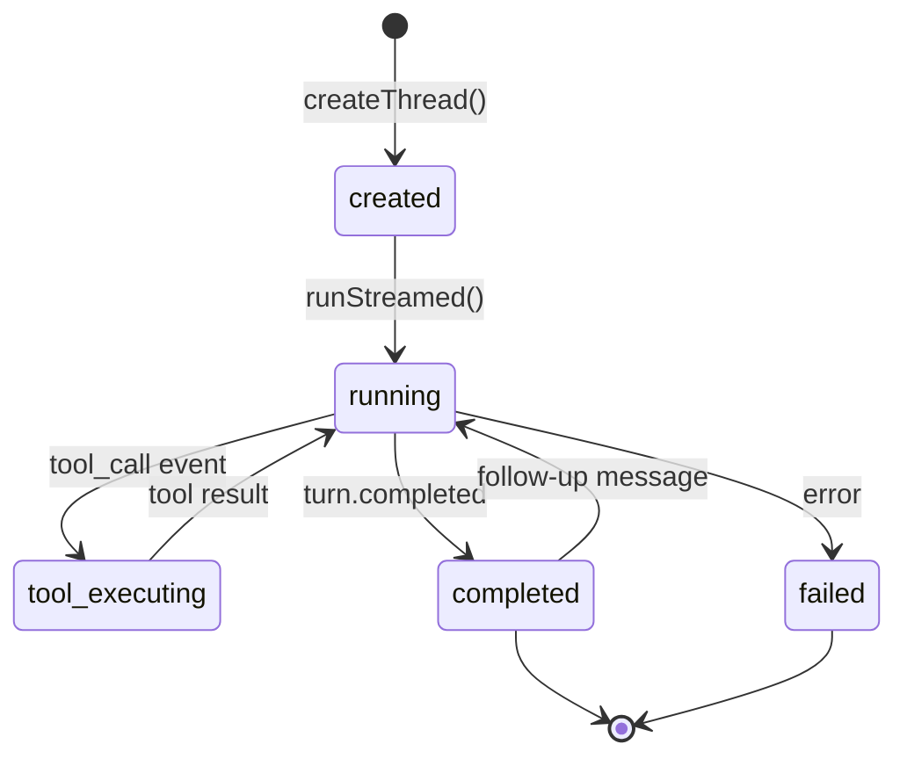

# 02. Codex App-Server Integration

## 1. Назначение

Codex App-Server — агентный движок, который управляет:
- **Threads:** один thread per analysis
- **Tools:** calc_engine, search_knowledge, read_document
- **Streaming:** events → Gateway → SSE → Frontend
- **Models:** OpenAI / Claude via proxy / YandexGPT

Gateway **не дублирует** Codex. Он только создаёт threads, передаёт контекст и проксирует streaming.

## 2. Thread Lifecycle

### 2.1 Один thread per analysis

```
POST /analyses → Gateway → Codex.createThread() → thread_id
                         → Codex.runStreamed(user_message) → streaming events
                         → parsing lens outputs → LENS_OUTPUT rows
                         → parse final response → ANALYSIS_RESULT
```

Один анализ = один thread. Thread содержит:
- `system_prompt` — промпт tenant (627–712 строк)
- `tools` — calc_engine + search_knowledge + read_document
- `files` — документы проекта + опорная база

### 2.2 Thread States



### 2.3 API Contract (pseudocode)

```python
class CodexClient:
    """Обёртка над Codex SDK."""

    async def create_thread(
        self,
        system_prompt: str,
        tools: list[ToolDefinition],
        files: list[FileRef],
        model: str = "gpt-4.1",
    ) -> str:
        """Создать thread. Возвращает thread_id."""

    async def run_streamed(
        self,
        thread_id: str,
        user_message: str,
    ) -> AsyncIterator[CodexEvent]:
        """Запустить thread и стримить события."""

    async def send_tool_result(
        self,
        thread_id: str,
        tool_call_id: str,
        result: dict,
    ) -> None:
        """Вернуть результат tool_call в thread."""
```

## 3. Tool Registration

### 3.1 Формат

Каждый tool регистрируется как JSON Schema:

```json
{
  "name": "calc_convergence",
  "description": "Проверка сходимости: сумма ЛСР = свод до рубля. Δ≠0 = 🔴.",
  "parameters": {
    "type": "object",
    "properties": {
      "sections": {
        "type": "array",
        "items": {"type": "string"},
        "description": "Суммы разделов сметы"
      },
      "total": {
        "type": "string",
        "description": "Итоговая сумма из документа"
      }
    },
    "required": ["sections", "total"]
  }
}
```

### 3.2 Список tools

| Tool | Описание | Спека |
|------|----------|-------|
| `calc_convergence` | Сходимость ЛСР vs свод | `04-calc-engine.md` |
| `calc_cost_per_sqm` | Себестоимость ₽/м² | `04-calc-engine.md` |
| `calc_project_finance` | Финмодель под эскроу/ПФ | `04-calc-engine.md` |
| `calc_deviation` | Отклонение от рынка | `04-calc-engine.md` |
| `calc_gu_vs_bg` | ГУ 5% vs БГ | `04-calc-engine.md` |
| `calc_bdds` | БДДС помесячно | `04-calc-engine.md` |
| `calc_advance_effect` | Эффект аванса на выборку | `04-calc-engine.md` |
| `calc_timeline_shift` | Эффект сдвига срока | `04-calc-engine.md` |
| `calc_penalties` | Пени 1/300 ключевой ставки | `04-calc-engine.md` |
| `calc_margin` | Маржа проекта (3 сценария) | `04-calc-engine.md` |
| `search_knowledge` | Поиск в опорной базе | `05-knowledge-and-documents.md` |
| `read_document_section` | Чтение секции документа | `05-knowledge-and-documents.md` |

### 3.3 Tool Execution Flow

```
Codex Thread:
  1. Агент решает вызвать tool (например, calc_convergence)
  2. → event: {type: "tool_call", name: "calc_convergence", args: {...}, call_id: "tc_123"}
  3. Gateway перехватывает event
  4. Gateway выполняет calc_convergence(**args) локально (Python/Decimal)
  5. Gateway → Codex.send_tool_result(thread_id, "tc_123", result)
  6. Codex продолжает генерацию с результатом tool
```

## 4. Streaming Protocol

### 4.1 Event Types

| Event Type | Данные | Когда |
|------------|--------|-------|
| `text_delta` | `{content: "..."}` | Каждый chunk текста |
| `tool_call` | `{name, args, call_id}` | Агент вызывает tool |
| `tool_result` | `{call_id, result}` | Tool вернул результат |
| `item_completed` | `{item_id, content}` | Блок завершён |
| `turn_completed` | `{final_response}` | Ответ агента завершён |
| `error` | `{code, message}` | Ошибка |

### 4.2 Gateway → SSE Mapping

Gateway парсит Codex events и транслирует их в SSE для Frontend:

```python
async def codex_to_sse(codex_event: CodexEvent) -> SSEEvent | None:
    match codex_event.type:
        case "text_delta":
            lens = detect_lens(codex_event.content)
            markers = extract_markers(codex_event.content)
            return SSEEvent(
                event="lens_output",
                data={
                    "lens": lens,          # "lyudmila" | "denchik" | ...
                    "content": codex_event.content,
                    "markers": markers,    # ["fact", "assumption"]
                }
            )
        case "tool_call":
            return SSEEvent(
                event="tool_call",
                data={
                    "tool": codex_event.name,
                    "status": "executing",
                }
            )
        case "tool_result":
            return SSEEvent(
                event="tool_result",
                data={
                    "tool": codex_event.name,
                    "result_summary": summarize(codex_event.result),
                }
            )
        case "turn_completed":
            return SSEEvent(
                event="analysis_completed",
                data={"analysis_id": analysis_id}
            )
```

## 5. Model Configuration

```yaml
# config/providers/openai.yaml
provider: openai
models:
  default: "gpt-4.1"
  express: "gpt-4.1-mini"
  expert: "gpt-4.1"
api_key_env: "OPENAI_API_KEY"
base_url: null

# config/providers/anthropic.yaml
provider: anthropic
models:
  default: "claude-sonnet-4-20250514"
  express: "claude-sonnet-4-20250514"
  expert: "claude-sonnet-4-20250514"
api_key_env: "ANTHROPIC_API_KEY"
base_url: "https://api.anthropic.com/v1"

# config/providers/yandex.yaml
provider: yandex
models:
  default: "yandexgpt/latest"
api_key_env: "YANDEX_API_KEY"
base_url: "https://llm.api.cloud.yandex.net/foundationModels/v1"
```

## 6. Context Assembly

Перед созданием thread Gateway собирает контекст:

```python
def build_context(
    tenant: Tenant,
    documents: list[Document],
    knowledge_base: KnowledgeBase,
    mode: str,
) -> ThreadContext:
    return ThreadContext(
        system_prompt=load_tenant_prompt(tenant.id),
        files=[
            # Документы проекта (redacted)
            *[doc.redacted_parsed_data for doc in documents],
            # Опорная база (summary для контекста)
            knowledge_base.summary_for_context(),
        ],
        tools=register_all_tools(),
        model=select_model(tenant, mode),
    )
```

### 6.1 Размер контекста

| Компонент | Примерный размер |
|-----------|-----------------|
| System prompt | 15–20K tokens |
| Опорная база summary | 5–10K tokens |
| Документы (redacted) | 10–30K tokens |
| **Итого** | 30–60K tokens |

При превышении лимита модели — truncate документы по приоритету (ЛСР > КП > договор > прочее).

## 7. Error Handling

| Ошибка | Поведение |
|--------|-----------|
| Codex connection timeout | Retry 3 раза, exponential backoff |
| Tool execution error | Возвращаем error result в thread, агент решает |
| Model rate limit | Queue + retry с задержкой |
| Thread too large | Summarize history, создать continuation thread |
| Invalid tool args | Возвращаем validation error, агент корректирует |
