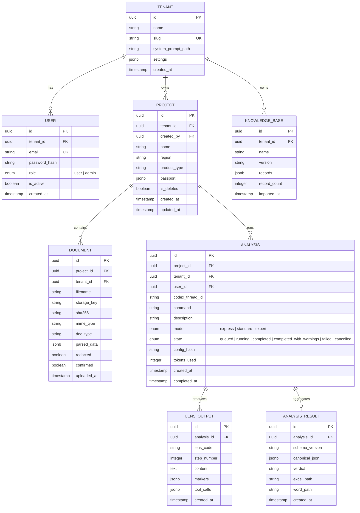
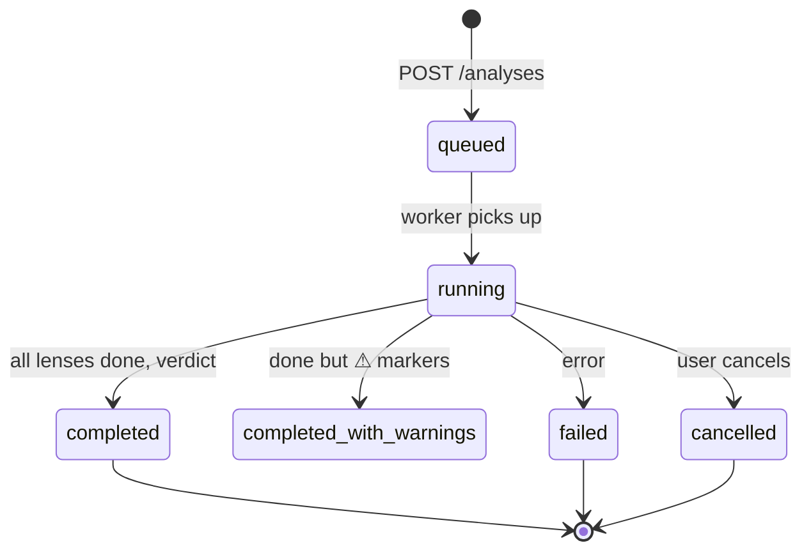

# 06. Data Model & Storage

## 1. Назначение

PostgreSQL 16 — единственное хранилище данных. 8 основных таблиц + 2 служебных = 10. Без Redis, без внешних очередей.

## 2. ER-диаграмма



## 3. Дополнительные таблицы

### 3.1 jobs (очередь задач)

```sql
CREATE TABLE jobs (
    id          UUID PRIMARY KEY DEFAULT gen_random_uuid(),
    tenant_id   UUID NOT NULL REFERENCES tenants(id),
    job_type    TEXT NOT NULL,        -- 'analysis' | 'import' | 'export'
    payload     JSONB NOT NULL,
    state       TEXT NOT NULL DEFAULT 'pending',  -- pending | running | done | failed
    attempts    INTEGER NOT NULL DEFAULT 0,
    max_attempts INTEGER NOT NULL DEFAULT 3,
    error       TEXT,
    created_at  TIMESTAMPTZ NOT NULL DEFAULT now(),
    started_at  TIMESTAMPTZ,
    finished_at TIMESTAMPTZ
);

CREATE INDEX idx_jobs_state ON jobs(state) WHERE state = 'pending';
CREATE INDEX idx_jobs_tenant ON jobs(tenant_id);
```

### 3.2 audit_events (журнал)

```sql
CREATE TABLE audit_events (
    id          UUID PRIMARY KEY DEFAULT gen_random_uuid(),
    tenant_id   UUID NOT NULL REFERENCES tenants(id),
    user_id     UUID REFERENCES users(id),
    action      TEXT NOT NULL,       -- 'login' | 'upload' | 'analysis' | 'export' | 'import'
    resource    TEXT,                 -- 'project' | 'document' | 'analysis'
    resource_id UUID,
    details     JSONB,
    ip_address  INET,
    created_at  TIMESTAMPTZ NOT NULL DEFAULT now()
);

CREATE INDEX idx_audit_tenant_time ON audit_events(tenant_id, created_at DESC);
```

## 4. Row-Level Security (RLS)

Каждая таблица с `tenant_id` защищена RLS:

```sql
-- Включаем RLS
ALTER TABLE projects ENABLE ROW LEVEL SECURITY;

-- Политика: видишь только свой tenant
CREATE POLICY tenant_isolation ON projects
    USING (tenant_id = current_setting('app.current_tenant_id')::uuid);

-- Аналогично для documents, analyses, lens_outputs, etc.
```

**Установка tenant context в Gateway:**

```python
async def set_tenant_context(session: AsyncSession, tenant_id: UUID):
    await session.execute(
        text("SET LOCAL app.current_tenant_id = :tid"),
        {"tid": str(tenant_id)}
    )
```

## 5. Lens Codes

Допустимые значения `lens_code` в таблице `LENS_OUTPUT`:

| Code | Линза | Описание |
|------|-------|----------|
| `passport` | Паспорт | Шаг 0, домен-детектор |
| `denchik` | ГИП | Физика, объёмы |
| `lyudmila` | Смета | Сходимость, конъюнктура |
| `marina` | Снаб | Рынок, КП, лид-тайм |
| `khalil` | Подряд | Субподрядчики, скоринг |
| `vanych` | Эконом | Финмодель, маржа |
| `palych` | ПТО | ИД, КС, приказы |
| `viktor` | Договор | Red-flag, ГУ/БГ |
| `artemiy` | РП | Синтез, вердикт |
| `nastenka` | Админ | Реестр, сроки |
| `unknown` | — | Не распознана |

## 6. Analysis States



## 7. Migrations

Alembic для управления миграциями:

```
backend/alembic/
├── env.py
├── script.py.mako
└── versions/
    ├── 001_initial_schema.py
    ├── 002_add_lens_outputs.py
    └── ...
```

**Команды:**
```bash
alembic upgrade head        # Применить все миграции
alembic revision --autogenerate -m "description"  # Создать миграцию
alembic downgrade -1        # Откатить одну
```

## 8. Индексы

```sql
-- Performance-critical queries
CREATE INDEX idx_projects_tenant ON projects(tenant_id);
CREATE INDEX idx_documents_project ON documents(project_id);
CREATE INDEX idx_analyses_project ON analyses(project_id);
CREATE INDEX idx_analyses_state ON analyses(state) WHERE state IN ('queued', 'running');
CREATE INDEX idx_lens_outputs_analysis ON lens_outputs(analysis_id);
CREATE INDEX idx_knowledge_tenant ON knowledge_bases(tenant_id);

-- Full-text search on knowledge
CREATE INDEX idx_knowledge_records_gin ON knowledge_bases USING gin(records);
```

## 9. Backup

```bash
# Ежедневный pg_dump
pg_dump -Fc -f /backups/stroyintellekt_$(date +%Y%m%d).dump $DATABASE_URL

# Хранение: 30 дней
find /backups -name "*.dump" -mtime +30 -delete
```
