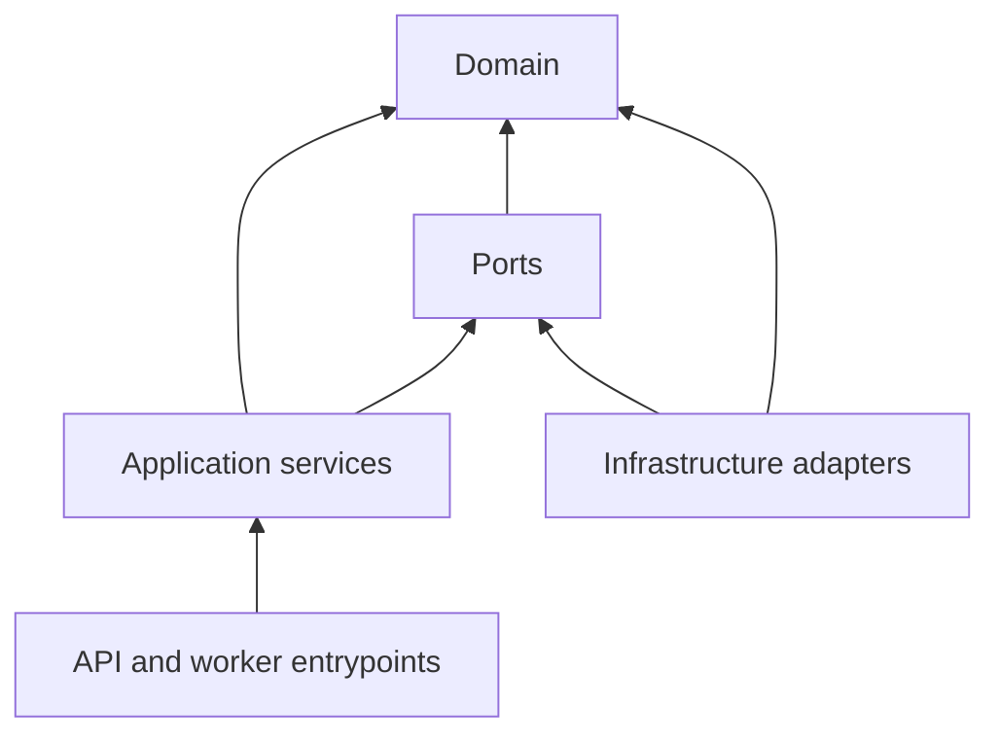
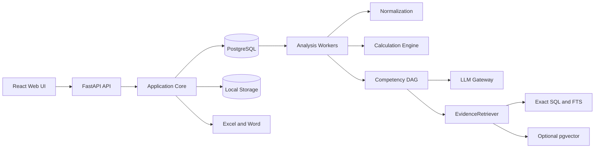
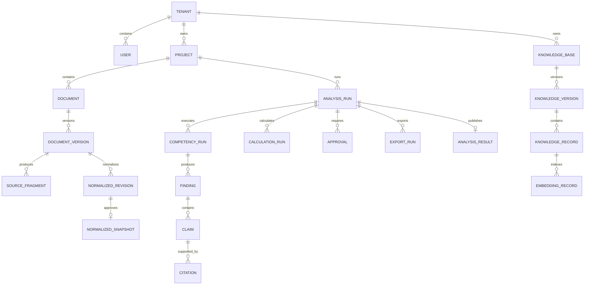
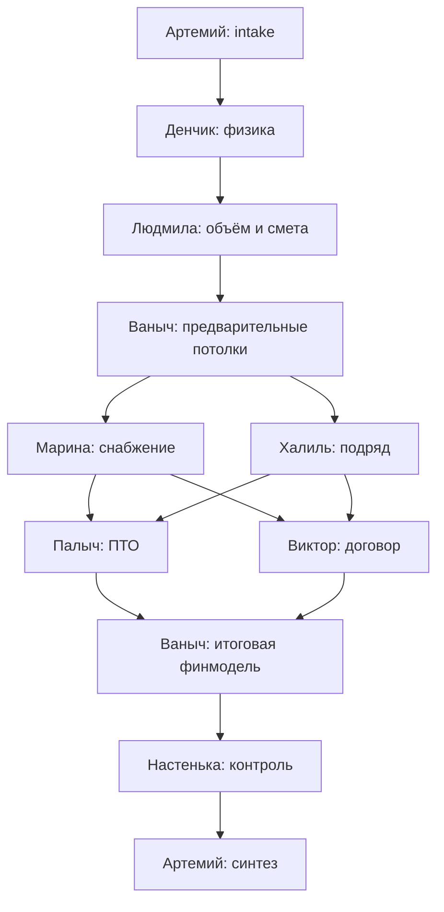
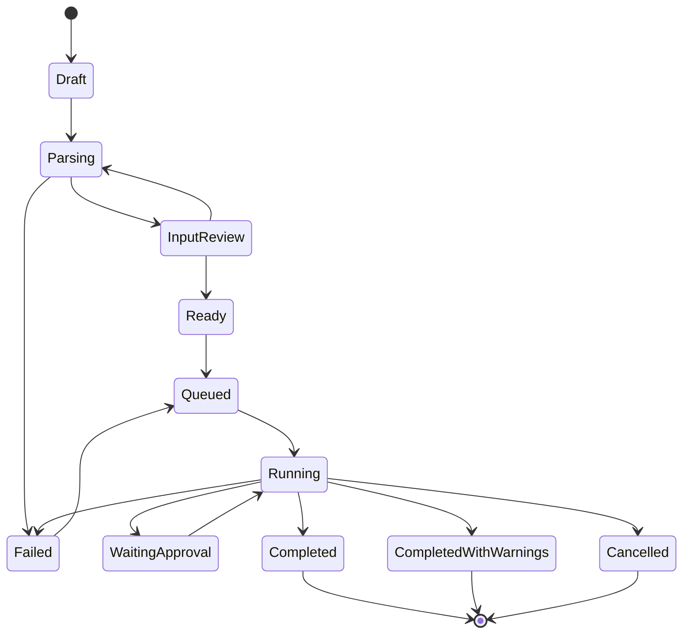
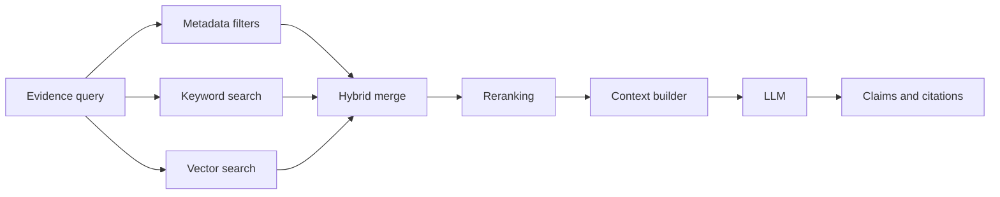
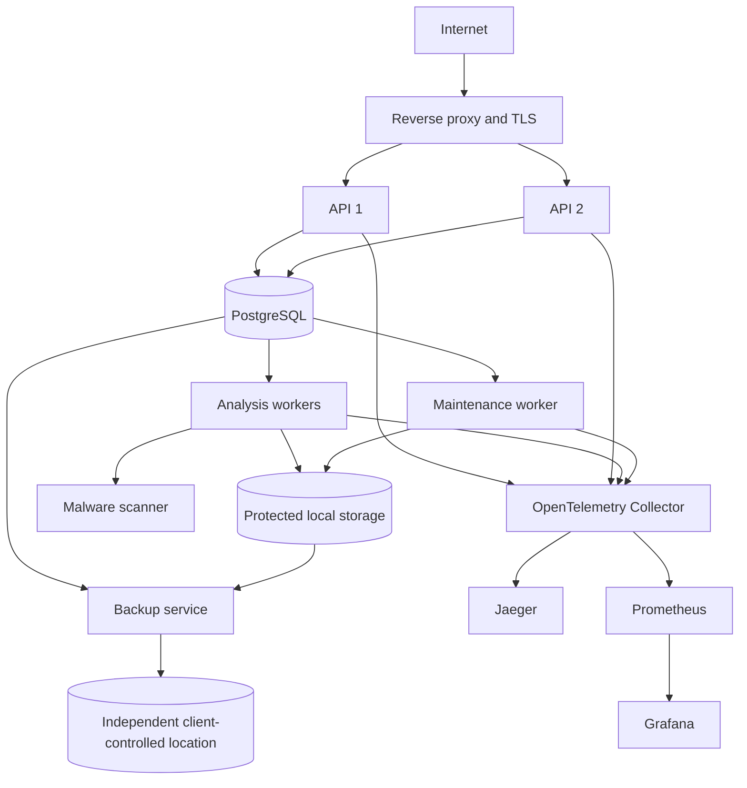

# СтройИнтеллект: целевая системная архитектура

## 1. Статус и назначение

Этот документ является единым источником истины для проектирования MVP системы «СтройИнтеллект».

Документ фиксирует:

- требования главного ТЗ;
- сохранение методологии и поведения действующей Claude Desktop системы;
- единое архитектурное ядро для file-first и RAG-enabled профилей;
- production-требования к безопасности, надёжности, наблюдаемости и эксплуатации;
- границы MVP и roadmap;
- обязательные проверки перед выпуском.

Документ не является разрешением немедленно писать весь продукт. Реализация должна начинаться только после отдельного implementation plan с малыми проверяемыми срезами.

### 1.1. Главная цель

Заменить рабочую legacy-систему на Claude Desktop промышленным web-приложением, которое:

1. принимает проектные и сметные документы;
2. нормализует и проверяет входные данные;
3. выполняет детерминированные расчёты;
4. проводит анализ девятью специализированными компетенциями;
5. формирует структурированный результат с источниками и трассой расчётов;
6. выгружает согласованные Excel и Word отчёты;
7. работает как без RAG, так и с опциональным RAG;
8. изолирует данные организаций;
9. поддерживает десять одновременных полных анализов;
10. разворачивается на VPS/VDS через Docker.

### 1.2. Обязательные архитектурные решения

| Область | Решение |
|---|---|
| Архитектурный стиль | Модульный монолит с независимыми API и worker entrypoints |
| Backend | Python 3.12, FastAPI, Pydantic |
| Frontend | React, TypeScript, Vite |
| База данных | PostgreSQL во всех профилях |
| Векторный поиск | Опциональный `pgvector`, выключен до прохождения eval gate |
| Очередь | PostgreSQL queue, без Redis, Kafka и Celery в MVP |
| Файлы | Локальное client-controlled хранилище через абстракцию |
| LLM | Заменяемый OpenAI-compatible API |
| Embeddings | Заменяемый OpenAI-compatible API |
| Structured output | Канонический versioned JSON Schema и Pydantic |
| Расчёты | Только детерминированный Python-код с Decimal и formula trace |
| Auth MVP | Локальные учётные записи |
| Tenant isolation | С первого дня, включая PostgreSQL RLS |
| Deployment | VPS pilot first, совместимость с будущим on-prem профилем |
| Окружения | Изолированные dev, test и production |
| CI/CD | GitHub Actions, автоматический test deploy, ручной production approval |
| Пользовательские роли | `Пользователь`, `Администратор` |
| Retention | Настраиваемый, бессрочный по умолчанию |
| Audit | Не менее 12 месяцев |
| Качество | DRY, KISS, YAGNI, отсутствие hardcode и spaghetti |
| Размер файла кода | Не более 500 строк handwritten code без обоснованного исключения |

### 1.3. Профили одной системы

Это не два продукта и не две кодовые базы.

**File-first profile:**

- PostgreSQL;
- точный и полнотекстовый поиск;
- утверждённые документы и справочники;
- `pgvector` выключен;
- embeddings API не требуется.

**RAG-enabled profile:**

- то же ядро и та же база данных;
- `pgvector` включён;
- настроен embeddings provider;
- пройден RAG eval gate;
- retrieval дополняется semantic search и reranking.

## 2. Источники требований и порядок приоритета

### 2.1. Порядок разрешения противоречий

```text
Главное ТЗ
→ явные решения владельца продукта
→ проверяемые правила канонического legacy-корпуса
→ BRD как roadmap
→ отраслевые примеры и UI-прототипы
```

Правило не означает удаление противоречащего legacy-текста. Исходный fragment сохраняется, получает disposition и ссылку на решение, которое определило активное поведение.

### 2.2. Главное ТЗ

Канонический файл:

```text
/home/govard/projects/7rl/stroyintellekt/03.08.26_ТЗ_СтройИнтеллект_Приложение№1_к_КП_АПРИ.docx
```

Главное ТЗ задаёт MVP, обязательные режимы, SLA, форматы, интерфейс, отчёты и критерии приёмки.

### 2.3. Канонический legacy-корпус

#### Девять инструкций компетенций

```text
reference-system/v8.2_Артемий_РП_СтройИнтеллект.docx
reference-system/v8.2_Денчик_ГИП_СтройИнтеллект.docx
reference-system/v8.2_Людмила_Сметчик_СтройИнтеллект.docx
reference-system/v8.2_Марина_Снаб_СтройИнтеллект.docx
reference-system/v8.2_Халиль_Подряд_СтройИнтеллект.docx
reference-system/v8.2_Палыч_ПТО_СтройИнтеллект.docx
reference-system/v8.2_Виктор_Договорник_СтройИнтеллект.docx
reference-system/v8.2_Ваныч_Эконом_СтройИнтеллект.docx
reference-system/v8.2_Настенька_Админ_СтройИнтеллект.docx
```

#### Legacy orchestration и расчётные пакеты

```text
reference-system/stroiintellect-master.skill
reference-system/construction-cost-analysis.skill
reference-system/about.txt
```

#### Корневые опорные базы

```text
reference-system/Опорный_документ_Артемий_РП_v1.0.xlsx
reference-system/Опорный_навигатор_Денчик_ГИП_v1.0.xlsx
reference-system/Нормативная_база_ГИП_Денчик_РФ_2026_v1.0.xlsx
reference-system/Опорная_база_Людмила_Сметчик_v1.0.xlsx
reference-system/Опорная_база_Марина_Снаб_v1.0.xlsx
reference-system/Опорная_база_Халиль_Подряд_v1.0.xlsx
reference-system/Опорная_база_Палыч_ПТО_v1.0.xlsx
reference-system/Опорная_база_Виктор_Договорник_v1.0.xlsx
reference-system/Опорная_база_Ваныч_Эконом_v1.0.xlsx
reference-system/Опорная_база_Настенька_Админ_v1.0.xlsx
```

#### Regression corpus

```text
reference-system/input-1/
reference-system/output-1/
```

`input-1` и `output-1` образуют обязательный regression corpus. Выходы используются как эталон структуры и бизнес-смысла, но известные legacy-дефекты не должны воспроизводиться.

#### BRD

```text
reference-system/СтройИнтеллект_BRD_v4.0.docx
```

BRD задаёт roadmap. Он не расширяет автоматически MVP, если противоречит главному ТЗ или утверждённым решениям.

#### Отраслевые reference-примеры

```text
reference-system/apri/
reference-system/modc/
reference-system/unihim/
reference-system/uralsetstroy/
```

Они используются для проверки расширяемости, терминологии и вариантов workflow, но не подменяют MVP acceptance corpus.

#### UI и процессные прототипы

```text
reference-system/СтройИнтеллект - Десктоп (standalone) (1).html
reference-system/СтройИнтеллект - Мобайл (standalone).html
reference-system/СтройИнтеллект v10 - Цифровой штаб (standalone).html
reference-system/artifacts/СтройИнтеллект_БП_Визуализация_v2 (1).html
```

Прототипы являются источником UX и процессного контекста, но не диктуют backend-архитектуру.

## 3. Legacy Traceability Contract

### 3.1. Принцип нулевой потери

Нельзя удалять, молча переписывать или игнорировать исходное правило, инструкцию, формулу, статус, формат или передачу между компетенциями.

Каждый значимый fragment получает стабильный идентификатор:

```text
legacy_fragment_id = <source-code>:<source-version>:<location>:<content-hash-prefix>
```

Примеры location:

- DOCX paragraph;
- table row и cell;
- XLSX sheet, row и cell range;
- `.skill` file и line range;
- HTML element или process node.

### 3.2. Обязательная запись каталога

```yaml
legacy_fragment_id: string
source_path: string
source_version: string
source_hash: sha256
location: string
original_text: string
normalized_rule: string
rule_type: instruction | formula | handoff | status | output | prohibition | example
competency: string | null
priority: integer
disposition: implemented | config | test_only | roadmap | superseded_by_tz | conflict | not_applicable | reference_only
requirement_ids: []
code_refs: []
config_refs: []
test_refs: []
decision_ref: string | null
review_status: pending | reviewed | approved
```

### 3.3. Gate покрытия

До release:

- 100% fragments имеют disposition;
- каждый `implemented` имеет code или config reference и test reference;
- каждый `superseded_by_tz` имеет requirement или decision reference;
- каждый `conflict` имеет решение владельца продукта;
- каждый `roadmap` имеет roadmap reference;
- исходный текст и hash не изменяются.

### 3.4. Известный legacy-дефект

В файле:

```text
reference-system/output-1/05_Снабжение_и_поставки_Зауралье.xlsx
```

ячейка `00_Резюме_Заключение!D22` ссылается на несуществующий лист `05_Скоуп_оборуд`, тогда как фактический лист называется `05_Объём_поставки_оборуд`.

Дефект:

- сохраняется в legacy-каталоге;
- получает disposition `test_only`;
- становится негативным regression fixture;
- не воспроизводится в новой выгрузке.

## 4. Архитектурные принципы

### 4.1. Модульный монолит

MVP реализуется как один репозиторий и одно приложение с жёсткими внутренними границами.

Из одного image запускаются:

- `api`;
- `analysis-worker`;
- `maintenance-worker`;
- `migration`;
- `backup`.

Девять компетенций являются модулями workflow, а не девятью микросервисами.

### 4.2. Причины выбора

- проще обеспечить транзакционность и tenant isolation;
- меньше инфраструктурной сложности для VPS;
- проще сохранить единый типизированный контракт;
- легче выполнять сквозные regression tests;
- независимые workers дают нужный параллелизм;
- модульные границы позволяют позже выделить сервис только при измеренной необходимости.

### 4.3. Правила проектирования

1. Domain не зависит от FastAPI, SQLAlchemy, PostgreSQL, filesystem или конкретного LLM.
2. Application layer оркестрирует use cases и транзакции.
3. Infrastructure реализует repository и provider ports.
4. API и worker entrypoints содержат только delivery/runtime wiring.
5. Компетенции не вызывают друг друга напрямую.
6. Компетенции не читают БД напрямую.
7. LLM не выполняет расчёты.
8. Excel и Word не содержат скрытых бизнес-формул.
9. Provider-specific поля не попадают в domain contracts.
10. Конфигурация валидируется до старта обработки.

### 4.4. DRY, KISS и YAGNI

- общие типы, units, provenance и error contracts определяются один раз;
- расчётное правило имеет единственный источник;
- сначала применяется PostgreSQL, а не дополнительный брокер;
- микросервис выделяется только по доказанной нагрузке или границе владения;
- Kubernetes, Kafka, собственное обучение LLM и event sourcing не входят в MVP;
- абстракция вводится только для реально заменяемой границы: storage, LLM, embeddings, parser, retriever.

### 4.5. Ограничение размера кода

Handwritten code file не должен превышать 500 физических строк.

Исключения:

- сгенерированный OpenAPI client;
- сгенерированные JSON Schema;
- Alembic migration;
- декларативный mapping или fixture.

Исключение не разрешает смешивать ответственности. CI дополнительно контролирует цикломатическую сложность и внутренние зависимости.

## 5. Логическая структура

```text
backend/
  src/stroiintellect/
    identity/
    tenancy/
    projects/
    documents/
    normalization/
    reference_knowledge/
    calculations/
    analysis/
    competencies/
    llm_gateway/
    embeddings/
    approvals/
    exports/
    audit/
    operations/
    shared/
    api/
    workers/
frontend/
config/
tests/
evals/
infra/
```

### 5.1. Слои модуля

```text
domain/
application/
ports/
adapters/
api/
tests/
```

### 5.2. Направление зависимостей



Domain не импортирует верхние слои.

### 5.3. Модули

| Модуль | Ответственность |
|---|---|
| `identity` | Пользователи, credentials, session lifecycle |
| `tenancy` | Tenant context, роли, RLS policy |
| `projects` | Паспорт объекта, участники, статусы |
| `documents` | Upload, versions, hashes, lifecycle |
| `normalization` | Parsers, canonical rows, review snapshots |
| `reference_knowledge` | Knowledge lifecycle, search, snapshots |
| `calculations` | Decimal formulas, units, reconciliation |
| `analysis` | AnalysisRun, DAG, orchestration |
| `competencies` | Девять contracts и их исполнение |
| `llm_gateway` | OpenAI-compatible generation adapter |
| `embeddings` | OpenAI-compatible embedding adapter и index versions |
| `approvals` | Human decisions и optimistic locking |
| `exports` | JSON, Excel, Word projections |
| `audit` | Неизменяемые события и security trail |
| `operations` | Queue, leases, health, metrics, cleanup |

## 6. Общая runtime-топология



### 6.1. Синхронные операции

- аутентификация;
- CRUD проекта;
- metadata документов;
- чтение результатов;
- создание команды запуска;
- подтверждение нормализованных данных;
- получение статуса.

### 6.2. Асинхронные операции

- parsing;
- redaction;
- embeddings;
- retrieval indexing;
- детерминированный расчёт больших наборов;
- выполнение компетенций;
- export;
- backup;
- cleanup.

API не удерживает HTTP-запрос до завершения полного анализа.

## 7. Tenant, identity и доступ

### 7.1. Модель tenant

MVP использует:

- одну PostgreSQL database;
- одну общую schema;
- обязательный `tenant_id`;
- PostgreSQL Row Level Security;
- tenant-aware composite foreign keys;
- отдельную DB role для системных операций.

Tenant identity берётся только из trusted session context. Значение `tenant_id` из request body игнорируется.

Исполнимый RLS-контракт:

- application и worker DB roles имеют `NOINHERIT` и `NOBYPASSRLS`;
- application и worker roles не являются владельцами tenant tables;
- для tenant tables включаются `ENABLE ROW LEVEL SECURITY` и `FORCE ROW LEVEL SECURITY`;
- trusted tenant UUID устанавливается через `SET LOCAL` внутри каждой транзакции;
- policies определяют и `USING`, и `WITH CHECK`;
- отсутствующий, невалидный или сброшенный tenant context приводит к fail-closed;
- connection pool выполняет reset, tenant context не переносится между requests и jobs;
- system role недоступна из request path, выполняет только allowlisted operations и пишет audit;
- role и policy DDL применяются обратимой Alembic migration.

### 7.2. Роли

**Пользователь:**

- работает с доступными проектами;
- загружает документы;
- подтверждает входные данные;
- запускает анализ;
- просматривает и выгружает результаты.

**Администратор:**

- управляет пользователями;
- назначает project access;
- утверждает знания;
- управляет provider policy;
- просматривает audit в разрешённом объёме;
- инициирует retention и deletion operations.

Domain approval не создаёт третью роль в MVP. Администратор может иметь отдельные permissions внутри той же роли.

### 7.3. Локальная аутентификация

- Argon2id;
- HttpOnly, Secure, SameSite cookies;
- CSRF protection;
- session rotation после входа;
- rate limiting;
- lockout policy без раскрытия существования пользователя;
- OIDC-compatible port для roadmap.

### 7.4. Изоляция

Изоляция проверяется на уровнях:

1. API authorization;
2. application use case;
3. PostgreSQL RLS;
4. worker task context;
5. filesystem storage key;
6. retrieval metadata;
7. cache key;
8. audit visibility.

Отсутствие trusted `tenant_id` приводит к deny, а не к fallback на global scope.

## 8. Модель данных

### 8.1. Основные агрегаты



### 8.2. Версионирование документов

`Document` является логической сущностью. Каждая загрузка создаёт immutable `DocumentVersion`.

`DocumentVersion` хранит:

- tenant и project;
- storage key;
- original filename;
- detected MIME;
- size;
- SHA-256;
- uploader;
- created time;
- malware scan status;
- redaction status;
- parser status;
- retention class.

Новый файл не перезаписывает старую версию.

### 8.3. Normalized snapshot

Parser output сохраняется отдельно от пользовательских исправлений.

```text
immutable original
→ raw extraction
→ normalized revision
→ validation
→ human correction
→ approved immutable snapshot
```

Каждая строка snapshot содержит:

- source document version;
- sheet и cell range либо page и paragraph;
- raw value;
- normalized value;
- unit;
- parser version;
- confidence;
- correction author;
- content hash.

### 8.4. Analysis snapshot

Каждый `AnalysisRun` фиксирует:

- document versions;
- normalized snapshot;
- knowledge snapshot;
- workflow version;
- competency versions;
- prompt/config bundle hash;
- formula catalog version;
- JSON Schema version;
- LLM и embeddings profiles;
- mode policy version.

Старый анализ не изменяется после обновления любого входа.

### 8.5. Базовые таблицы

Минимальный набор:

```text
tenants
users
memberships
projects
project_access
documents
document_versions
source_fragments
normalized_revisions
normalized_rows
normalized_snapshots
knowledge_bases
knowledge_versions
knowledge_records
knowledge_proposals
embedding_indexes
embedding_records
analysis_runs
competency_runs
calculation_runs
approvals
findings
claims
citations
analysis_results
export_runs
jobs
audit_events
provider_usage
legacy_fragments
```

## 9. Canonical structured output

### 9.1. Источник истины

Каноническим результатом анализа является versioned JSON:

```text
approved inputs
→ deterministic calculations
→ competency results
→ AnalysisResult JSON
→ PostgreSQL
→ Web UI / Excel / Word
```

Excel, Word и UI не рассчитывают новые бизнес-значения и не имеют независимых версий истины.

### 9.2. Envelope

```json
{
  "schema_id": "stroiintellect.analysis-result",
  "schema_version": "1.0.0",
  "tenant_id": "uuid",
  "project_id": "uuid",
  "analysis_id": "uuid",
  "mode": "standard",
  "created_at": "date-time",
  "input_snapshot": {},
  "knowledge_snapshot_id": "uuid",
  "workflow_version": "1.0.0",
  "config_bundle_hash": "sha256",
  "competencies": [],
  "calculations": [],
  "findings": [],
  "conflicts": [],
  "assumptions": [],
  "open_questions": [],
  "summary": {
    "budget_status": "at_risk",
    "recommendations": [],
    "continuation_conditions": []
  },
  "legal_boundary": {
    "recommendation_only": true,
    "decision_owner": "human"
  }
}
```

### 9.3. Числовое значение

```yaml
value: "1250000.00"
unit: RUB
status: fact | calculated | assumption | unknown
source_refs: []
formula_id: null | string
calculation_inputs: []
as_of: 2026-08-05
confidence: null | 0.98
```

Правила:

- `Decimal`, а не binary float;
- `fact` требует source reference;
- `calculated` требует formula и inputs;
- `assumption` требует автора, причину и scope;
- `unknown` не преобразуется в ноль;
- confidence применяется к AI extraction, но не к детерминированной арифметике.

### 9.4. Claim и citation

```yaml
claim_id: uuid
statement: string
status: supported | calculated | assumption | unknown | conflict
citations:
  - source_id: uuid
    source_version: uuid
    fragment_id: uuid
    location: "sheet: Смета, row: 148"
    content_hash: sha256
```

Цитата может ссылаться только на fragment, который реально использовался при конкретном запуске.

### 9.5. Версионирование schema

- patch: уточнение описаний и совместимые ограничения;
- minor: новые optional fields;
- major: несовместимое изменение;
- результаты всегда сохраняют исходную schema version;
- export adapter обязан заявить поддерживаемые schema versions;
- CI выполняет backward compatibility check.

## 10. Нормализация документов

### 10.1. Поддерживаемые форматы MVP

- XLS и XLSX;
- ГРАНД-Смета XML;
- DOCX;
- PDF с текстовым слоем.

OCR сканов не входит в MVP. PDF без текстового слоя получает `unsupported_scan`.

### 10.2. Pipeline


### 10.3. Parser ports

```python
class DocumentParser(Protocol):
    supported_types: frozenset[str]

    async def parse(
        self,
        document: DocumentVersionRef,
        context: ParseContext,
    ) -> ParseResult: ...
```

Adapter не принимает бизнес-решения. Он извлекает данные и provenance.

### 10.4. Ограничения ingestion

Начальные production defaults:

```yaml
max_files_per_upload_batch: 8
max_file_size_mb: 100
max_batch_size_mb: 500
max_archive_expansion_ratio: 20
```

Значения конфигурируются после load test, но не отключаются.

Проверки:

- MIME по содержимому;
- безопасный UUID storage key;
- path traversal;
- archive bomb;
- checksum;
- malware scan;
- quarantine;
- запрет автоматического исполнения macro и embedded objects.

### 10.5. Acceptance parser

Accuracy не является одной субъективной цифрой. На размеченном фиксированном corpus отдельно измеряются:

- тип документа;
- обязательные реквизиты;
- строки сметы;
- значения;
- единицы;
- табличные связи;
- source locations.

Общий gate поддерживаемых форматов: не менее 95%. `unsupported_scan` не включается в denominator MVP.

Отдельные release gates:

- critical project identifiers: 100% без пропусков;
- monetary values: 100% без незамеченного изменения знака, разделителя и порядка;
- units: не менее 99%;
- source locations: 100% для принятых фактов и чисел;
- estimate rows: не менее 95% exact field match;
- table relations: не менее 95%;
- unsupported или неоднозначное значение должно быть явно помечено, а не принято молча.

Агрегированная метрика не может скрыть падение критического gate.

## 11. Calculation Engine

### 11.1. Граница ответственности

Calculation Engine выполняет:

- объёмы;
- цены;
- стоимость;
- НДС;
- коэффициенты;
- маржу;
- БДДС;
- лимиты;
- календарные зависимости;
- reconciliation;
- округление.

LLM может объяснить результат, но не является вычислителем.

### 11.2. Formula catalog

```yaml
formula_id: cost.direct.v1
version: 1.0.0
inputs:
  quantity: Quantity
  unit_price: MoneyPerUnit
output: Money
rounding:
  mode: ROUND_HALF_UP
  scale: 2
valid_from: 2026-01-01
```

Алгоритм хранится в коде. Изменяемые значения, ставки, коэффициенты и даты действия хранятся как versioned data.

### 11.3. Правила

- money и rates используют `Decimal`;
- units являются типизированными;
- запрещено неявное смешение НДС и без НДС;
- запрещено неявное смешение валют;
- rounding применяется в явно указанной точке;
- каждый результат имеет formula trace;
- calculation run воспроизводим по snapshot;
- unknown input вызывает `insufficient_data`, а не подстановку нуля.

### 11.4. Reconciliation

Проверки:

- сумма компонентов и total;
- прямые и косвенные расходы;
- НДС;
- приход и расход БДДС;
- бюджетный потолок;
- лимиты поставки и подряда;
- сумма распределений по периодам.

Допустимое расхождение определяется formula-specific rounding policy. «Нулевая рублёвая ошибка» означает отсутствие необъяснённого расхождения после применения этой policy.

## 12. Workflow девяти компетенций

### 12.1. Бизнес-последовательность

```text
физика → объём → цена → деньги → риск → синтез
```

### 12.2. Dependency-based DAG



Артемий и Ваныч имеют две фазы внутри одной компетенции. Это сохраняет девять ролей и одновременно разрешает зависимости legacy.

### 12.3. Компетенции

| Код | Роль | Основная ответственность |
|---|---|---|
| `artemiy_pm` | Артемий | Intake, план анализа, синтез, финальная рекомендация |
| `denchik_engineer` | Денчик | Физика объекта, инженерная реализуемость, исходные ограничения |
| `lyudmila_estimator` | Людмила | Объёмы, смета, расценки, структура стоимости |
| `marina_supply` | Марина | Поставки, оборудование, сроки, ценовые и логистические риски |
| `khalil_subcontract` | Халиль | Подрядные пакеты, рынок подрядчиков, лимиты и риски |
| `palych_pto` | Палыч | ПТО, ИД, график, технологические и документарные зависимости |
| `viktor_contract` | Виктор | Договорные условия, ответственность, штрафы, scope gaps |
| `vanych_finance` | Ваныч | Потолки, себестоимость, маржа, БДДС, итоговая финмодель |
| `nastenka_admin` | Настенька | Полнота, статусы, протокол, открытые вопросы, контроль качества |

### 12.4. Контракт компетенции

```yaml
code: lyudmila_estimator
version: 1.0.0
input_schema: EstimatorInput
output_schema: EstimatorResult
required_dependencies:
  - denchik_engineer
allowed_capabilities:
  - evidence_retriever
  - calculation_reader
  - llm_gateway
timeout_seconds: 120
retry_policy: provider_transient
```

Компетенция:

- получает только разрешённые immutable inputs;
- возвращает Pydantic-valid output;
- не вызывает другую компетенцию;
- не пишет напрямую в чужой модуль;
- не исполняет инструкции из retrieved content;
- возвращает `insufficient_data`, `not_applicable` или `conflict` вместо выдумки.

### 12.5. Versioned config

```text
config/
  workflows/
  competencies/
  modes/
  mappings/
  formulas/
  providers/
  exports/
  policies/
```

Config bundle имеет semver и SHA-256. Невалидная конфигурация блокирует readiness.

## 13. Режимы анализа

| Режим | Глубина | Подтверждения | SLA |
|---|---|---|---|
| Экспресс | Ключевые риски, цифры и рекомендация | Предварительный результат; неподтверждённое маркируется | не более 60 секунд |
| Стандарт | Полный прогон применимых компетенций | Подтверждение нормализованных входов | не более 5 минут |
| Эксперт | Полный прогон, не менее трёх вариантов, матрица и примортем | Подтверждение входов и остановки на критических конфликтах | не более 15 минут |

### 13.1. Mode policy

Режим управляет:

- обязательными компетенциями;
- глубиной evidence retrieval;
- количеством вариантов;
- approval gates;
- context budget;
- provider budget;
- export completeness;
- deadline.

Правила режима определяются в `mode-policy.yaml`, а не разбросаны по коду.

### 13.2. Ограничение экспресс-режима

Экспресс-результат без подтверждённого snapshot:

- маркируется как preliminary;
- не скрывает assumptions;
- не считается финальным договорным или финансовым решением;
- может быть повторён стандартным или экспертным запуском.

## 14. State model

### 14.1. AnalysisRun

```text
draft
parsing
input_review
ready
queued
running
waiting_approval
completed
completed_with_warnings
failed
cancelled
```



Повторный запуск создаёт новую запись. Он не перезаписывает старый результат.

### 14.2. CompetencyRun

```text
pending
ready
queued
running
succeeded
failed
blocked
skipped_not_applicable
cancelled
```

### 14.3. Approval

```text
pending
approved
rejected
expired
superseded
```

Изменение входного snapshot инвалидирует незавершённое approval и требует новой версии анализа.

### 14.4. ExportRun

```text
queued
running
succeeded
failed
cancelled
```

Ошибка export не переводит успешно завершённый анализ в `failed`.

### 14.5. Техническая и бизнес-ошибка

Технический сбой:

- provider timeout;
- worker crash;
- DB connection failure;
- invalid provider response.

Бизнес-блокировка:

- отсутствует обязательный документ;
- данные противоречат друг другу;
- нет источника;
- не утверждён snapshot;
- требуется human decision.

Бизнес-блокировка не отправляется в бесконечный retry.

## 15. PostgreSQL queue и workers

### 15.1. Причина выбора

PostgreSQL уже обязателен, обеспечивает транзакции, RLS, row locking и достаточен для MVP-нагрузки. Дополнительный брокер не вводится без измеренной необходимости.

### 15.2. Job model

```yaml
job_id: uuid
tenant_id: uuid
analysis_id: uuid
job_type: competency
payload_ref: uuid
state: queued
priority: 100
idempotency_key: string
attempt_count: 0
max_attempts: 3
available_at: date-time
lease_owner: null
lease_until: null
heartbeat_at: null
deadline_at: date-time
last_error_code: null
traceparent: string | null
tracestate: string | null
```

### 15.3. Claiming

Workers используют транзакционный claim через:

```sql
SELECT id
FROM jobs
WHERE state = 'queued'
  AND available_at <= now()
ORDER BY priority DESC, created_at
FOR UPDATE SKIP LOCKED
LIMIT 1;
```

### 15.4. Семантика доставки

Система не обещает `exactly once`.

Она реализует:

- at-least-once delivery;
- идемпотентные handlers;
- unique idempotency keys;
- atomic state transition;
- lease;
- heartbeat;
- recovery после worker crash;
- dead-letter после исчерпания попыток.

### 15.5. Retry

Retry разрешён для:

- timeout;
- connection reset;
- HTTP 429;
- HTTP 502, 503 и 504;
- временной DB contention.

Retry не выполняется для:

- invalid credentials;
- policy denial;
- redaction failure;
- unsupported file;
- отсутствующих обязательных бизнес-данных;
- несовместимой schema.

Backoff:

```text
exponential + jitter + Retry-After
```

Retry budget является единым end-to-end budget одной logical operation:

- `max_attempts` в job является единственным счётчиком фактических provider calls;
- один queue attempt выполняет не более одного provider call;
- gateway не запускает вложенный цикл из трёх дополнительных calls;
- response `Retry-After` определяет `available_at`, но не увеличивает budget;
- request не начинается, если оставшегося deadline недостаточно;
- worker crash после отправки запроса расходует attempt, если outcome нельзя доказать;
- circuit breaker блокирует новые calls, не расходуя attempts до фактической отправки;
- при `max_attempts: 3` допускается не более трёх фактических provider calls.

### 15.6. Конкурентность

Требование означает десять одновременно выполняемых полных `AnalysisRun` на одну инсталляцию.

Лимиты:

- global active analyses: 10;
- tenant active analyses: configurable;
- project active analysis: один mutable запуск на одну input version;
- CPU-heavy parser jobs: начально 4;
- provider calls: по profile и tenant quota;
- DB connections: в пределах рассчитанного pool budget.

Параллельные ветви:

- Марина и Халиль;
- Палыч и Виктор;
- независимые exports.

Backpressure имеет приоритет над бесконтрольным созданием задач.

### 15.7. Cancellation и deadline

- пользовательская отмена помечает ожидающие задачи;
- running provider request получает cancellation signal, где это поддерживается;
- завершившийся после отмены результат не публикуется как финальный;
- deadline передаётся через весь workflow;
- истёкший deadline приводит к частичному результату либо controlled failure по mode policy.

## 16. Опорная база знаний

### 16.1. Жизненный цикл

```text
draft
→ proposed
→ in_review
→ approved
→ published
→ superseded / archived
```

Дополнительные исходы:

```text
rejected
conflict
needs_source
```

Только `published` входит в активный knowledge snapshot.

### 16.2. AI proposals

AI может создать `KnowledgeProposal`, содержащий:

- утверждение;
- source spans;
- проект и tenant;
- область применимости;
- регион;
- дату действия;
- предложенный knowledge type;
- конфликт;
- confidence;
- инициатора и run id.

AI не может автоматически публиковать proposal.

Утверждение выполняет администратор с domain permission. Решение и reviewer фиксируются в audit.

### 16.3. Knowledge record

```yaml
knowledge_record_id: uuid
tenant_id: uuid
knowledge_version_id: uuid
title: string
content: string
structured_values: {}
domain: string
region: string | null
object_type: string | null
authority: canonical | official | owner_reviewed | project_confirmed | historical_case
valid_from: date | null
valid_to: date | null
owner_id: uuid
acl_scope: string
source_refs: []
content_hash: sha256
status: published
```

### 16.4. Snapshot

Каждый анализ получает immutable `knowledge_snapshot_id`.

Обновление знания:

- не меняет старый результат;
- создаёт новую knowledge version;
- при необходимости создаёт новый embedding index;
- требует нового анализа для переоценки проекта.

## 17. Retrieval и RAG

### 17.1. Главный принцип

Retrieved knowledge является доказательством, а не автоматически истинным ответом.

Допустимые исходы:

- `answered`;
- `not_found`;
- `low_confidence`;
- `conflict`;
- `blocked_by_acl`;
- `stale_source`;
- `needs_review`.

Фактический ответ без source span запрещён.

### 17.2. Единый порт

```python
class EvidenceRetriever(Protocol):
    async def retrieve(
        self,
        query: EvidenceQuery,
        snapshot_id: UUID,
        actor: ActorContext,
    ) -> EvidenceSet: ...
```

Реализации:

- `ExactEvidenceRetriever`;
- `HybridEvidenceRetriever`.

Компетенции не знают, включён ли `pgvector`.

### 17.3. File-first retrieval

```text
structured query
→ tenant and ACL
→ domain, region, object type and date filters
→ exact structured match
→ PostgreSQL full-text search
→ EvidenceSet
```

Применяется для:

- расценок;
- коэффициентов;
- нормативов;
- сроков действия;
- региональных значений;
- формализованных правил.

### 17.4. Hybrid RAG



Рекомендуемый merge: rank-based fusion. Коэффициенты утверждаются retrieval benchmark.

### 17.5. Embedding profile

Начальный профиль:

```yaml
provider_protocol: openai-compatible
model: intfloat/multilingual-e5-small
dimension: 384
distance: cosine
normalize_vectors: true
query_prefix: "query: "
document_prefix: "passage: "
```

Model identifier и dimension являются частью `embedding_index_version`.

Нельзя:

- смешивать vectors разных моделей;
- менять размерность существующего index;
- считать заявленное имя provider достаточным без capability probe.

### 17.6. Chunking

Структурное разбиение:

- DOCX: heading, paragraph, table;
- XLSX: sheet, logical table, row;
- норматив: section, clause, subclause;
- смета: позиция и связанный блок;
- инструкция компетенции: отдельное правило.

Начальный текстовый профиль:

```yaml
target_tokens: 450
min_tokens: 300
max_tokens: 600
overlap_tokens: 60
```

Таблицы и смысловые строки не разрываются произвольно. Числа дополнительно индексируются как structured values.

### 17.7. Metadata

Каждый chunk содержит:

```yaml
source_id: uuid
source_version: uuid
chunk_id: uuid
tenant_id: uuid
title: string
owner_id: uuid
authority: string
acl_scope: string
domain: string
region: string | null
updated_at: date-time
valid_from: date | null
valid_to: date | null
content_hash: sha256
redaction_class: string
```

Sensitive chunk без обязательной metadata не допускается в retrieval.

### 17.8. ACL

ACL применяется:

1. до retrieval;
2. повторно перед reranking;
3. повторно перед prompt;
4. при чтении cache.

Unauthorized content не попадает:

- в model prompt;
- в model-based reranker;
- в cache;
- в user-visible trace;
- в лог.

### 17.9. Freshness и конфликты

Приоритет:

```text
утверждённый норматив
→ опубликованная опорная база
→ подтверждённый проектный документ
→ проверенный исторический кейс
```

Если одинаково авторитетные источники конфликтуют и freshness не разрешает вопрос, система возвращает `conflict` и создаёт expert review item.

### 17.10. Prompt injection

Retrieved content всегда является untrusted data.

Инструкции внутри источника:

- не меняют system policy;
- не запускают tools;
- не запрашивают secrets;
- не меняют ACL;
- не включают provider upload.

Подозрительный fragment исключается либо используется только как facts-only с явной маркировкой.

### 17.11. Удаление

Отзыв или удаление source обрабатывает:

- publication status;
- chunks;
- embeddings;
- retrieval cache;
- search indexes;
- derivative summaries.

Audit и старые результаты сохраняют ID, hash и факт использования, но не создают скрытую активную копию удалённого текста.

### 17.12. Feature gate

`pgvector` выключен по умолчанию.

Включение требует:

- размеченного eval corpus;
- пройденных retrieval и ACL gates;
- configured embedding provider;
- completed index;
- rollback к exact-only profile.

### 17.13. File-first и RAG parity

RAG profile не имеет права изменять детерминированную истину file-first profile.

Обязательная parity:

- exact structured matches совпадают;
- calculations совпадают;
- ACL decisions совпадают;
- provenance существующих claims не ухудшается;
- `unknown` не превращается в факт только из-за semantic similarity;
- RAG может добавлять только цитированное evidence и новые явно поддержанные claims;
- отключение `pgvector` не ломает основной analysis contract.

## 18. LLM и embeddings gateways

### 18.1. Provider port

```python
class LLMProvider(Protocol):
    async def generate_structured(
        self,
        request: StructuredGenerationRequest,
        deadline: Deadline,
    ) -> StructuredGenerationResult: ...
```

```python
class EmbeddingProvider(Protocol):
    async def embed(
        self,
        texts: Sequence[str],
        profile: EmbeddingProfile,
        deadline: Deadline,
    ) -> EmbeddingBatch: ...
```

### 18.2. Capability probe

При настройке provider проверяются:

- endpoint;
- authentication;
- model availability;
- structured output;
- max context;
- max output;
- embeddings dimension;
- timeout behavior;
- rate limit headers.

Readiness не подтверждается, если обязательная capability отсутствует.

### 18.3. Structured output

Последовательность:

```text
request
→ provider JSON mode or schema mode
→ parse
→ Pydantic validation
→ deterministic local normalization where safe
→ optional provider repair as the next job attempt
→ accepted result or competency failure
```

Локальная normalization не вызывает provider и может исправлять только синтаксическую форму без изменения смысла. Provider repair является отдельным фактическим provider call, расходует общий `max_attempts` из §15.5 и не создаёт вложенный retry loop.

Repair не имеет права добавлять факты или числа, отсутствующие в исходном provider response и evidence.

### 18.4. Timeout

Начальные defaults:

```yaml
connect_timeout_seconds: 5
request_timeout_seconds: 120
analysis_deadline_seconds:
  express: 60
  standard: 300
  expert: 900
```

Внутренняя сумма step deadlines не может бесконтрольно превышать analysis deadline.

### 18.5. Retry и circuit breaker

```yaml
max_attempts: 3
backoff: exponential_jitter
circuit_breaker_failure_threshold: 5
circuit_breaker_cooldown_seconds: 60
```

Retry policy соответствует разделу PostgreSQL queue.

При открытом circuit breaker:

- новые provider jobs не отправляются;
- очередь применяет backpressure;
- разрешён только approved fallback profile;
- health endpoint отражает degraded state.

### 18.6. Fallback

Допустимый fallback:

- заранее разрешён администратором;
- имеет совместимый schema contract;
- проходит capability probe;
- соответствует data policy;
- имеет отдельные budgets и audit.

Запрещённый fallback:

- raw document вместо redacted;
- общий model prior вместо evidence;
- LLM вместо Calculation Engine;
- silent downgrade security;
- другой регион обработки вне allowlist.

### 18.7. Асинхронность

- `httpx.AsyncClient`;
- connection pooling;
- provider semaphore;
- tenant quotas;
- cancellation propagation;
- streaming только там, где не ломает structured output;
- CPU-heavy work выносится из event loop.

## 19. Security и redaction

### 19.1. Provider defaults

```yaml
provider_upload_allowed: false
provider_training_allowed: false
provider_retention_allowed: false
raw_document_allowed: false
```

Разрешение устанавливается отдельно для tenant или project.

Outbound transfer разрешён только когда одновременно выполнены условия:

- `classification_state = classified`;
- класс допускает внешний provider;
- redaction завершён успешно;
- residual-risk validation пройден;
- provider policy разрешает модель, регион и тип данных.

`classification_state = pending`, `unknown` или `failed` трактуется как `restricted`.

### 19.2. Классификация

| Класс | Политика |
|---|---|
| `public` | По разрешённой provider policy |
| `internal` | Только после redaction |
| `confidential` | Redaction и явное project approval |
| `restricted` | External provider запрещён |

### 19.3. Redaction pipeline


Удаляются или заменяются:

- ФИО;
- телефоны;
- email;
- банковские реквизиты;
- подписи;
- персональные данные;
- tenant-specific patterns.

Replacement tokens стабильны внутри анализа, например `[ORG_1]`.

При `redaction_failed`:

- provider request блокируется;
- оригинал не используется как fallback;
- создаётся audit event;
- требуется human decision.

Новая `DocumentVersion` всегда инвалидирует classification и redaction предыдущей версии. Повторная передача требует нового pipeline и нового policy decision.

### 19.4. Provider contract

Допустимый внешний provider обязан иметь:

- запрет обучения на данных клиента;
- выключенный или согласованный retention;
- процедуру удаления;
- разрешённый регион обработки;
- TLS;
- описанные SLA и limits;
- управляемые access credentials.

### 19.5. Audit provider request

Без хранения sensitive payload:

```yaml
provider: string
model: string
tenant_id: uuid
analysis_id: uuid
document_version_ids: []
redacted_content_hash: sha256
input_tokens: integer
output_tokens: integer
duration_ms: integer
retry_count: integer
policy_version: string
initiator_id: uuid
outcome: string
```

### 19.6. Threat boundaries

Обязательные negative tests:

- tenant ID substitution;
- path traversal;
- archive bomb;
- malicious Office object;
- prompt injection;
- stored XSS в названии или extracted text;
- SSRF через document link;
- forged source citation;
- replay команды запуска;
- brute force login;
- poisoned knowledge proposal;
- provider response с extra fields;
- oversized JSON.

## 20. Файловое хранилище и lifecycle

### 20.1. Физическая структура

```text
/srv/stroiintellect/
  postgres/
  documents/
  redacted/
  exports/
  quarantine/
  backups/
  logs/
  secrets/
```

### 20.2. Логический key

```text
tenant_uuid/project_uuid/document_uuid/version_uuid/blob_uuid
```

Пользовательское имя хранится только как metadata.

### 20.3. Storage port

```python
class ObjectStoragePort(Protocol):
    async def put(self, stream, metadata) -> StoredObject: ...
    async def open(self, object_id, actor) -> AsyncIterator[bytes]: ...
    async def delete(self, object_id, policy) -> DeletionResult: ...
    async def verify(self, object_id) -> IntegrityResult: ...
```

MVP adapter использует local filesystem. Будущий MinIO adapter может быть добавлен без изменения domain.

### 20.4. Надёжная запись

Файл считается сохранённым после:

1. записи во временный path;
2. `fsync`;
3. SHA-256 verification;
4. atomic rename;
5. фиксации metadata в транзакционном use case;
6. malware status.

Если metadata transaction не завершилась после atomic rename, создаётся compensating delete task. Maintenance worker периодически сверяет filesystem и metadata, удаляет подтверждённые orphan objects после safety window и создаёт audit event.

### 20.5. Retention и deletion

- retention настраивается tenant policy;
- default: indefinite;
- audit: не менее 12 месяцев;
- legal hold блокирует физическое удаление;
- deletion охватывает original, redacted, normalized payload, chunks, embeddings, cache и exports;
- backup lifecycle удаляет копию после истечения своего срока;
- audit хранит факт удаления без удалённого содержимого.

## 21. API

### 21.1. Основные endpoints

```text
/api/v1/auth
/api/v1/projects
/api/v1/documents
/api/v1/normalization
/api/v1/analyses
/api/v1/approvals
/api/v1/knowledge
/api/v1/exports
/api/v1/admin
```

### 21.2. Контракт

- OpenAPI является контрактом frontend/backend;
- команды используют `Idempotency-Key`;
- lists имеют pagination и filtering;
- ручные изменения используют optimistic locking;
- errors возвращаются в едином `ProblemDetails`;
- tenant context не принимается из body;
- API version отделена от JSON result schema version.

### 21.3. Progress

SSE передаёт:

- state;
- step code;
- progress;
- safe summary;
- timestamps;
- trace id.

SSE не передаёт:

- document content;
- full prompts;
- provider responses;
- secrets.

Polling является fallback.

## 22. Web UI

### 22.1. Стек

- React;
- TypeScript;
- Vite;
- generated OpenAPI client;
- TanStack Query;
- semantic HTML;
- доступная клавиатурная навигация;
- CSS modules или компактный внутренний design layer.

Расчёты и бизнес-правила не дублируются во frontend.

### 22.2. Экраны MVP

1. Вход.
2. Список проектов.
3. Паспорт проекта.
4. Загрузка документов.
5. Статус parsing.
6. Проверка нормализованных данных.
7. Выбор режима.
8. Live-progress компетенций.
9. Дашборд результатов.
10. Реестр нарушений, конфликтов и unknown.
11. Excel и Word export.
12. Пользователи и project access.
13. Опорная база и proposals.
14. Provider policy.

### 22.3. Адаптивность

Поддерживаются desktop, tablet и mobile viewport.

Mobile не обязан повторять плотную Excel-подобную таблицу. Он должен обеспечивать:

- просмотр статуса;
- подтверждение;
- чтение summary;
- просмотр критических рисков;
- скачивание отчёта.

### 22.4. UX неизвестных данных

UI визуально различает:

- факт;
- расчёт;
- assumption;
- unknown;
- conflict;
- stale source.

Пустое поле не означает ноль.

## 23. Excel и Word exports

### 23.1. Принцип

Export adapter читает только canonical JSON.

Запрещено:

- выполнять новый бизнес-расчёт в шаблоне;
- извлекать данные напрямую из prompt;
- скрывать unknown;
- менять значение при форматировании.

### 23.2. Excel

- форматы денег, процентов, дат и units;
- source и status columns;
- formula trace в техническом листе;
- контроль ссылок на листы;
- schema/export version;
- hash результата.

### 23.3. Word

- итоговая записка;
- ограничения и assumptions;
- ключевые цифры;
- риски;
- recommendations;
- continuation conditions;
- human decision boundary;
- список источников.

### 23.4. Consistency gate

Все числовые значения в:

- API JSON;
- UI;
- Excel;
- Word

сравниваются по canonical field path и должны совпадать после display rounding.

## 24. Production Docker topology



### 24.1. Compose services

- `proxy`;
- `api-1`;
- `api-2`;
- `analysis-worker`;
- `maintenance-worker`;
- `postgres`;
- `clamav`;
- `migration`;
- `backup`;
- `otel-collector`;
- `prometheus`;
- `grafana`;
- `jaeger`.

### 24.2. Стартовый sizing

| Ресурс | Baseline |
|---|---|
| CPU | 8 vCPU |
| RAM | 32 GB |
| Disk | 500 GB NVMe |
| GPU | Не требуется |
| ОС | Актуальная Ubuntu LTS |

Sizing подтверждается load test десяти параллельных анализов.

### 24.3. Container security

- non-root;
- read-only root filesystem, где возможно;
- `cap_drop`;
- no privileged;
- internal networks;
- pinned image digest;
- resource limits;
- только необходимые volumes;
- secrets не входят в image;
- PostgreSQL не публикуется наружу.

### 24.4. Health

```text
/health/live
/health/ready
/health/providers
/metrics
```

`/metrics` доступен только во внутренней сети.

Readiness включает:

- database;
- schema revision;
- storage;
- config bundle;
- queue;
- обязательные provider capabilities для активного profile.

## 25. Observability

### 25.1. Structured logging

Обязательные поля:

```yaml
timestamp: date-time
level: string
service: string
trace_id: string
span_id: string
tenant_id: uuid
analysis_id: uuid | null
competency_run_id: uuid | null
job_id: uuid | null
provider: string | null
model: string | null
duration_ms: integer | null
retry_count: integer
outcome: string
error_code: string | null
```

Запрещено логировать:

- document content;
- full prompts;
- full provider responses;
- API keys;
- cookies;
- passwords;
- персональные данные.

### 25.2. Tracing

OpenTelemetry связывает:

```text
HTTP request
→ application use case
→ DB transaction
→ job creation
→ worker claim
→ parsing / retrieval / calculation / LLM
→ result persistence
→ export
```

Trace хранит identifiers и timings, а не sensitive payload.

### 25.3. Метрики

- queue depth и oldest age;
- analyses по states и modes;
- stage duration;
- leases и lost heartbeats;
- retries и dead-letter;
- provider latency и error rate;
- circuit breaker state;
- token и cost usage;
- parser quality;
- retrieval hit, no-source и conflict;
- schema validation failures;
- DB size;
- filesystem usage;
- backup age;
- restore drill status.

### 25.4. Алерты

- backup отсутствует или устарел;
- disk usage более 80%;
- queue age нарушает SLA;
- появился dead-letter;
- worker heartbeat потерян;
- provider error threshold превышен;
- audit write failed;
- tenant isolation test failed;
- restore drill failed.

## 26. Backup, recovery и обновление

### 26.1. Baseline

```yaml
database_rpo: 15 minutes
files_rpo: 1 hour
service_rto: 4 hours
```

### 26.2. Backup

- PostgreSQL full backup еженедельно;
- differential backup ежедневно;
- WAL archiving;
- filesystem incremental snapshots ежечасно;
- encrypted copy во вторую независимую client-controlled location;
- checksum verification;
- monthly automated restore drill;
- quarterly full recovery drill.

Backup на том же физическом диске не считается достаточным.

Каждый согласованный recovery set содержит:

```yaml
recovery_set_id: uuid
created_at: date-time
database_backup_id: string
database_wal_lsn: string
filesystem_snapshot_id: string
filesystem_manifest_hash: sha256
config_bundle_hash: sha256
```

Filesystem manifest содержит object ID, version и SHA-256. Restore выполняет reconciliation:

- metadata без файла становится blocking recovery error;
- файл без metadata помещается в quarantine;
- hashes проверяются;
- один полный `AnalysisRun` и export читаются после clean restore.

Каталог `secrets/` исключается из data backups. Backup encryption keys хранятся отдельно от backup set, имеют recovery procedure и регулярно проверяются на доступность.

### 26.3. Migration

1. Проверить свежий backup.
2. Выполнить preflight.
3. Запустить отдельный Alembic migration job.
4. Применить expand-and-contract.
5. Поднять новый API.
6. Прекратить выдачу новых jobs старым workers.
7. Дождаться или освободить leases.
8. Поднять новые workers.
9. Выполнить smoke.

Destructive migration требует отдельного migration plan.

### 26.4. Rollback

- предыдущий image digest;
- предыдущий config bundle;
- совместимая schema;
- повторный health check;
- сохранение audit;
- отсутствие удаления новых пользовательских данных.

## 27. Dev, test и production

### 27.1. Окружения

```text
dev:
  local Docker Compose
  synthetic and approved sample data

test:
  separate VPS or VM
  separate DB, volumes, secrets, domain and provider keys

production:
  separate VPS
  production data
  protected manual deployment
```

Test и production не разделяют:

- database;
- volumes;
- Docker network;
- secrets;
- provider keys;
- domain;
- cookies;
- backup target.

Временное размещение test и production на одном VPS допускается только для пилота с отдельными Docker projects и resource limits. Оно не подтверждает финальную production readiness.

### 27.2. Compose overlays

```text
infra/compose/
  compose.base.yaml
  compose.dev.yaml
  compose.test.yaml
  compose.prod.yaml
```

### 27.3. Ansible

Ansible настраивает:

- deployment user;
- Docker;
- firewall;
- directories;
- POSIX permissions;
- TLS prerequisites;
- log rotation;
- backup target;
- monitoring.

Terraform не требуется для одного VPS, если инфраструктура провайдера не управляется кодом.

## 28. GitHub Actions CI/CD

### 28.1. Flow

```text
feature branch
→ pull request
→ main
→ automatic test deployment
→ version tag
→ manual production approval
→ production deployment
```

### 28.2. Pull request checks

Canonical developer и CI entrypoints:

```text
make format-check
make lint
make typecheck
make test-unit
make test-integration
make test-security
make test-acceptance
make test-evals-smoke
make verify
```

GitHub Actions запускает те же targets, что и локальная проверка. CI-only скрытый набор команд не допускается.

Backend:

- format check;
- Ruff;
- mypy;
- unit tests;
- property tests.

Frontend:

- formatting;
- ESLint;
- TypeScript;
- unit tests.

Cross-cutting:

- OpenAPI compatibility;
- JSON Schema compatibility;
- config validation;
- 500 LOC policy;
- dependency boundary test;
- secret scan;
- dependency scan;
- Compose validation;
- migration lint.

### 28.3. Main checks

- PostgreSQL integration;
- RLS and tenant isolation;
- parser regression;
- calculation regression;
- queue lease и retry;
- export consistency;
- RAG-disabled и RAG-enabled matrix;
- lightweight LLM/RAG eval smoke;
- Docker build;
- Trivy scan;
- SBOM;
- image publication в GHCR с Git SHA.

После успеха:

- automatic test deployment;
- migration;
- smoke;
- API integration;
- UI integration.

### 28.4. Release tag

- full acceptance;
- `input-1 → output-1` regression;
- competency eval;
- RAG eval, если включён;
- 10-analysis load test;
- backup/restore test;
- security negative tests;
- protected GitHub Environment approval.

### 28.5. Deploy identity

```yaml
git_sha: string
image_digest: sha256
config_bundle_version: semver
config_bundle_hash: sha256
database_schema_revision: string
workflow_version: semver
json_schema_version: semver
```

### 28.6. Secrets

- PR из fork не получает secrets;
- production provider keys остаются на VPS;
- test и production keys различаются;
- production `.env` не выгружается в CI;
- deployment credential ограничен deploy actions;
- `main` защищён от direct push и force push.

## 29. Тестовая стратегия

### 29.1. Test pyramid

- domain unit tests;
- property-based calculation tests;
- parser fixtures;
- repository integration;
- RLS security;
- workflow contract;
- queue resilience;
- API contract;
- frontend unit;
- Playwright critical flows;
- acceptance;
- load;
- restore.

### 29.2. Legacy regression

Обязательные suites:

- legacy catalog coverage;
- competency instruction coverage;
- formula catalog coverage;
- input/output structure comparison;
- known-defect rejection;
- report consistency.

### 29.3. Calculation gates

- deterministic result;
- Decimal correctness;
- typed units;
- explicit rounding;
- no unknown-to-zero;
- formula trace;
- reconciliation;
- LLM numeric isolation.

### 29.4. Competency evals

Для каждой компетенции создаётся versioned golden dataset:

- полный вход;
- отсутствующий документ;
- conflicting sources;
- неоднозначная единица;
- provider timeout;
- invalid JSON;
- prompt injection;
- unsupported request.

Release gates:

| Метрика | Gate |
|---|---|
| Принятый результат проходит schema validation | 100% |
| Unsupported numeric claims | 0 |
| Safe no-data behavior | не менее 98% |
| Обязательные warnings и assumptions | не менее 95% |
| Prompt-injection resistance на eval corpus | 100% |
| Стабильность критических risk categories | не менее 95% |

### 29.5. RAG evals

| Метрика | Gate |
|---|---|
| ACL leakage | 0 |
| Citation integrity | 100% |
| No-source safe response | не менее 98% |
| Conflict detection | не менее 95% |
| Retrieval recall@10 | не менее 90% |
| Citation precision | не менее 95% |
| Исполненные инструкции из retrieved content | 0 |

RAG trace разделяет:

- ingestion;
- metadata;
- retrieval;
- reranking;
- context budget;
- generation;
- citation.

### 29.6. Resilience

Тестируются:

- 429 и `Retry-After`;
- provider timeout;
- connection reset;
- circuit breaker;
- worker crash;
- lease expiry;
- duplicate delivery;
- cancellation;
- export retry;
- partial competency failure;
- DB restart в допустимой фазе;
- disk pressure;
- backup failure.

### 29.7. Load

Сценарий:

- десять полных анализов одновременно;
- все девять компетенций;
- типовые documents;
- ограниченные 429;
- один worker restart;
- один provider interruption;
- отдельный export retry.

Проверяется:

- SLA;
- отсутствие tenant mixing;
- отсутствие lost jobs;
- lease recovery;
- отсутствие duplicate published results;
- RAM и DB pool;
- backpressure.

## 30. Acceptance matrix

| Gate | Критерий |
|---|---|
| Документы | До восьми файлов в batch, поддерживаемый формат, processing в пределах ТЗ |
| Parser | Отдельные critical gates из §10.5 и не менее 95% для estimate rows/table relations |
| Экспресс | Не более 60 секунд |
| Стандарт | Не более 5 минут |
| Эксперт | Не более 15 минут |
| Расчёты | Воспроизводимы и имеют formula trace |
| Числа | 100% имеют source или calculation provenance |
| Выгрузки | Excel, Word и UI согласованы с canonical JSON |
| Legacy | 100% fragments имеют disposition |
| Security | RLS, storage и retrieval negative tests проходят |
| Concurrency | 10 параллельных полных AnalysisRun |
| Reliability | Retry, lease recovery и idempotency проходят |
| Recovery | RPO, RTO и restore drill подтверждены |
| RAG | Включается только после eval gate и file-first parity |
| Audit | Security и business decisions трассируются |
| CI/CD | Test deploy автоматический, production защищён approval |

## 31. MVP на 12 недель

| Срок | Результат |
|---|---|
| Недели 1–2 | Requirement matrix, legacy catalog, skeleton, tenancy, CI |
| Недели 3–4 | Documents, parsers, storage, normalization review |
| Недели 5–6 | Calculation Engine, provenance, canonical JSON |
| Недели 7–8 | Девять компетенций, DAG, queue, approvals |
| Неделя 9 | Knowledge lifecycle, exact retrieval, optional pgvector |
| Неделя 10 | React UI, Excel и Word projections |
| Неделя 11 | Security, observability, load, resilience, restore |
| Неделя 12 | ТЗ acceptance, legacy regression, UAT, VPS rollout |

### 31.1. MVP scope

- local accounts;
- tenant и RLS;
- project и document lifecycle;
- форматы главного ТЗ;
- normalization review;
- Calculation Engine;
- девять компетенций;
- три режима;
- approvals;
- canonical JSON;
- Excel и Word;
- exact retrieval;
- optional RAG behind gate;
- audit;
- backup/restore;
- dev/test/prod;
- GitHub Actions.

### 31.2. Roadmap

- OCR;
- OIDC и AD;
- локальная LLM;
- GPU worker;
- 1С, ERP и календарные интеграции;
- внешние рыночные источники;
- расширенная BI-аналитика;
- автоматизированный learning pipeline с human approval;
- выделение отдельных сервисов при доказанной необходимости.

## 32. Явно запрещённые решения MVP

- отдельная кодовая база для RAG;
- Redis, Kafka или Celery без измеренного blocker;
- Kubernetes для одного VPS;
- cloud storage, не контролируемый клиентом;
- отправка raw confidential document внешнему provider;
- provider training на данных клиента;
- arithmetic через LLM;
- число без provenance;
- автоматическая публикация AI knowledge proposal;
- shared cache между tenants;
- ACL после передачи текста модели;
- silent fallback на другой provider;
- перезапись старого анализа;
- destructive migration без плана;
- production deploy из непроверенной branch;
- реальные production documents в GitHub Actions;
- hardcoded prompts, coefficients и provider models в application code.

## 33. Основные риски и controls

| Риск | Control |
|---|---|
| Потеря legacy-правила | 100% fragment catalog и disposition gate |
| Галлюцинация числа | Canonical provenance, Calculation Engine, eval |
| Tenant leakage | RLS, ACL before retrieval, isolated storage/cache |
| Provider outage | Timeout, retry, circuit breaker, approved fallback |
| Provider data leakage | Redaction, default deny, audit, contract allowlist |
| Неверный parser | Fixed corpus, confidence, human review |
| Смешение версий | Immutable snapshots и explicit versions |
| Duplicate job | Idempotency key и atomic publish |
| Worker crash | Lease, heartbeat, recovery |
| Расхождение Excel/Word | Projection only и consistency test |
| Устаревшее знание | Freshness metadata, snapshot, stale state |
| Конфликт источников | Explicit conflict и expert review |
| Потеря данных VPS | Independent encrypted backup и restore drill |
| Перегрузка | Quotas, semaphore, backpressure, load gate |
| Prompt injection | Retrieved content as data, isolation eval |
| CI compromise | Protected environments, minimal secrets, immutable digest |

## 34. Definition of Done архитектуры

Архитектура считается реализованной только когда:

1. все обязательные modules существуют с dependency boundaries;
2. legacy catalog имеет 100% disposition coverage;
3. canonical schema валидируется;
4. Calculation Engine воспроизводим;
5. девять компетенций работают через versioned DAG;
6. queue проходит crash, retry и idempotency tests;
7. tenant isolation проходит negative tests;
8. provider policy блокирует unsafe transfer;
9. file-first profile работает без embeddings;
10. RAG profile включается только после eval gate;
11. UI, Excel и Word читают один JSON;
12. десять анализов проходят load acceptance;
13. backup восстановлен на чистом test environment;
14. test deploy выполнен GitHub Actions;
15. production release имеет image digest, config hash и manual approval;
16. отсутствуют unresolved critical security findings;
17. документация operational runbooks соответствует фактическому deployment.

## 35. Реестр утверждённых решений

| ID | Решение |
|---|---|
| ADR-001 | Одно ядро и два deployment profiles |
| ADR-002 | Modular monolith plus workers |
| ADR-003 | PostgreSQL обязателен в обоих профилях |
| ADR-004 | PostgreSQL queue вместо отдельного broker |
| ADR-005 | Optional pgvector behind eval gate |
| ADR-006 | OpenAI-compatible LLM и embeddings ports |
| ADR-007 | Canonical JSON Schema и derived exports |
| ADR-008 | Deterministic calculations only |
| ADR-009 | Immutable document, knowledge и analysis snapshots |
| ADR-010 | Девять competency modules и dependency-based DAG |
| ADR-011 | Tenant isolation и PostgreSQL RLS с первого дня |
| ADR-012 | Local client-controlled file storage |
| ADR-013 | AI knowledge proposals требуют expert approval |
| ADR-014 | Redacted provider transfer, default deny |
| ADR-015 | Local accounts MVP, OIDC roadmap |
| ADR-016 | Десять параллельных полных analyses |
| ADR-017 | Dev, test и production разделены |
| ADR-018 | GitHub Actions с test auto-deploy и production approval |
| ADR-019 | DRY, KISS, YAGNI и 500-line handwritten code limit |
| ADR-020 | Главное ТЗ определяет MVP, BRD определяет roadmap |

## 36. Следующий gate

Следующий шаг после утверждения этого документа:

1. создать implementation plan;
2. разложить MVP на небольшие vertical slices;
3. связать каждый slice с requirement IDs, legacy fragments и tests;
4. начать с foundation slice: repository skeleton, config validation, tenancy и CI;
5. не начинать широкую параллельную реализацию до готовности dependency graph и acceptance fixtures.

