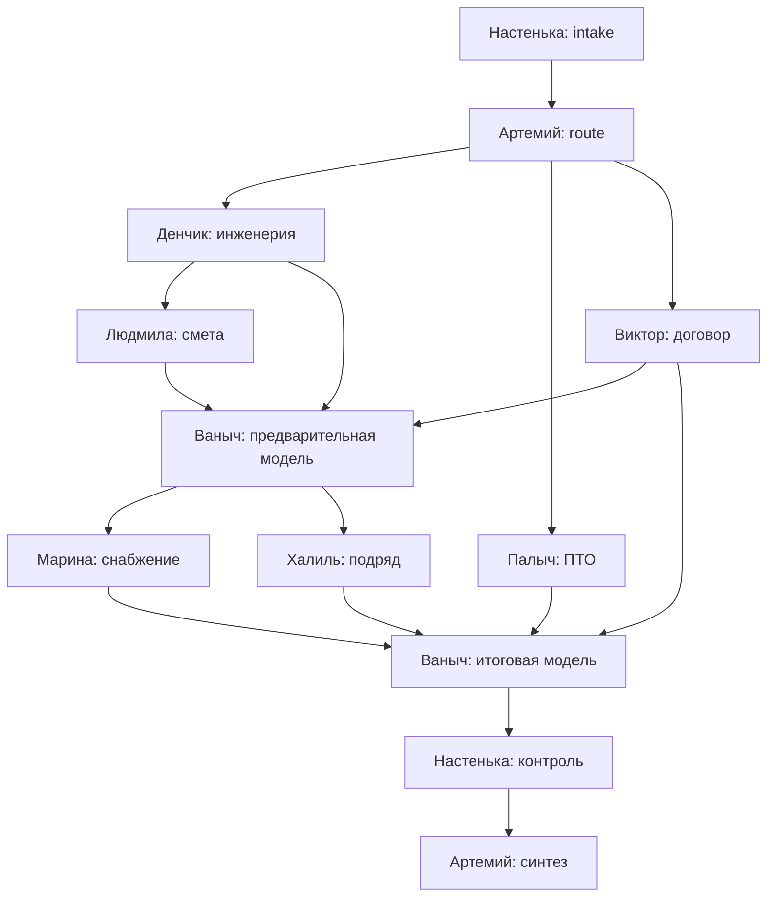
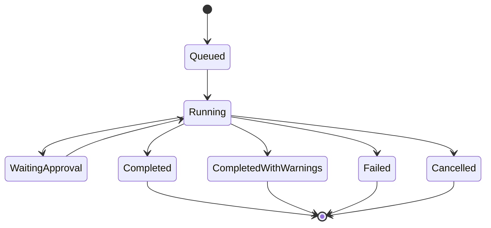

# СтройИнтеллект: workflow и контракты компетенций

## 1. Цель

Документ определяет:

- legacy-aligned workflow девяти компетенций;
- правила выбора применимых ветвей;
- обязательные зависимости «физика → объём → деньги»;
- input/output schemas компетенций;
- state и failure semantics;
- human approval gates.

Компетенции являются модулями одного workflow, а не независимыми чат-агентами или микросервисами.

## 2. Принципы

1. ТЗ задаёт последовательность `technical → quantity → cost → finance → risk → synthesis`.
2. Legacy задаёт доказанные handoff и stop rules.
3. Оркестратор запускает только применимые компетенции.
4. Компетенция не вызывает другую компетенцию напрямую.
5. Компетенция получает immutable inputs и возвращает strict structured output.
6. LLM не рассчитывает числа.
7. Business blocker не превращается в технический retry.
8. Отсутствующий источник возвращает `insufficient_data`, а не догадку.
9. Final synthesis не скрывает conflicts и open questions.

## 3. Базовый DAG



### 3.1 Сквозные роли

- Настенька создаёт паспорт и реестр открытых вопросов, затем обновляет их на каждом gate.
- Артемий выполняет intake/route и final synthesis как две фазы одной компетенции.
- Ваныч выполняет preliminary budget ceilings и final financial consolidation как две фазы.

### 3.2 Параллелизм

- Денчик, Палыч и Виктор стартуют после route по доступным документам.
- Марина и Халиль стартуют после preliminary ceilings.
- Параллелизм не отменяет обязательные data dependencies.

## 4. Pruning

Route строится по:

- типу запроса;
- загруженным document types;
- выбранному режиму;
- требуемым output artifacts;
- обязательным acceptance scenarios;
- business applicability.

Примеры:

| Запрос | Обязательные ветви |
|---|---|
| Полная сквозная проверка | Все применимые компетенции |
| Анализ договора | Виктор → ограниченная фаза `contract_effect` Ваныча при наличии параметров → Артемий |
| Смета и переплата | Денчик → Людмила → Ваныч → Артемий |
| Снабжение | Денчик → Людмила → Ваныч → Марина → Артемий |
| ПТО | Палыч; финансовая ветвь только при наличии количественного эффекта |

`skipped_not_applicable` является нормальным terminal state и содержит reason code.

## 5. Workflow state

### 5.1 AnalysisRun

```text
queued
running
waiting_approval
completed
completed_with_warnings
failed
cancelled
```



Document parsing, input review и confirmation имеют отдельный lifecycle в spec 06. `AnalysisRun` создаётся только для confirmed inputs и начинает lifecycle в `queued`. Повторный запуск создаёт новый `AnalysisRun`; старый run/result immutable.

### 5.2 CompetencyRun

```text
pending
ready
queued
running
succeeded
failed
blocked
skipped_not_applicable
cancelled
```

### 5.3 Approval

```text
pending
approved
rejected
expired
superseded
```

Изменение input, knowledge или config snapshot supersedes незавершённое approval.

## 6. Общий контракт компетенции

```yaml
code: lyudmila_estimator
version: 1.0.0
input_schema: EstimatorInput@1
output_schema: EstimatorResult@1
required_dependencies:
  - denchik_engineer
optional_dependencies: []
allowed_capabilities:
  - evidence_retriever
  - calculation_reader
  - llm_gateway
forbidden_capabilities:
  - arithmetic_write
  - direct_database_access
  - direct_competency_call
timeout_policy_ref: mode.standard
retry_policy: provider_transient
```

Обязательные output fields:

```yaml
competency_code: string
competency_version: string
state: succeeded | blocked | insufficient_data | not_applicable
input_snapshot_refs: []
findings: []
claims: []
recommendations: []
assumptions: []
unknowns: []
conflicts: []
open_questions: []
source_refs: []
calculation_refs: []
quality_checks: []
```

## 7. Контракты компетенций

### 7.1 Настенька, `nastenka_admin`

**Intake input:**

- project identity;
- customer identity token;
- dates;
- uploaded document inventory;
- requested analysis;
- responsible persons.

**Output:**

- project passport;
- document completeness matrix;
- task/open-question registry;
- deadlines;
- control dates;
- current workflow status.

Настенька не рассчитывает финансовые показатели и не закрывает экспертные выводы.

### 7.2 Артемий, `artemiy_pm`

**Intake output:**

- route;
- applicable competencies;
- required documents;
- stop conditions;
- expected artifacts;
- mode policy.

**Synthesis input:**

- structured outputs всех применимых ветвей;
- final calculations;
- completeness report;
- conflicts и approvals.

**Synthesis output:**

- budget status;
- base и adjusted margin;
- top risks в ₽;
- corrective measures в ₽;
- critical threshold;
- continuation conditions;
- explicit recommendation;
- insight, action и next step.

Синтез блокируется при unresolved critical conflict.

### 7.3 Денчик, `denchik_engineer`

**Input:**

- ТЗ, РД, ВОР/описание объекта;
- geometrical parameters;
- specifications;
- applicable knowledge snapshot.

**Output:**

- normative profile со статусом редакций;
- geometrically justified quantities;
- engineering constraints;
- document mismatch;
- assumptions;
- specification и technical requirements handoff.

Число без инженерного происхождения не становится подтверждённым объёмом.

### 7.4 Людмила, `lyudmila_estimator`

**Required input:**

- confirmed Денчик quantities;
- estimate normalized snapshot;
- knowledge records и dated parameters.

**Output:**

- estimate rows mapping;
- convergence result;
- double-count findings;
- coefficient/rate findings;
- target prices;
- potential overpayment;
- ВОР handoff для Ваныча.

Людмила использует Calculation Engine для арифметики.

### 7.5 Виктор, `viktor_contract`

**Input:**

- один contract snapshot;
- project context;
- applicable legal/norm records.

**Output:**

- structured payment terms;
- advance;
- guarantee retention;
- firm/open price status;
- penalties;
- acceptance and warranty terms;
- risk register;
- required specialist disclaimer.

Structured payment terms доступны Ванычу до финализации финансовой модели.

### 7.6 Палыч, `palych_pto`

**Input:**

- project passport;
- document inventory;
- КС-2/КС-3 data, если есть;
- work and schedule context.

**Output:**

- start checklist;
- ИД status;
- missing acts/journals;
- blocking documents;
- financial effect request, если применимо;
- deadlines и owners.

Pilot scope не включает построчную сверку КС-2/КС-3 с проектом.

### 7.7 Ваныч, `vanych_finance`

Ваныч имеет три versioned phase contracts.

**Phase `contract_effect`:**

- required: structured payment terms from Виктор;
- optional: contract amount, financing rate и duration;
- output: только вычислимые эффекты аванса, удержания, пени и условий оплаты;
- missing numeric input: `insufficient_data`, без запуска полной финмодели.

**Phase `preliminary_model`, required input:**

- quantities/costs from Людмила;
- engineering constraints from Денчик;
- payment terms from Виктор;
- project financing parameters.

**Phase `preliminary_model`, output:**

- cost ceiling by package;
- initial margin scenarios;
- initial cash constraints;
- handoff для Марины и Халиля.

**Phase `final_model`, input:**

- supply, subcontract, PTO и contract risks;
- all deterministic calculation results.

**Phase `final_model`, output:**

- cost per m²;
- project credit schedule;
- monthly БДДС;
- first cash gap date and amount;
- base/realistic/stress margin;
- adjusted financial model.

### 7.8 Марина, `marina_supply`

**Input:**

- specification;
- quantities;
- Ваныч ceilings;
- knowledge prices и lead times.

**Output:**

- significant item comparison;
- logistics/delivery effect;
- long-lead risks;
- latest order dates;
- deviations in ₽;
- source and freshness for each value.

Legacy requirement «3 КП» имеет disposition `superseded_by_tz` для pilot scope, если owner decision не вернёт его отдельно.

### 7.9 Халиль, `khalil_subcontract`

**Input:**

- one contractor proposal;
- work package and technical requirements;
- ceiling;
- available contractor knowledge.

**Output:**

- proposal structure completeness;
- feasibility risk at offered price;
- package allocation;
- conditions and recommendations.

External multi-contractor scoring не входит в pilot scope.

## 8. Handoff schemas

Каждый handoff содержит:

```yaml
handoff_id: uuid
handoff_type: estimate_to_finance
producer_run_id: uuid
consumer_code: vanych_finance
schema_version: 1.0.0
payload_ref: uuid
source_refs: []
calculation_refs: []
completeness:
  required_fields_total: integer
  required_fields_present: integer
  missing: []
status: ready | incomplete | conflict | superseded
created_at: date-time
```

Consumer не читает произвольный producer JSON. Используется versioned handoff schema.

## 9. Mode policy

| Policy | Express | Standard | Expert |
|---|---|---|---|
| SLA | 60с | 5мин | 15мин |
| Input confirmation | Required | Required | Required |
| Variants | 1 | По необходимости | ≥3 |
| Tables | Нет | Да | Да |
| Critical conflict | Mark and stop unsafe conclusion | Approval gate | Approval gate |
| Retrieval depth | Bounded | Full applicable | Full + alternatives |
| Output | ≤15 строк | Full | Full + matrix/premortem |

Mode меняет глубину, но не ослабляет provenance, schema validation или расчётную корректность.

## 10. Error semantics

### 10.1 Technical failure

- provider timeout;
- invalid provider schema;
- worker crash;
- DB/storage failure.

Допускается retry по operations policy.

### 10.2 Business blocker

- обязательный документ отсутствует;
- input snapshot не подтверждён;
- неизвестен обязательный параметр;
- источники конфликтуют;
- нормативный статус не подтверждён;
- требуется human decision.

Business blocker получает `blocked` или `waiting_approval` и не отправляется в бесконечный retry.

## 11. Acceptance

- DAG order сохраняет обязательные legacy dependencies;
- ранние ветви ПТО и договора запускаются без ожидания снабжения/подряда;
- pruning не запускает нерелевантные компетенции;
- каждый handoff валидируется отдельной schema;
- competency output с неизвестным полем или неверным типом отклоняется;
- LLM-generated number без CalculationRef не публикуется;
- unresolved critical блокирует final recommendation;
- полный legacy regression проходит на `input-1/output-1`;
- по каждой компетенции достигается contract gate `≥80%` согласованного чек-листа.
