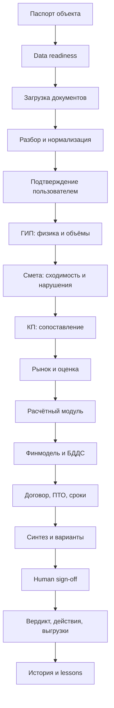
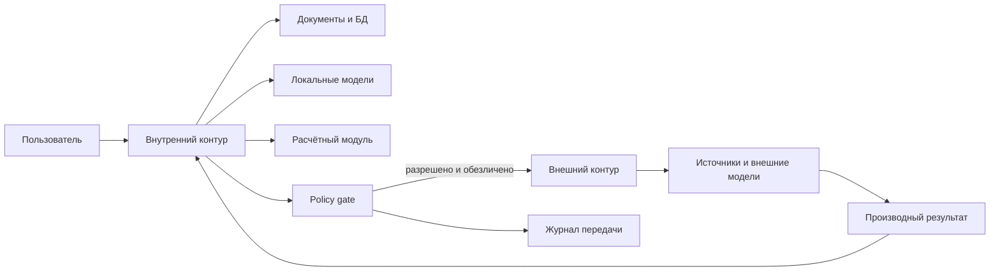

# СтройИнтеллект: карта возможностей, workflow и outcomes

## 1. Принцип проектирования

Продукт следует описывать не списком ИИ-персонажей, а сквозным workflow объекта.

Каждый функциональный контур должен иметь:

- пользователя;
- вход;
- преобразование;
- детерминированную часть;
- AI-часть;
- выход;
- источник;
- статус зрелости;
- точку проверки человеком;
- правило отказа или деградации.

## 2. Сквозной workflow

## 3. Объектная модель продукта

Минимальные сущности, независимо от технической реализации:

| Сущность | Назначение |
|---|---|
| Клиентский контур | Граница данных, правил и пользователей |
| Объект | Единица анализа и накопления истории |
| Паспорт объекта | Тип, регион, стадия, финансирование, сроки, стороны |
| Документ | Исходный файл, версия, тип, происхождение |
| Извлечённая позиция | Нормализованная строка сметы, ВОР или КП |
| Сопоставление | Связь позиций между документами и предложениями |
| Значение | Число, единица, источник, дата, статус |
| Расчёт | Формула, входы, результат, версия |
| Находка | Отклонение, риск, неизвестное или конфликт |
| Сценарий | Набор допущений и расчётный outcome |
| Рекомендация | Вариант действия с условиями |
| Проверка | Запуск workflow на фиксированном комплекте данных |
| Решение человека | Принято, отклонено, требует доработки |
| Выгрузка | Excel, Word, реестр, сравнительная таблица |
| Audit event | Кто, когда и на основании чего изменил состояние |

Источниками данных аналитического слоя могут быть СОД, ERP/1С, BIM/ТИМ, StorHaus, отраслевые платформы и структурированные файлы. СтройИнтеллект не становится master-системой документов, бухгалтерского учёта или информационных моделей без отдельного scope и интеграционного контракта.

## 4. Девять договорных агентов и общие платформенные контуры

Тринадцать контуров ниже не означают тринадцать агентов. Новое ТЗ фиксирует девять функциональных агентов. Документы, расчёты, база, интеграции, безопасность, очередь и интерфейс являются общими платформенными сервисами.

| Агент по ТЗ | Основные capabilities | Общие сервисы | Основной output | Приёмка |
|---|---|---|---|---|
| Главный инженер проекта | Физика, объёмы, состав документов, нормативы | Разбор документов, база, расчёт | Неподтверждённые работы, допущения, вопросы | Чек-лист агента + эксперт ГИП |
| Сметчик | Сходимость, двойной учёт, коэффициенты, расценки | Разбор, расчёт, сопоставление | Реестр нарушений, сумма, целевая цена | 0 ₽ сходимости, coverage нарушений |
| Снабжение | Материалы, оборудование, доставка, длинноцикл | База, внешний контур, расчёт | Отклонения, ориентиры, крайние даты заказа | Источники, дата, применимость |
| Специалист по поиску подрядчиков | Сравнение КП, аномалии, риск цены | Сопоставление, оценочная модель, внешний контур | Таблица предложений, диапазон, риск | Mapping, объяснение отклонений |
| Экономист | Себестоимость, маржа, БДДС, ПФ | Расчётный модуль, база | ₽/м², сценарии, выборка, разрыв | Сходимость с ручным расчётом |
| Инженер ПТО | КС, финансовое влияние, ИД | Документы, расчёт, календарь | Влияние на бюджет, реестр ИД | Эксперт ПТО, ограничения scope |
| Юрист | Аванс, удержание, цена, штрафы, приёмка | Документы, расчёт | Риски и рекомендации | Human sign-off юриста |
| Руководитель проекта | Синтез, график, варианты | Все outputs, расчёт, журнал | Итоговый вывод и условия | Общий чек-лист решения |
| Администратор | Паспорт, данные, вопросы, даты | БД, интеграции, UI, журнал | Структурированный набор и реестры | Полнота и версия данных |

### Матрица владения контурами 1–13

| Агент | Owner | Support |
|---|---|---|
| Главный инженер проекта | Контур 3, инженерная проверка | Контуры 2 и 13 |
| Сметчик | Контур 4, смета и нарушения | Контуры 2, 5, 7 и 13 |
| Снабжение | Контур 9, снабжение и длинноцикл | Контуры 5, 6 и 13 |
| Специалист по поиску подрядчиков | Контуры 5 и 10, предложения и подрядчики | Контуры 9 и 13 |
| Экономист | Контуры 7 и 8, расчётное ядро и финансовая модель | Контуры 4, 5, 9, 11, 12 и 13 |
| Инженер ПТО | Контур 12, КС и ИД | Контуры 3 и 13 |
| Юрист | Контур 11, договор | Контуры 5, 8, 12 и 13 |
| Руководитель проекта | Контур 13, управленческий синтез | Контуры 1–12 |
| Администратор | Контуры 1, 2 и 6, паспорт, документы и база | Контуры 3–13 по данным, версиям и журналу |

Все 13 контуров имеют функционального owner. Техническими владельцами общих сервисов могут быть отдельные платформенные компоненты и команды, не являющиеся договорными агентами.

### Общие платформенные сервисы

1. Document pipeline.
2. Модуль сопоставления.
3. Расчётно-аналитическая оценка.
4. Расчётный модуль.
5. Опорная база.
6. Внутренний и внешний контуры данных.
7. StorHaus/API/файловая интеграция.
8. Очередь и повторный запуск.
9. Журнал.
10. Генератор выгрузок.

Договорный агент является владельцем функционального результата, но не обязан быть отдельным runtime-процессом. Техническая топология выбирается отдельно.

### 4.1 Рыночная карта 12 функциональных блоков

Рыночная карта показывает место продукта относительно классов решений, а не зрелость runtime.

| Блок рынка | Покрытие заявленного scope | Статус зрелости |
|---|---|---|
| 1. СОД и документы | Частично | База, карточки и документы предусмотрены; полноценные согласования и управление документацией не входят |
| 2. ПИР и проверка исходных данных | Core | Есть артефакты метода и договорные требования; требуется UAT |
| 3. ТИМ/BIM | Вне scope | Не обещать проверку моделей, коллизии и извлечение объёмов из BIM |
| 4. Сметы, объёмы и стоимость | Core | Есть расчётные артефакты; runtime и точность требуют UAT |
| 5. Закупки и сравнение предложений | Core / частично | Сопоставление КП входит; полный тендерный процесс и кабинет поставщика не входят |
| 6. Сроки и план-факт | Частично | Есть анализ влияния; специализированный календарный контур не входит |
| 7. Экономика и БДДС | Core | Есть артефакты; программный движок требует тестов |
| 8. Стройконтроль на площадке | Вне scope | Нет мобильных инспекций, замечаний и фотофиксации |
| 9. Исполнительная документация | Частично | Только аналитика и финансовое влияние по доступным данным |
| 10. Договорные риски | Core | Требуется human sign-off юриста |
| 11. Портфельная аналитика | Частично / roadmap | Текущая единица продукта — объект |
| 12. Данные, интеграции и ИИ | Core целевой архитектуры | Договорный target; production proof отсутствует |

Референсные классы российского рынка: G-Tech, Exon, SIGNAL, SAREX, ЦУС, Tangl, «Адепт» и АЛТИУС. СтройИнтеллект не позиционируется как их полная замена. Его место — интеллектуальный финансово-технический слой поверх систем хранения, учёта и управления.

## 5. Контур 1. Паспорт объекта и data readiness

### Пользователи

- руководитель проекта;
- администратор;
- технический директор;
- аналитик внедрения.

### Вход

- название и тип объекта;
- регион;
- стадия;
- продукт;
- бюджет;
- площадь;
- дата ввода;
- схема финансирования;
- перечень документов;
- стороны договора;
- цель Проверки.

### Обработка

- определение доменного профиля;
- проверка обязательных полей;
- фиксация версий;
- классификация отсутствующих данных;
- определение применимых аналитических контуров;
- ограничение достижимой точности.

### Выход

- паспорт;
- readiness score по категориям данных;
- список блокеров;
- список допустимых допущений;
- маршрут Проверки;
- ответственные и сроки.

### Human approval

Пользователь подтверждает:

- цель;
- комплект;
- версии;
- допустимые допущения;
- границу анализа.

### Зрелость

`artifact-observed`: паспорта и административные реестры существуют в кейсах.

## 6. Контур 2. Документы и нормализация

### Поддерживаемые входы по новому ТЗ

- Excel `.xlsx`, `.xls`;
- ГРАНД-Смета XML;
- Word `.docx`;
- PDF с текстовым слоем;
- CSV и структурированные файлы согласованного формата.

### Вне текущего scope

- АРПС;
- OCR PDF-сканов;
- универсальный разбор любого произвольного формата;
- глубокий BIM parsing.

### Функции

1. определить тип документа;
2. извлечь таблицы и позиции;
3. сохранить связь с исходной страницей/листом/строкой;
4. нормализовать единицы;
5. выделить неполные строки;
6. сверить сумму с итогом;
7. показать preview;
8. дать пользователю исправить;
9. подтвердить версию;
10. сохранить hash и provenance.

### Детерминированная часть

- арифметическая сходимость;
- типы данных;
- единицы;
- обязательные поля;
- контроль дубликатов;
- версия документа.

### AI-часть

- классификация документа;
- сопоставление неоднозначных колонок;
- нормализация наименований;
- определение состава позиции.

### Human approval

Без подтверждения извлечённых данных расчёт не должен переходить к сильному вердикту.

### Зрелость

`acceptance-target`: парсеры описаны в ТЗ, но рабочий runtime не подтверждён.

## 7. Контур 3. Инженерная проверка

### Основной вопрос

> Есть ли физическое и документное основание для объёма, на котором строится цена?

### Функции

- состав «проект — ВОР — смета — ТЗ»;
- объёмы по геометрии и ведомостям;
- неподтверждённые работы;
- коллизии между разделами;
- применимость нормативов;
- отдельный блок допущений;
- вопросы к проектировщику и заказчику.

### Выход

- инженерное заключение;
- реестр неподтверждённых объёмов;
- реестр конфликтов;
- перечень норм со статусом;
- денежный эффект, если он может быть рассчитан;
- блокеры следующего шага.

### Граница

Это аналитическая проверка документов, не экспертиза и не акт строительного контроля.

### Evidence

- Зауралье: инженерный и сводный пакет;
- Ирбит: 28-раздельная ВОР;
- ЧТЗ: расчётная ЦИМ теплосети;
- кейсы Махачкалы и школы №19.

Статус: `artifact-observed`, корректность каждого вывода требует экспертного review.

## 8. Контур 4. Смета и реестр нарушений

### Основной вопрос

> Сходится ли смета и где цена содержит потенциальную переплату, недобор или двойной учёт?

### Функции

- сумма разделов против итога;
- двойной учёт;
- коэффициенты;
- расценки;
- состав «материал / работа / доставка»;
- позиция «1 комплект»;
- целевая цена;
- реестр нарушений;
- путь урегулирования.

### Детерминированная часть

- сумма;
- объём × цена;
- отклонение;
- доля;
- медиана;
- диапазон;
- порог существенности.

### AI-часть

- классификация природы расхождения;
- объяснение;
- сопоставление с типом работ;
- предложение запроса или условия торга.

### Выход

- реестр потенциальных переплат;
- сумма влияния;
- источник;
- confidence;
- рекомендуемое действие.

### Зрелость

`artifact-observed` для формата результата; `acceptance-target` для 70% полноты нарушений.

## 9. Контур 5. Сопоставление предложений и собственная оценка

Это центральное расширение нового ТЗ.

### Основной вопрос

> Как сравнить предложения, если они по-разному описывают состав и ни одно из них не является эталоном?

### Workflow

1. принять несколько КП по одному объекту;
2. выделить состав каждой позиции;
3. привести наименования и единицы;
4. разделить сопоставимые и несопоставимые позиции;
5. рассчитать минимум, максимум, медиану и разброс;
6. построить собственную расчётно-аналитическую оценку;
7. сравнить каждое предложение с оценкой;
8. классифицировать аномалии;
9. сформировать диапазон и целевую цену;
10. показать пользователю mapping для подтверждения.

### Источники собственной оценки

- нормализованный массив Исполнителя;
- клиентская опорная база;
- исторические данные заказчика;
- актуальные рыночные ориентиры;
- формальные расчётные правила.

### Критический product gap

Не определено, чем именно является «модель оценки»:

- статистической моделью;
- rule-based расчётом;
- retrieval + преобразование;
- ML-регрессией;
- гибридом;
- LLM reasoning.

До архитектурного redesign claim должен звучать:

> «Продукт формирует независимую оценку на основе нормализованных исторических и клиентских данных».

Нельзя обещать «обученную модель высокой точности».

### Human approval

Пользователь подтверждает:

- mapping позиций;
- исключения;
- базис цены;
- логистику;
- применимость аналога.

### Зрелость

`contractual-requirement` как требование; `hypothesis` как работающая capability до UAT.

## 10. Контур 6. Опорная база и knowledge

### Назначение

Не «память чата», а управляемый набор:

- цен;
- норм;
- алгоритмов;
- фактических объектов;
- lessons;
- подрядчиков;
- результатов сопоставления.

### Требования к записи

Каждое числовое значение:

- значение;
- единица;
- год;
- источник;
- статус;
- дата проверки;
- регион;
- применимость;
- владелец подтверждения.

### Freshness

Значения старше 90 дней:

- не удаляются;
- получают warning;
- не должны выдаваться за актуальный факт;
- требуют живой проверки для критического решения.

### RAG-ready актив

Существует корпус из 1668 чанков и 120 вкладок.

Статус:

- `artifact-observed` как подготовленный корпус;
- `hypothesis` как качество retrieval;
- не доказан production RAG.

### Human approval

Администратор или предметный владелец подтверждает импорт и критические значения.

## 11. Контур 7. Расчётное ядро

### Инвариант

Числа в итоговых выгрузках рассчитывает не LLM.

### Минимальный набор расчётов

- сходимость разделов;
- объём × цена;
- отклонение цены;
- разброс и медиана;
- себестоимость;
- ₽/м²;
- проектное финансирование;
- график выборки;
- проценты;
- БДДС;
- прогноз кассового разрыва;
- три сценария маржи;
- крайний срок заказа;
- обратный расчёт срока;
- пеня;
- аванс;
- гарантийное удержание и БГ.

### Контракт расчёта

Каждый расчёт хранит:

- ID формулы;
- версию;
- входы;
- единицы;
- результат;
- округление;
- источник входов;
- warning;
- контрольный пример.

### Evidence

Расчётные книги показывают способность формировать сложные модели, но не заменяют unit/eval-набор.

Статус:

- `artifact-observed` для подхода;
- `contractual-requirement` как требование;
- `hypothesis` для программного движка до тестов.

## 12. Контур 8. Финансовая модель девелопера

### Результаты

- себестоимость по слоям;
- себестоимость ₽/м²;
- маржа проекта;
- три сценария;
- выборка кредита;
- проценты;
- помесячный БДДС;
- период и сумма кассового разрыва;
- дата раскрытия эскроу;
- чувствительность к сдвигу срока;
- эффект аванса и удержаний.

### Входы от заказчика

- цена продажи и спрос;
- площадь;
- график;
- ставка;
- условия банка;
- аванс;
- удержание;
- продуктовая матрица.

### Граница

Продукт не прогнозирует рыночный спрос и цену продажи в текущем scope.

### Human approval

CFO подтверждает финансовые параметры и трактовку сценариев.

## 13. Контур 9. Снабжение и длинноцикл

### Функции

- значимые материалы и оборудование;
- цена с базисом поставки;
- транспортное плечо;
- источник и дата;
- аналоги;
- лид-тайм;
- крайняя дата заказа;
- влияние на критический путь.

### Правило

Интернет-цена — ориентир, а не живое КП.

### Выход

- закупочный фон;
- диапазон;
- позиции «под КП»;
- карта длинноцикла;
- запросы поставщикам.

### Зрелость

`artifact-observed` по кейсам; рыночные claims имеют статус `hypothesis`.

## 14. Контур 10. Подрядчики

### Два разных сценария

1. Сопоставление уже полученных предложений.
2. Поиск и оценка подрядчиков во внешних источниках.

Второй сценарий требует внешнего контура и регламента.

### Функции

- полнота предложения;
- цена;
- квалификация;
- допуски;
- финансовая устойчивость;
- судебные и реестровые сигналы;
- референсы;
- риск невыполнения по заявленной цене.

### Граница

Накопление статистического рейтинга исполнения договоров не входит в текущее ТЗ.

## 15. Контур 11. Договор

### Зоны

- аванс;
- гарантийное удержание;
- банковская гарантия;
- твёрдая цена;
- порядок изменения;
- штрафы;
- приёмка;
- гарантии;
- расторжение;
- ответственность за исходные данные.

### Выход

- red flags;
- влияние в рублях и сроках;
- рекомендуемая позиция;
- список пунктов для профильного юриста.

### Граница

Продукт не выдаёт юридическое заключение и не заменяет подписание.

## 16. Контур 12. ПТО, КС и исполнительная документация

### Текущий договорный scope

- оценка финансового влияния расхождений по загруженным данным;
- реестр документов;
- связь комплектности с оплатой и вводом.

### Вне scope

- визуальный контроль;
- специализированный экран КС;
- полная построчная сверка КС с проектной документацией.

### Выход

- реестр ИД;
- контрольные даты;
- риски оплаты;
- влияние на ввод;
- запросы по отсутствующим документам.

## 17. Контур 13. Управленческий синтез

### Главный output

Один экран:

- статус решения;
- базовая маржа;
- маржа после мер;
- диапазон;
- критический порог;
- топ-3 риска;
- топ-3 действия;
- критический путь;
- неизвестные;
- условия продолжения;
- ответственные и сроки.

### Вердикт

- зелёный: проходит при подтверждённых данных;
- жёлтый: допустимо с условиями;
- красный: не принимать или пересчитать.

Цвет не является автоматическим решением. Он является формой представления аналитической позиции.

Ни цветовой вердикт, ни агентный вывод не являются исполнением юридических полномочий технического заказчика. Подписание, допуск, приёмка, оплата и профессиональная ответственность остаются за уполномоченными лицами.

## 18. Внутренний и внешний контуры

### До утверждения регламента

Внешний контур не используется.

### Каждая передача

- процесс;
- разрешение;
- состав данных;
- применённое маскирование;
- получатель;
- время;
- результат;
- происхождение.

## 19. Human approval points

| Этап | Кто подтверждает | Что |
|---|---|---|
| Паспорт | РП / администратор | Цель, версии и комплект |
| Разбор | Сметчик / инженер | Извлечённые позиции |
| Mapping КП | Снабжение / сметчик | Сопоставимость |
| Технические выводы | ГИП | Применимость и объёмы |
| Финансы | CFO / экономист | Параметры и сценарии |
| Договор | Юрист | Правовая позиция |
| ПТО | ПТО / стройконтроль | Факт и комплектность |
| Вердикт | Уполномоченный руководитель | Решение и условия |
| Публикация кейса | Владелец данных | Обезличивание и разрешение |

Human approval не является декоративной проверкой: система не должна выполнять юридически значимые действия, подписание, оплату, допуск или приёмку вместо уполномоченных лиц.

## 20. Outcome hierarchy

### Уровень 1. Данные

- комплектность;
- версии;
- provenance;
- меньше ручного переноса.

### Уровень 2. Анализ

- сходимость;
- сопоставимость;
- выявленные конфликты;
- расчётный след.

### Уровень 3. Решение

- понятные варианты;
- условия;
- пороги;
- приоритеты;
- ответственные.

### Уровень 4. Бизнес

- раньше обнаруженные отклонения;
- меньше поздних изменений;
- защищённая маржа;
- управляемая стоимость денег;
- переносимость знания.

## 21. Метрики

Core metric и quality guardrails определены в `01-product-definition-and-strategy.md`, раздел 16. Этот документ не создаёт альтернативный набор первичных метрик.

### Для пилота

- Validated Finding Coverage;
- extraction accuracy;
- arithmetic convergence;
- source coverage;
- human review effort;
- data boundary integrity.

### Для эксплуатации

- Проверки на объект;
- стоимость Проверки;
- retry rate;
- доля ручных исправлений;
- принятые рекомендации;
- повторно используемые правила;
- freshness базы;
- инциденты egress;
- деградация при смене модели;
- uptime при согласованной инфраструктуре.

### Для бизнеса

Только после фактического подтверждения:

- предотвращённая переплата;
- сокращение цикла решения;
- стоимость раннего обнаружения;
- снижение количества поздних change requests;
- уменьшение процентных потерь;
- предотвращённый сдвиг срока.

## 22. Покрытие обязательного scope нового ТЗ

### 22.1 Шесть договорных экранов

| Экран | Назначение | Владелец | Статус |
|---|---|---|---|
| Реестр объектов | Статус и последняя Проверка | Администратор / РП | `contractual-requirement` |
| Карточка объекта | Паспорт, документы, история | Администратор | `contractual-requirement` |
| Загрузка и разбор | Preview, правка, сходимость | Сметчик / инженер | `contractual-requirement` |
| Сравнение предложений | Mapping, разброс, оценка, аномалии | Сметчик / подряд | `contractual-requirement` |
| Рабочий экран | Запуск, результат, выгрузка | Все пользователи | `contractual-requirement` |
| Журнал | Документы, запросы, результаты | Администратор / аудит | `contractual-requirement` |

Фактическая реализация экранов не подтверждена.

### 22.2 Очередь и повторный запуск

Требования:

- асинхронные режимы «стандарт» и «эксперт»;
- состояния «в очереди / выполняется / завершена / ошибка»;
- работа пользователя с другими задачами;
- уведомление;
- сохранение результата;
- повторный запуск без повторной загрузки.

Статус: `contractual-requirement`.

### 22.3 StorHaus и каналы получения данных

| Канал | Направление | Что должно быть определено | Текущий статус |
|---|---|---|---|
| StorHaus | Приём исходных данных и передача результатов | Auth, поля, mapping, периодичность, ошибки, audit, UAT | `contractual-requirement`, контракт отсутствует |
| API Системы | Приём от иных систем | Схема, auth, idempotency, версии | `contractual-requirement`, не реализовано |
| Файловый каталог | Приём структурированных файлов | Формат, watcher, validation, rejected rows | `contractual-requirement`, не реализовано |

До получения документации StorHaus файловый канал является договорным fallback.

### 22.4 Развёртывание и эксплуатация

- узел вывода моделей;
- сервер приложения и БД;
- локальная сеть;
- Linux и контейнерная среда;
- резервное копирование и мониторинг силами заказчика;
- конфигурация фиксируется протоколом.

Статус: `contractual-requirement`, production proof отсутствует.

## 23. Основные gaps

1. Не определена формальная модель расчётно-аналитической оценки.
2. Нет подтверждённого end-to-end runtime.
3. Нет подписанного eval/UAT-пакета.
4. Нет адаптерного контракта локальных моделей.
5. Нет доказанного data egress policy engine.
6. Нет спецификации StorHaus.
7. Нет нормализованной case schema.
8. Нет подтверждённого реестра обучающего массива.
9. Нет product analytics contract.
10. Нет operating model обновления клиентских инсталляций.
