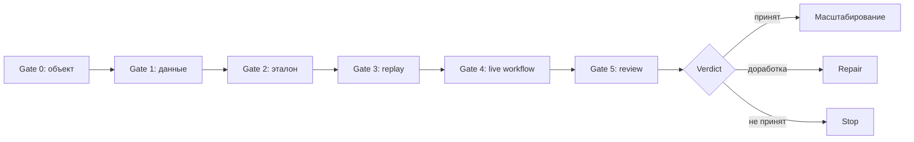

# СтройИнтеллект: продуктовая лестница, пилот и модель оффера

## 1. Принцип коммерциализации

СтройИнтеллект нельзя безопасно продавать сразу как полностью готовую платформу.

Правильный путь:

> **доказать один управленческий outcome на известном объекте → подтвердить workflow на ограниченном пилоте → стандартизировать внедрение → масштабировать на портфель и отраслевые пакеты.**

Каждый уровень должен иметь:

- отдельный предмет;
- ограниченный scope;
- входные данные;
- deliverables;
- критерии перехода;
- stop conditions;
- допустимый claim.

## 2. Продуктовая лестница

### Уровень 0. Экспертно-аналитический производственный прототип

**Текущее доказанное состояние.**

Интеллектуальное ядро можно считать существующим минимальным продуктовым прототипом: метод и сценарии уже применялись для производства артефактов. Это не означает готовность серийной платформы. Следующий этап должен доказать runtime, воспроизводимость, безопасность и экономическую применимость.

Что есть:

- методика;
- промпты;
- кейсы;
- опорные базы;
- расчётные книги;
- ручные workflow;
- HTML-прототипы;
- RAG-ready корпус.

Что можно обещать:

- способность производить сложные аналитические артефакты;
- наличие предметного метода;
- наличие артефактов метода по нескольким функциональным зонам; это не доказывает runtime-покрытие 12 рыночных блоков;
- готовность к формализации пилота.

Что нельзя обещать:

- автономную платформу;
- on-premise production;
- точность;
- SLA;
- интеграции;
- безопасность.

### Уровень 1. Replay закрытого объекта

**Цель**

Проверить воспроизводимость на объекте, где заказчик знает правильный ответ.

**Формат**

- один закрытый объект;
- фиксированный пакет документов;
- один основной сценарий;
- ручной эталон;
- независимая проверка находок.

**Результат**

- source map;
- сравнение с эталоном;
- новые находки;
- false positives;
- false negatives;
- data gaps;
- решение о пилоте.

**Допустимый claim после прохождения**

> «На контрольном объекте система воспроизвела согласованный сценарий с зафиксированными показателями качества».

**Коммерческие варианты**

- стандартная модель — платный replay с фиксированным scope;
- бесплатный replay — только стратегический коммерческий эксперимент после полной квалификации и решения владельца продукта;
- рабочая внутренняя гипотеза цены платного replay: 1,5–3,0 млн ₽ с НДС 22% с возможным зачётом части стоимости в пилот по отдельному решению;
- ценовую гипотезу replay запрещено публиковать до расчёта трудозатрат и проверки на сделках.

### Уровень 2. Ограниченный пилот

**Цель**

Проверить управленческую применимость на реальном workflow до необратимого решения.

**Рекомендуемый сценарий**

> Проверка сметы и нескольких коммерческих предложений подрядчиков перед выбором цены и условий договора.

**Почему этот сценарий**

- понятный buyer pain;
- доступные входы;
- измеримый ручной эталон;
- связь технического и финансового результата;
- не требует сразу всего портфельного контура;
- формирует сильный proof для следующей продажи.

**Допустимый claim после прохождения**

> «Пилот подтвердил применимость продукта для конкретного сценария на согласованном наборе данных».

### Уровень 3. Цифровой контур службы технического заказчика

**Цель**

Подключить повторяемые проверки по объектам заказчика.

Включает:

- локальное развёртывание;
- пользователи и роли;
- объектный реестр;
- документы;
- расчётное ядро;
- аналитические контуры;
- опорную базу;
- журнал;
- выгрузки;
- регламент данных;
- обучение.

**Допустимый claim**

Только после приёмки:

> «Система работает в согласованном клиентском контуре и поддерживает принятые сценарии».

### Уровень 4. Тиражируемое отраслевое решение

Новый клиент не получает новую кодовую ветку. Он получает:

- стандартное ядро;
- доменный пакет;
- клиентскую конфигурацию;
- mapping;
- контрольный набор;
- процедуру установки;
- процедуру обновления.

### Уровень 5. Платформа продуктовых пакетов

Возможные пакеты:

- Developer / Technical Customer;
- General Contractor;
- Industrial CAPEX;
- Infrastructure;
- Engineering Networks;
- Cost & Tender Control;
- Contract & Payment Control;
- PТО & Handover Readiness.

### Уровень 6. Управляемая отраслевая платформа

Добавляются:

- портфель;
- policy engine;
- модельный registry;
- eval platform;
- клиентские upgrade channels;
- агрегированная аналитика;
- разрешённые learning loops;
- несколько языков и региональных профилей.

## 3. Две дорожки: договорная поставка АПРИ и рыночная лестница

### 3.1 Договорная поставка АПРИ

Каноническое новое ТЗ фиксирует конкретный проект, который нельзя автоматически переносить на всех клиентов.

| Этап | Срок | Договорный результат |
|---|---:|---|
| 1. Развёртывание и опорная база | 45 дней | Локальные модели, БД, 9 агентов, база по ≥3 объектам, эталоны, чек-листы, Regламент данных |
| 2. Расчётный модуль и разбор | 40 дней | Реестр расхождений, ₽/м², финансовая модель, прогноз разрыва, Excel/Word |
| 3. Сравнительный контур и оценка | 30 дней | Mapping КП, аномалии, собственная оценка, диапазон, зафиксированная точность |
| 4. Интерфейс, интеграция и приёмка | 20 дней | 6 экранов, очередь, журнал, StorHaus/API/files, UAT, обучение |

Итого: **135 календарных дней**.

Договорные границы:

- 12 месяцев гарантийного сопровождения;
- изменение функциональности только через письменный change request;
- инфраструктуру, резервное копирование, мониторинг и ОС обеспечивает заказчик;
- новые экраны, интеграции, актуализация базы и развитие не входят в гарантию;
- цена и авансовая схема относятся к конкретному КП АПРИ.

### 3.2 Рыночная продуктовая лестница

Для других клиентов используется не копия четырёх этапов, а стандартизированный путь:

`diagnostic → replay → pilot → implementation → expansion`.

Конкретный срок и состав определяются после data readiness и выбора deployment-модели. Нельзя обещать всем клиентам 135 дней или условия АПРИ без отдельной оценки.

## 4. Offer ladder

| Ступень | Предложение | Покупательский риск | Цель |
|---|---|---|---|
| 0 | Диагностика красных линий процесса | Минимальный | Понять, где решение принимается вслепую |
| 1 | Replay закрытого объекта | Низкий | Проверить воспроизводимость |
| 2 | Пилот на одном сценарии | Ограниченный | Проверить применимость |
| 3 | Внедрение клиентского контура | Средний | Перевести сценарий в регулярную работу |
| 4 | Расширение на несколько процессов | Управляемый | Увеличить покрытие |
| 5 | Портфель и отраслевые пакеты | Высокий | Масштабировать стандарт |

### 4.1 GTM: путь от аккаунта до референса

`квалифицированный аккаунт → готовность данных → replay на закрытом объекте → сравнение с фактом → подтверждаемый эффект → pilot charter → промышленное внедрение → разрешённый референс`

Интерфейс и презентация поддерживают продажу, но не заменяют proof на данных клиента.

### 4.2 Validation-воронка

| Уровень | Рабочая цель | Статус |
|---|---:|---|
| Discovery-интервью | 10–15 | `hypothesis`, внутренний ориентир |
| Квалифицированные компании | 5–10 | `hypothesis`, ближайший коммерческий этап |
| Предложенные replay | 5 | `hypothesis` |
| Завершённые replay | Не менее 3 | `hypothesis` |
| Pilot proposals | 1–2 | `hypothesis` |

Цель воронки — проверить проблему, качество, готовность платить, причины отказа и стоимость производства результата. Эти числа не являются публичным прогнозом продаж.

## 5. Рекомендуемый пилот

### 5.1 Название

**«Контроль цены и условий подрядчика до решения»**

### 5.2 User outcome

До тендерного решения получить:

- проверенный состав входных данных;
- сопоставление предложений;
- реестр аномалий;
- независимую оценку;
- диапазон;
- целевую цену;
- финансовый эффект;
- условия договора;
- итоговую позицию.

### 5.3 Периметр

- один объект;
- один тип работ или один крупный пакет;
- не менее трёх предложений, если сценарий сравнительный;
- смета или ВОР;
- один проект договора;
- один набор финансовых параметров;
- один согласованный ручной эталон;
- одна ответственная рабочая группа.

### 5.4 Не входит

- портфель;
- OCR;
- BIM;
- визуальный контроль;
- полная КС-проверка;
- автоматическое подписание;
- двусторонняя интеграция с 1С;
- рейтинг подрядчиков на истории исполнения;
- разработка дополнительных экранов;
- fine-tuning без отдельного решения.

## 6. Этапы пилота

### Gate 0. Выбор объекта

DoR:

- понятное решение;
- материальный риск;
- владелец;
- доступ к данным;
- отсутствие конфликта интересов.

Stop:

- объект используется только для демонстрации без возможности проверки;
- нет владельца;
- нет согласия на обработку.

### Gate 1. Data readiness

Проверяется:

- версии;
- полнота;
- форматы;
- качество;
- коммерческая тайна;
- разрешённые контуры.

Stop:

- неизвестна версия сметы;
- нет состава предложений;
- данные нельзя законно использовать;
- эталон строится на другом базисе.

### Gate 2. Экспертный эталон

Нужны:

- ручной расчёт;
- перечень контрольных нарушений;
- подтверждённые параметры;
- reviewers;
- допустимые расхождения.

### Gate 3. Replay

Система обрабатывает закрытый набор.

Фиксируется:

- время;
- доля разбора;
- mapping;
- находки;
- источники;
- расхождения с эталоном;
- причины.

### Gate 4. Live workflow

Проверяется:

- работа пользователей;
- ручное подтверждение;
- очередь;
- повторный запуск;
- выгрузки;
- журнал;
- условия решения.

### Gate 5. Совместный review

Участники:

- технический владелец;
- сметчик;
- экономист;
- юрист;
- ИТ/ИБ;
- владелец продукта.

## 7. Критерии приёмки

Новое ТЗ содержит целевые показатели:

- ≥95% корректно извлечённых позиций;
- 0 ₽ расхождения суммы разделов с итогом;
- ≥70% полноты реестра нарушений;
- ≥80% пунктов чек-листа по каждому агенту;
- время в рамках режимов;
- источники по значимым позициям;
- работа контуров данных.

До подписанного протокола эти цифры имеют статус `acceptance-target`.

### Рекомендуемая структура критерия

| Поле | Пример |
|---|---|
| Метрика | Доля корректно извлечённых позиций |
| Набор | Объект X, версия документов Y |
| Denominator | Все размеченные позиции |
| Метод | Независимая сверка |
| Порог | 95% |
| Reviewer | ФИО/роль |
| Дата | Дата измерения |
| Результат | Факт |
| Решение | pass / repair / fail |

## 8. Pilot scorecard

### Качество данных

- полнота;
- доля ручных исправлений;
- пропущенные позиции;
- версия.

### Качество анализа

- найденные контрольные нарушения;
- false positives;
- false negatives;
- корректность классификации;
- источники.

### Качество решения

- применимость рекомендаций;
- прозрачность сценариев;
- достаточность условий;
- время human review.

### Эксплуатация

- стабильность;
- повторный запуск;
- журнал;
- выгрузка;
- data boundary.

## 9. Risk reversal

### 9.1 Закрытый объект до активного

Сначала известный ответ, потом реальное решение.

### 9.2 Этапная приёмка

Клиент принимает конкретные deliverables, а не абстрактный «ИИ».

### 9.3 Фиксированный scope

Все дополнительные функции проходят change request.

### 9.4 Стоп при недостатке данных

Нельзя компенсировать плохие данные сильным обещанием.

### 9.5 Human sign-off

Никаких автоматических управленческих, юридических или платёжных действий.

### 9.6 Право не масштабировать

Пилот может закончиться без внедрения, если критерии не достигнуты.

## 10. Модель основного оффера

### 10.1 Формула

> Мы разворачиваем в контуре девелопера цифровой второй контур проверки, который связывает технические объёмы, сметы, предложения подрядчиков, финансовую модель и договорные условия в один проверяемый вывод по объекту.

### 10.2 Что входит в enterprise-внедрение

- обследование;
- развёртывание;
- документный pipeline;
- расчётное ядро;
- аналитические контуры;
- собственная БД;
- клиентская опорная база;
- эталонные образцы;
- чек-листы;
- интеграционный канал;
- регламент данных;
- обучение;
- гарантия.

### 10.3 Что не следует включать по умолчанию

- оборудование;
- сопровождение ОС;
- постоянное обновление нормативной базы;
- новые интеграции;
- OCR;
- портфель;
- новые домены;
- новые модели;
- fine-tuning;
- эксплуатационный SLA выше базового;
- публичное использование кейсов.

## 11. Коммерческая модель

Текущая цена АПРИ — проектная цена конкретного внедрения. Она не является публичным прайсом.

### 11.1 Внутренняя ценовая архитектура

| Уровень цены с НДС 22% | Назначение | Статус и граница |
|---:|---|---|
| 22,5–25,0 млн ₽ | Первое промышленное, стратегическое или референсное внедрение | 22,5 млн ₽ — цена конкретного КП АПРИ; остальной диапазон — `hypothesis` |
| 29,9–32,9 млн ₽ | Целевой диапазон сделки для следующего крупного клиента | `hypothesis`, `sales-only` |
| 34,9 млн ₽ | Базовая цена коммерческого предложения | `hypothesis`, старт переговоров |
| 40 млн ₽ и выше | Расширенный scope, значимые интеграции или дополнительные модули | Требует отдельной оценки |
| 45–60 млн ₽ | Зрелая корпоративная версия | `hypothesis`, требуется продуктовая финансовая модель |
| 60–90+ млн ₽ | Многопроектный или холдинговый контур | `hypothesis`, `NDA/internal` |

Все значения, кроме цены АПРИ 22,5 млн ₽, являются внутренней оценкой 7КЛ, а не опубликованным рыночным тарифом. Они не включают автоматически вычислительное оборудование и требуют отдельной оценки интеграций.

Strategic price допускается только с письменным `give/get`, например:

- ограниченный или стандартный scope;
- минимизация уникальных интеграций;
- соблюдение платёжного графика;
- разрешение на обезличенный case packet;
- доступ к эталонным данным и reviewers;
- значение клиента как первого отраслевого референса.

### 11.2 Правило сравнения с конкурентами

Публичные цены G-Tech, Exon, SIGNAL, Tangl, «Адепт» и АЛТИУС нельзя механически сравнивать с ценой внедрения. Перед использованием фиксируются:

- дата тарифа;
- SaaS или on-premise;
- число пользователей, проектов или объектов;
- годовая или бессрочная лицензия;
- включённые модули;
- стоимость внедрения и интеграций;
- НДС или иной налоговый режим.

Номинальная цена лицензии не является прямым эквивалентом стоимости продуктового внедрения СтройИнтеллекта.

### Возможные компоненты цены

1. **Диагностика и replay**
   - фиксированная цена;
   - один объект;
   - один сценарий.

2. **Пилот**
   - фиксированный scope;
   - этапная оплата;
   - отдельный data readiness gate.

3. **Внедрение**
   - платформа;
   - доменный пакет;
   - клиентская конфигурация;
   - интеграции.

4. **Поддержка**
   - дефекты;
   - SLA;
   - мониторинг;
   - консультации.

5. **Развитие**
   - новые сценарии;
   - новые экраны;
   - новые домены;
   - новые интеграции.

6. **Актуализация базы**
   - отдельный recurring service.

### Не рекомендуется

- цена за токен как главный коммерческий показатель;
- процент от «найденной экономии» без независимого подтверждения;
- безлимитное обещание при ограниченной инфраструктуре;
- пожизненная поддержка без operating model.

## 12. Права и данные

Рекомендуемая продуктовая конструкция:

### Клиенту принадлежат

- исходные документы;
- результаты;
- клиентская опорная база;
- клиентские правила;
- история;
- клиентские интеграционные mapping.

### Исполнителю принадлежат

- универсальная платформа;
- общие алгоритмы;
- методика;
- общие схемы данных;
- обезличенные и законно используемые отраслевые активы.

### Требует отдельного решения

- производные данные;
- агрегированная статистика;
- улучшения общих моделей;
- использование клиентских кейсов;
- публикация.

## 13. Путь к тиражируемости

Чтобы второй клиент не стал новым custom-проектом, необходимо стандартизировать:

1. Object schema.
2. Document schema.
3. Calculation contract.
4. Capability contracts.
5. Client config.
6. Domain pack.
7. Integration adapter.
8. Eval pack.
9. Deployment bundle.
10. Upgrade protocol.
11. Data retention.
12. Support boundaries.

## 14. Продуктовые пакеты будущего

### Developer Core

- смета;
- КП;
- собственная оценка;
- ₽/м²;
- ПФ;
- эскроу;
- договор;
- свод.

### Cost & Tender

- ВОР;
- смета;
- сравнение предложений;
- целевая цена;
- переговорная позиция.

### Project Finance

- себестоимость;
- маржа;
- БДДС;
- выборка;
- sensitivity.

### Contract & Payment

- договор;
- аванс;
- удержания;
- КС;
- финансовое влияние.

### Handover Readiness

- ИД;
- контрольные даты;
- риски ввода;
- связь с последним платежом и эскроу.

### General Contractor

Отдельная логика:

- брать / не брать;
- EBT;
- косвенные;
- субподряд;
- ГУ/БГ с позиции подрядчика;
- тендерный floor.

Не включать в основной девелоперский пакет.

## 15. Решение о масштабировании

Масштабирование разрешено, если:

- пилот пройден;
- есть подтверждённый owner;
- ошибки имеют repair path;
- клиентская конфигурация отделена от ядра;
- ИБ приняла контуры;
- operating cost понятен;
- support boundaries согласованы;
- claim после пилота соответствует факту.

Масштабирование блокируется, если:

- результат держится на ручном героизме;
- для каждого объекта переписывается логика;
- нет эталона;
- нет журнала;
- нет источников;
- on-premise неоперабелен;
- один успешный кейс выдается за универсальную точность.
